# Generar Mapas de B1 en Bruker


Paravision 7 incluye una secuencia para generar mapas de B1 basado en el método DREAM [(Nehrke y Börnet, 2012)](https://onlinelibrary.wiley.com/doi/10.1002/mrm.24158).

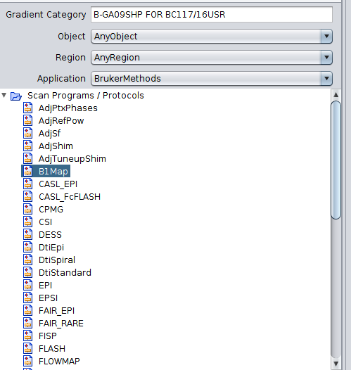

Según el manual de Paravision 7, es posible sacar directamente los mapas, que están representados en unidades de Hz/W. 

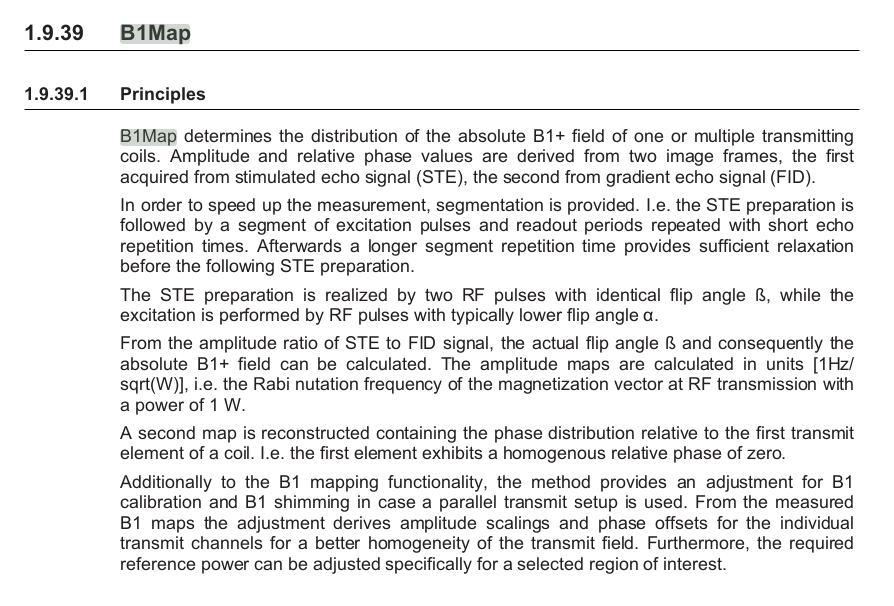

Sin embargo, en ocasiones uno puede preferir el mapa de ángulos de desviación en grados. 

En el foro de discusión de preclinical imaging de Bruker, dan una solución sencilla [(link, se requiere registrarse gratis)](https://pci-community.com/t/b1-mapping/900/11):

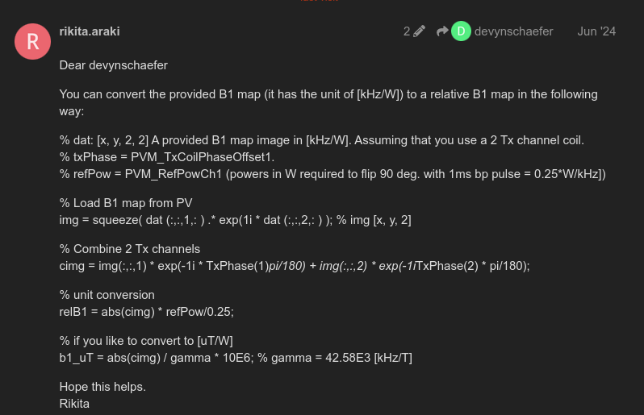

Muy bien, muy bien, pero puede haber una solución más sencilla y transparente. Es decir, quiero ver las imágenes que adquiere la secuencia de B1Map de Bruker, de las cuales se deriva el ángulo de desviación real. 

# Generar Mapas de B1 con QUIT

[QUIT](https://quit.readthedocs.io/en/latest/) es un programa que incluye diversas rutinas para imagen cuantitativa. Es bastante útil para relaxometría, transferencia de magnetización, etc. Afortunadamente, incluye una rutina para calcular el mapa de B1 a partir de las imágenes crudas del método DREAM.

Para poder tener las imágenes crudas del DREAM, debemos reconstruirlas de manera normal (el default es B1Map). Las buscamos en el Explorer de PV7, y damos clic derecho en ellas.

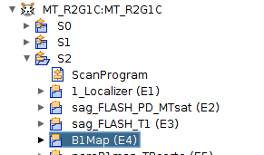

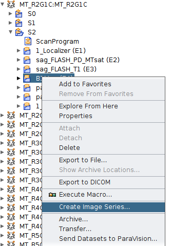

Seleccionamos Data Reconstruction

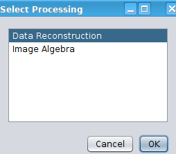

Y solicitamos una reconstrucción convencional.

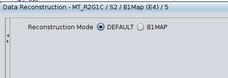

Eso genera una nueva serie de imágenes, en 4 dimensiones, siendo el primer volumen la imagen STE, y el segundo el eco de gradiente (FID):

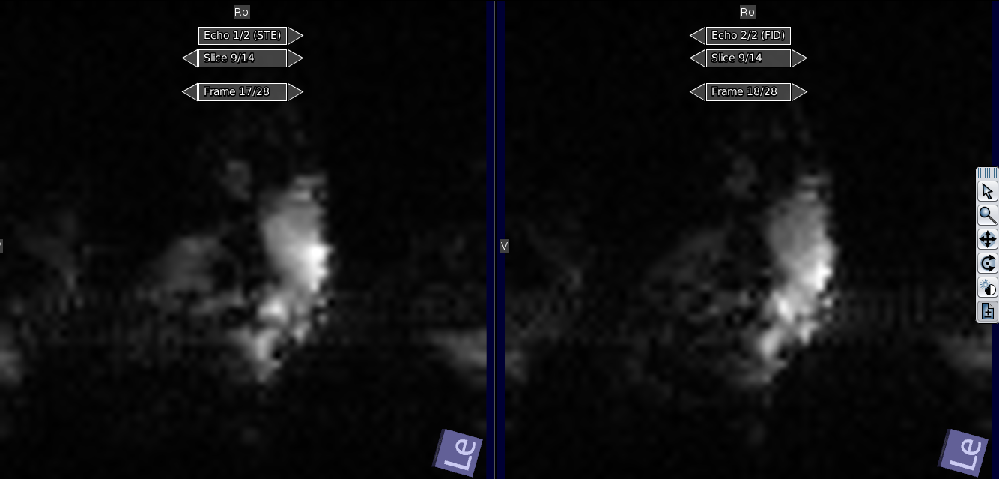

Ahora, convertimos esas imágenes usando `brkraw`. Las encontraremos como `Magnitude Image`, y veremos que tiene dos volúmenes.

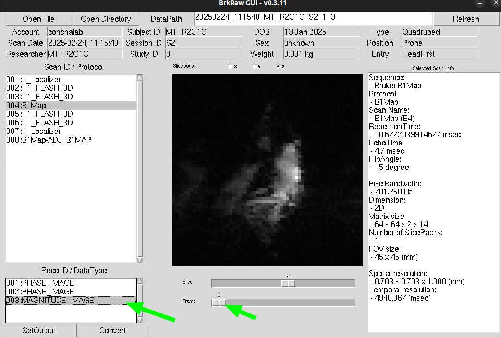


`brkraw` no lo convierte a 4D, sino que hace dos imágenes independientes. Para facilitarme la vida, voy a hacer unos links simbólicos para identificar quién es STE y quién es FID:

```bash
ln -s 250224_mt_r2g1c_s2_3_4_3_b1map-_e4_-01.nii.gz STE.nii.gz
ln -s 250224_mt_r2g1c_s2_3_4_3_b1map-_e4_-02.nii.gz fid.nii.gz
```

Ahora concatenamos estos dos volúmenes en un archivo 4D que llamaré `dream_file.nii.gz`:

```bash
mrcat -axis 3 fid.nii.gz ste.nii.gz dream_file.nii.gz
```

Usar `QUIT` para hacer B1map es muy sencillo:

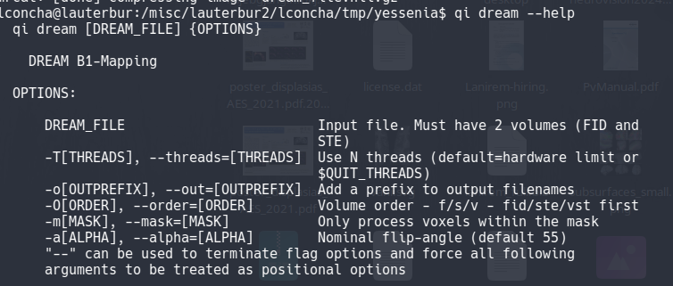

El ángulo nominal que nos pide lo podemos sacar con `brkraw` (si vemos la figura de arriba, notaremos que el _flip angle_ es 15).

Entonces, el comando queda:

```bash
qi dream dream_file.nii.gz --out=prefixdream --order=f -a 15
```

Esto es rapidísimo, y el resultado son dos archivos:

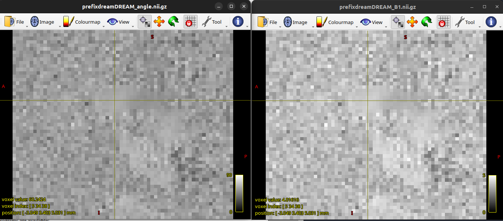