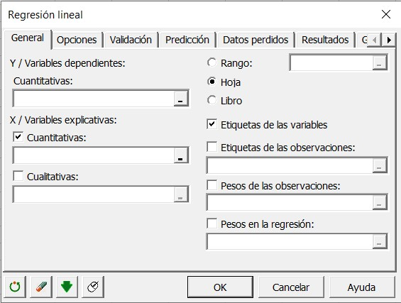
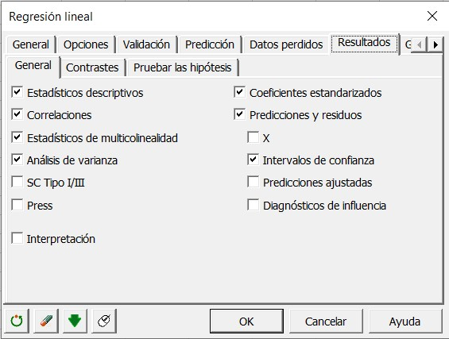
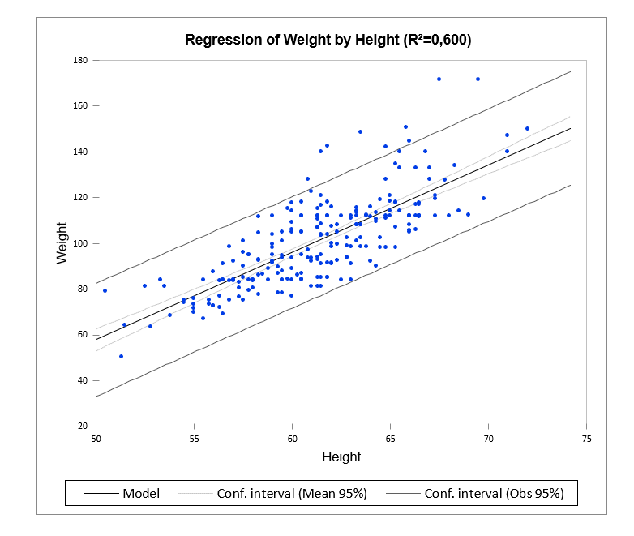

Regresión lineal de los mínimos cuadrados (OLS)
===============================================

https://www.xlstat.com/es/soluciones/funciones/regresion-lineal-de-los-minimos-cuadrados-ols

La regresión lineal de los mínimos cuadrados, también conocida como regresión lineal, es disponible en Excel usando el programa XLSTAT.

La regresión lineal de los mínimos cuadrados (en inglés OLS: Ordinary Least Squares regression) es un método común para estimar los coeficientes de las 
ecuaciones de regresión lineal que describen la relación entre una (o varias) variables independientes cuantitativas y una variable dependiente. Según el número 
de variables, podemos hacer una regresión simple o múltiple. Se llama regresión de los mínimos cuadrados por qué se basa en la minimización del error cuadrático. 
También podemos utilizar el método del máximo de verosimilitud y el estimador del método generalizado de momentos.

En la práctica, la regresión lineal se usa en varios dominios:

* meteorología, con la predicción de temperaturas o de la cantidad de lluvia basándose en factores externos

* biología, si tienes que predecir el número de individuos en una especie dependiendo en el número de predadores o la cantidad de recursos naturales

* economía, si tienes que predecir la facturación de una empresa basándose en la cantidad de ventas
* …y muchos otros

**Un poco de teoría: Ecuaciones para la regresión lineal de los cuadrados mínimos**

Fórmula de los cuadrados mínimos: ¿cuál es la ecuación del modelo?

En el caso de un modelo con p variables explicativas, el modelo de regresión OLS se escribe:

.. math::

   Y = \beta_0 + \sum_{j=1..p} \beta_j X_j + \varepsilon

Donde Y es la variable dependiente, :math:`\beta_0` el intercepto del modelo, :math:`X_j` la variable explicativa del modelo número j (entre 1 y p), y e el 
error aleatorio con 
esperanza 0 y varianza σ².

En el caso de n observaciones, la estimación del valor predicho de la variable dependiente Y para la observación número i es calculada así:

.. math::

   Y = \beta_0 + \sum_{j=1..p} \beta_j X_{ij} 

Ejemplo: Queremos predecir la altura de plantas según el número de días pasados en el sol. Antes de la exposición, miden 30 cm. Una planta crece de 1 mm (0.1 cm) 
después de un día de exposición.

* Y representa la altura de las plantas

* X representa el número de días pasados en el sol

* β0 es 30 por qué una planta mide 30 cm en el inicio

* β1 es 0.1 porque es el coeficiente que es multiplicado por el número de días

Así, una planta expuesta durante 5 días en el sol va a tener una altura aproxima de Y = 30 + 0.1*5 = 30.5 cm.

Las predicciones no son siempre exactas y por eso tenemos que tomar en cuenta el error aleatorio ε.

Además, antes de predecir, tenemos que encontrar los coeficientes β: empezamos con entrar una tabla que contiene las alturas de las plantas con el número de días 
pasados en el sol. Si quiere conocer las calculaciones en detalle, lea el próximo párrafo.

**¿Cómo funcionan los cuadrados mínimos?**

El método OLS tiene el objetivo de minimizar la suma de diferencias cuadras entre los valores observadas y predichas.

Así podemos estimar el vector β de los coeficientes:

.. math::

   \beta = (X'DX)^{-1}X'Dy

con X la matriz de variables explicativas precedida por un vector de 1s, D la matriz diagonal de los pesos w_i, y el vector de los n valores observados de la 
variable dependiente

Así podemos escribir el vector de los valores predichos:

.. math::

   y* = X \beta = X(X'DX)^{-1}X'Dy

También podemos calcular la varianza σ² del error aleatorio ε con la fórmula siguiente:

.. math::

   \sigma^2 = \frac{1}{W-p*} \sum_{i=1...n} w_i(y_i - y*_i)

p* es el número de variables explicativas mas 1 si el intercepto no es definido, w_i es el peso de la observación numero i, W es la suma de los pesos de todas 
las observaciones, y es el vector de los valores observadas, y el vector de los valores predichas.

**¿Cuál es la explicación intuitiva del método de los cuadrados mínimos?**

De manera intuitiva, el objetivo del método de los cuadrados mínimos es minimizar el error de predicción entre los valores reales y predichos. Podemos 
preguntarnos por qué minimizar la suma de los errores cuadrados en vez de la suma directa de los errores.

Tenemos en cuenta la suma de los errores cuadrados en vez de los errores porque a veces pueden ser negativas y entonces la suma podría acercarse de 0.

Por ejemplo, si sus valores reales son 2, 3, 5, 2 y 4 y sus valores predichos son 3, 2, 5, 1, 5, la suma de los errores es 
(3-2)+(2-3)+(5-5)+(1-2)+(5-4)=1-1+0-1+1=0 y el error medio es 0/5=0, que podría causar conclusiones falsas.

Si calculamos el error medio cuadrático, obtenemos (3-2)^2+(2-3)^2+(5-5)^2+(1-2)^2+(5-4)^2=4 y 4/5=0.8. Calculando la raíz cuadrática para volver a la escala de 
los datos, obtenemos sqrt(0.8)=0.89, y así en medio las predicciones varían de 0.89 en comparación con el valor real.

**¿Cuáles son las suposiciones para la regresión lineal?**

1. Los individuos (observaciones) son independientes. En general, es verdadero en las situaciones diarias (la cantidad de lluvia no depende del dia precedente, 
el 
salario no depende del mes anterior, y la altura de una persona no depende de la última persona medida antes).

2. La varianza es homogénea. En XLSTAT se propone la prueba de Levene para probar la igualdad de las varianzas de los errores.

3. Los residuos siguen una distribución normal. XLSTAT ofrece varios métodos para probar la normalidad de los residuos.

Los residuos del modelo (o los errores) son las diferencias entre los datos y los valores predichos con el modelo ajustado. Los residuos representen la parte de 
variabilidad explicada por el modelo. Los residuos bajan mientras el R² aumenta.

La homoscedasticidad y la independencia de los términos de error son hipótesis claves en una regresión lineal donde se asume que las varianzas de los términos de 
error son independientes e idénticamente distribuidos según una distribución normal. Cuando no son verdaderas estas suposiciones, una de las consecuencias es que 
no podemos estimar la matriz de covarianza usando la fórmula clásica, y la varianza de parámetros correspondiendo a los coeficientes beta del modelo lineal con 
también sus intervalos de confianza pueden ser falsos.

**¿Como configurar el modelo de regresión lineal en XLSTAT?**

En XLSTAT, es fácil lanzar su análisis ordinario de cuadrados mínimos sin programar, únicamente con selección de datos! Solo tiene que seleccionar su variable 
dependiente y sus variables explicativas.

Puede seleccionar varios resultados como Estadísticas descriptivas de tus datos, pero también Correlaciones y Análisis de la Varianza.

Aparte de las estadísticas y de la ecuación del modelo, también puede seleccionar los gráficos dados por XLSTAT, como por ejemplo lo de la regresión. En este 
gráfico puede ver todos los datos y la línea central de regresión con un intervalo de confianza.

**Predicciones con la regresión lineal de los mínimos cuadrados en XLSTAT**

La regresión lineal se usa a menudo para predecir las valores para nuevos juegos de datos. XLSTAT te permite hacer la caracterización de la cualidad del modelo 
para la predicción antes de utilizar el modelo para predecir.

**Ir adelante: limitaciones de la regresión lineal de los cuadrados mínimos**

Las limitaciones de la regresión OLS provienen de la necesidad de invertir la matriz X’X: se requiere que el rango de la matriz sea p+1, y si no es el caso, 
algunos problemas numéricos pueden aparecer. XLSTAT emplea algoritmos como el de Dempster (1969) que permiten de solucionar este problema. Si el rango de la 
matriz es menor qué p+1, algunas variables se remueven del modelo, porque son constantes o porque pertenecen a un bloc de variables colineales.

**Cuáles son las ventajas de la regresión lineal: selección de variables**

Una selección automática de variables se hace si el usuario selecciona un número de variables más mayor qué el número de observaciones. El límite teórico es n-1, 
y con valores más grandes la matriz X’X llega a ser non-invertible.

La supresión de algunas variables también puede ser no optimal: en algunos casos, es posible que no añadamos una variable al modelo porque es casi colineal a 
otros variables o a un bloc de variables, pero sería más relevante remover una variable que ya está en el modelo y añadir la nueva variable.

Por esta razón, y también para los casos en los cuales hay muchas variables exploratorias, otros métodos han sido desarrollados como el método de los cuadrados 
mínimos parciales (PLS).

**Guías para la regresión lineal de los cuadrados mínimos**

Abajo encontrarás una lista de ejemplos utilizando regresión lineal de los cuadrados mínimos:

* Un modelo de regresión lineal simple

* Un modelo de regresión lineal múltiple

