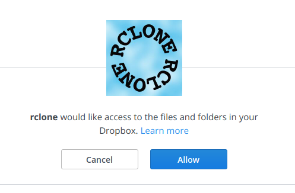

rclone
======

`rclone <https://rclone.org/>`_  te permite montar tu dropbox, google drive, amazon S3 y servicios similares como una carpeta local en linux!

Todas las máquinas del cluster ya tienen instalado rclone. Para verificarlo, escribe ``rclone`` en la terminal y debería mostrar las instrucciones y opciones. Si no lo hace, entonces avisa.

En la  `pagina de rclone <https://rclone.org/overview/>`_  encontrarás instrucciones sobre cómo montar una gran variedad de servicios. Todos son similares, así que aquí pondremos el ejemplo de cómo configurar Dropbox y cómo montarlo. Asumimos, por supuesto, que ya tienes cuenta en dropbox.

Configuración de rclone
----------------------------------------

1. Configuramos rclone
``rclone config``

2. Seleccionamos ``New remote``. Lo bautizaremos como ``dropbox`` (ojo, sensible a mayúsculas/minúsculas, yo decidí en minúsculas).

3. Aparecerá la lista de servicios que rclone conoce. Selecciono el número que corresponde a dropbox.

4. Nos pregunta por ``client_id``, y lo dejamos en blanco (presionamos Enter), y lo mismo para ``client_secret``. Cuando nos pregunte si queremos entrar a advanced config le decimos que ``n`` (o sea _nel_, en español). 

5. Cuando pregunta si queremos ``auto config`` le decimos que ``y``. 

6. Se abrirá nuestro navegador de internet de manera mágica, con una pantalla como:

7. Finalmente le decimos que ``y`` a cuando nos pregunte si todo está bien.

8. Salimos de la configuración con ``q``.

Montar Dropbox mediante rclone
----------------------------------------

1. Designamos un lugar dónde montarlo y creamos el directorio, en caso necesario. En mi caso, montaré en ``/misc/mansfield/lconcha/nobackup/mnt_dropbox``. Para facilitarme la vida, corro estos comandos:

.. code:: Bash

   dropbox_mount=/misc/mansfield/lconcha/nobackup/mnt_dropbox
   mkdir $dropbox_mount
   
>  :warning: La carpeta está adentro de una carpeta llamada **``nobackup``**. Ya sabes por qué, verdad? Si no sabes, consulta la entrada de [[Clúster]]
>  :warning: Si alguna vez lconcha se encuentra una carpeta de éstas montada en algún lugar _respaldable_ habrá  `consecuencias graves <https://media.giphy.com/media/ToMjGpIYtgvMP38WTFC/source.gif>`_ .

2. Monto Dropbox en ``dropbox_mount``:

.. code:: Bash

   rclone mount dropbox: $dropbox_mount
 
Se tarda unos segundos, pero ahora ya podemos ver los archivos adentro de esa carpeta, utilizando la terminal o cualquier gestor de archivos. Nota que el comando se queda _colgado_, eso quiere decir que está montado dropbox. Si cancelas ese comando, se desmonta dropbox.

3. Desmontar es fácil. Simplemente tecleamos ``Ctrl+c`` en la terminal. Si alguna vez te da algún problema, la manera manual de desmontar es:

.. code:: Bash

   fusermount -u $dropbox_mount
