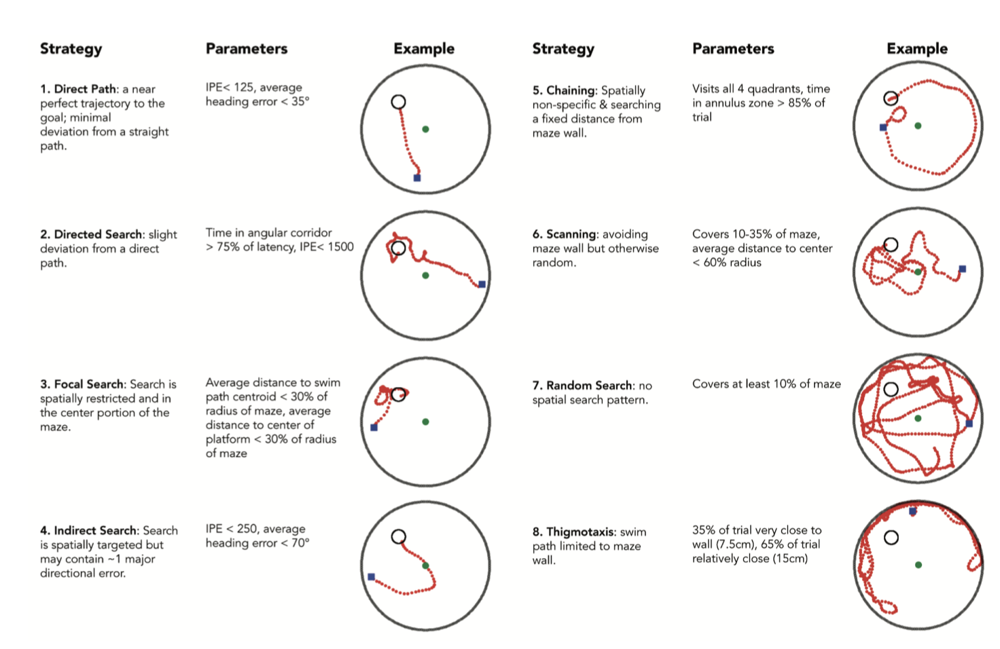
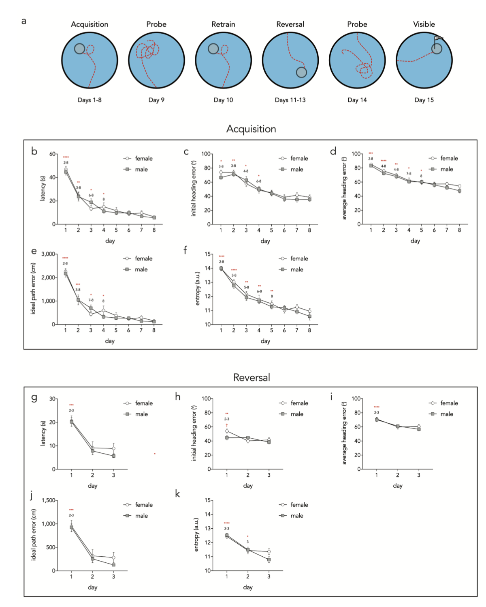
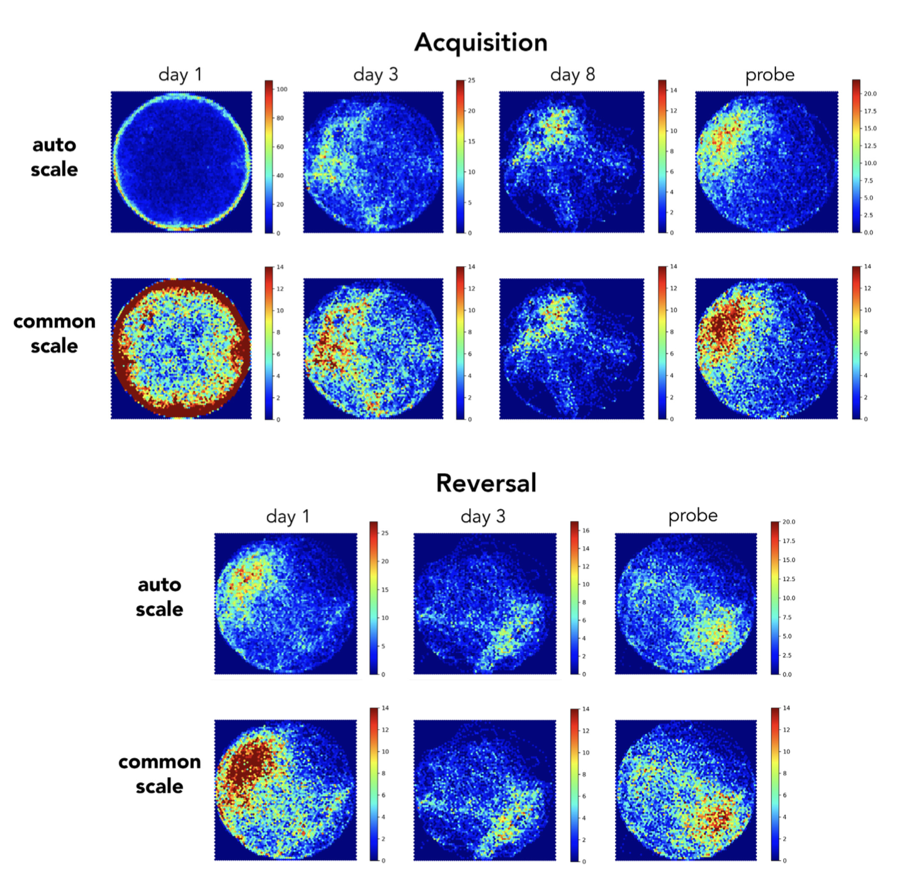

Pathfinder: open source software for analyzing spatial navigation search strategies
=======================================================

**Abstract**

Spatial navigation is a universal behavior that varies depending on goals, experience and 
available sensory stimuli. Spatial navigational tasks are routinely used to study learning, memory 
and goal-directed behavior, in both animals and humans. One popular paradigm for testing spatial 
memory is the Morris water maze, where subjects learn the location of a hidden platform that offers 
escape from a pool of water. Researchers typically express learning as a function of the latency to 
escape, though this reveals little about the underlying navigational strategies. Recently, a number 
of studies have begun to classify water maze search strategies in order to clarify the precise 
spatial and mnemonic functions of different brain regions, and to identify which aspects of spatial 
memory are disrupted in disease models. However, despite their usefulness, strategy analyses have 
not been widely adopted due to the lack of software to automate analyses. 

La navegación espacial es un comportamiento universal que varía según los objetivos, la experiencia 
y los estímulos sensoriales disponibles. Las tareas de navegación espacial se utilizan 
habitualmente para estudiar el aprendizaje, la memoria y el comportamiento dirigido a objetivos, 
tanto en animales como en humanos. Un paradigma popular para evaluar la memoria espacial es el 
laberinto acuático de Morris, donde los sujetos aprenden la ubicación de una plataforma oculta que 
les permite escapar de una piscina. Los investigadores suelen expresar el aprendizaje en función 
del tiempo de latencia para escapar, aunque esto revela poco sobre las estrategias de navegación 
subyacentes. Recientemente, varios estudios han comenzado a clasificar las estrategias de búsqueda 
en el laberinto acuático para esclarecer las funciones espaciales y mnemónicas precisas de 
diferentes regiones cerebrales e identificar qué aspectos de la memoria espacial se ven afectados 
en modelos de enfermedades. Sin embargo, a pesar de su utilidad, los análisis de estrategias no se 
han adoptado ampliamente debido a la falta de software para automatizarlos.

To address this need we 
developed Pathfinder, an open source application for analyzing spatial navigation behaviors. In a 
representative dataset, we show that Pathfinder effectively characterizes the development of 
highly-specific spatial search strategies as male and female mice learn a standard spatial water 
maze. Pathfinder can read data files from commercially- and freelyavailable software packages, is 
optimized for classifying search strategies in water maze paradigms, and can also be used to 
analyze 2D navigation by other species, and in other tasks, as long as timestamped xy coordinates 
are available. Pathfinder is simple to use, can automatically determine pool and platform geometry, 
generates heat maps, analyzes navigation with respect to multiple goal locations, and can be 
updated to accommodate future developments in spatial behavioral analyses. Given these features, 
Pathfinder may be a useful tool for studying how navigational strategies are regulated by the 
environment, depend on specific neural circuits, and are altered by pathology.

Para abordar esta necesidad, desarrollamos Pathfinder, una aplicación de código abierto para el 
análisis de comportamientos de navegación espacial. En un conjunto de datos representativo, 
demostramos que Pathfinder caracteriza eficazmente el desarrollo de estrategias de búsqueda 
espacial altamente específicas a medida que ratones machos y hembras aprenden un laberinto acuático 
espacial estándar. Pathfinder puede leer archivos de datos de paquetes de software comerciales y 
gratuitos, está optimizado para clasificar estrategias de búsqueda en paradigmas de laberinto 
acuático y también puede utilizarse para analizar la navegación 2D de otras especies y en otras 
tareas, siempre que se disponga de coordenadas xy con marca de tiempo. Pathfinder es fácil de usar, 
puede determinar automáticamente la geometría de la piscina y la plataforma, genera mapas de calor, 
analiza la navegación con respecto a múltiples ubicaciones objetivo y puede actualizarse para 
incorporar futuros avances en análisis de comportamiento espacial. Gracias a estas características, 
Pathfinder puede ser una herramienta útil para estudiar cómo las estrategias de navegación están 
reguladas por el entorno, dependen de circuitos neuronales específicos y se ven alteradas por 
patologías.

**Updates from Version 1**

We have updated Pathfinder in order to be more robust, easy to use, and more versatile. These 
updates include a new View Pane on the main window which displays the current user-defined 
parameters. This allows users to quickly see what they are changing in order to more accurately set 
desired classification limits. We have also added a ‘Define Software’ feature which allows users to 
import data that we have not explicitly implemented support for. Pathfinder now accepts data from 
any output as long as the .csv or .xlsx output contains columns for the x-coordinate, y-coordinate, 
and time. The new features were developed by Ricky Ma, who has therefore been added as an author in 
this updated version of the publication. Finally, we have added a relaxed focal search parameter, 
semi-focal search.

Hemos actualizado Pathfinder para que sea más robusto, fácil de usar y versátil. Estas 
actualizaciones incluyen un nuevo panel de visualización en la ventana principal que muestra los 
parámetros definidos por el usuario. Esto permite a los usuarios ver rápidamente los cambios 
realizados para establecer con mayor precisión los límites de clasificación deseados. También hemos 
añadido la función «Definir software», que permite importar datos para los que no hemos 
implementado compatibilidad explícita. Pathfinder ahora acepta datos de cualquier formato de 
salida, siempre que el archivo .csv o .xlsx contenga columnas para las coordenadas x e y, y la 
hora. Las nuevas funciones fueron desarrolladas por Ricky Ma, quien, por lo tanto, se ha añadido 
como autor en esta versión actualizada de la publicación. Finalmente, hemos añadido un parámetro de 
búsqueda focal relajada: la búsqueda semifocal.

This, like all previous parameters, is an optional Search Strategy for Pathfinder to classify 
trials into. Updates to Pathfinder are available on our GitHub https://github.com/MatthewBCooke/ 
Pathfinder, where you can download the most up-to-date version of the software.

**Any further responses from the reviewers can be found at the end of the article**

**Introduction**

All living organisms move throughout space to survive. Amongst mammals, there is a diversity of 
spatial behaviors that depend on numerous factors such as anxiety1 , 2 , learning3 , and the nature 
and pattern of stimuli that predict goals4 – 6 . Given rodents’ natural propensity to explore 
stimuli and environments, an array of rodent navigational tasks have been developed to investigate 
how various brain regions interact to control goaldirect behavior7 . This has routinely been 
conducted using fixed-trajectory mazes such as the T-maze or radial maze. While these dry maze 
paradigms offer the convenience of fixed choice points that reduce ambiguity associated with 
classifying decisions and navigational responses, they cannot be used to study patterns of 
exploration in open environments.

Todos los organismos vivos se desplazan por el espacio para sobrevivir. Entre los mamíferos, existe 
una diversidad de comportamientos espaciales que dependen de numerosos factores, como la 
ansiedad1,2, el aprendizaje3 y la naturaleza y el patrón de los estímulos que 
predicen los objetivos4-6. Dada la propensión natural de los roedores a explorar 
estímulos y entornos, se ha desarrollado una variedad de tareas de navegación para investigar cómo 
interactúan diversas regiones cerebrales para controlar el comportamiento dirigido a 
objetivos7. Esto se ha llevado a cabo habitualmente utilizando laberintos de trayectoria 
fija, como el laberinto en T o el laberinto radial. Si bien estos paradigmas de laberintos secos 
ofrecen la conveniencia de puntos de decisión fijos que reducen la ambigüedad asociada con la 
clasificación de decisiones y respuestas de navegación, no se pueden utilizar para estudiar 
patrones de exploración en entornos abiertos.

A popular approach for studying free navigation in animals has been the water maze, where rodents 
learn the location of a hidden escape platform in a pool of water based on distal and/or local cue 
configurations 3 Early studies validated the usefulness of the water maze for studying spatial 
processing and described progressive stages of learning where a rodent searches for the platform 
with increasing spatial specificity8 , 9 . The vast majority of studies have since used escape 
latency or path length as primary measures of spatial learning. However, water maze navigation is 
unconstrained and animals can solve the task using different strategies that may not always differ 
in terms of the time it takes to reach the platform8 , 9 . Thus, while latency and path length 
measures are convenient, they discard a rich amount of behavioral data.

Un método popular para estudiar la navegación libre en animales ha sido el laberinto acuático, 
donde los roedores aprenden la ubicación de una plataforma de escape oculta en un estanque 
basándose en configuraciones de señales distales y/o locales.3 Estudios iniciales 
validaron la utilidad del laberinto acuático para estudiar el procesamiento espacial y describieron 
etapas progresivas de aprendizaje en las que el roedor busca la plataforma con una especificidad 
espacial cada vez mayor.8,9 La gran mayoría de los estudios posteriores han utilizado la 
latencia de escape o la longitud del recorrido como medidas principales del aprendizaje espacial. 
Sin embargo, la navegación en el laberinto acuático no está restringida y los animales pueden 
resolver la tarea utilizando diferentes estrategias que no siempre difieren en el tiempo que tardan 
en alcanzar la plataforma.8,9 Por lo tanto, si bien las medidas de latencia y longitud 
del recorrido son convenientes, descartan una gran cantidad de datos conductuales.

Over the years, a number of groups have described manual and automated methods for classifying 
search strategies used by animals and humans in water maze experiments8 , 10 – 19 . By 
mathematically relating the swim path to features of the maze environment one can identify and 
quantify the types of search strategies employed. Search strategy analyses have
revealed that the ventral hippocampus is involved in coarse spatial goal-directed search16 , that 
adult neurogenesis promotes spatially precise search20 , and that spatially accurate search is 
reduced in humans with, and/or animal models of, Alzheimer’s disease21 , 22 , autism23 , traumatic 
brain injury 22 , 24 and aging14 , 25 . Despite the utility of these analyses they have been 
relatively uncommon to date, likely because commercially-available software packages often do not 
perform these analyses and the analytic methods used in previous work are not typically available 
in the form of an easy-to-use software package.

A lo largo de los años, diversos grupos han descrito métodos manuales y automatizados para 
clasificar las estrategias de búsqueda empleadas por animales y humanos en experimentos con 
laberintos acuáticos8, 10-19. Al relacionar matemáticamente la trayectoria de nado con 
las características del entorno del laberinto, es posible identificar y cuantificar los tipos de 
estrategias de búsqueda utilizadas. Los análisis de estrategias de búsqueda han revelado que el 
hipocampo ventral participa en la búsqueda espacial general dirigida a un objetivo16, 
que la neurogénesis adulta promueve la búsqueda espacialmente precisa20 y que la 
búsqueda espacialmente precisa se reduce en humanos con enfermedad de Alzheimer y/o en modelos 
animales de estas enfermedades21, 22, autismo23, traumatismo 
craneoencefálico22, 24 y envejecimiento14, 25. A pesar de la utilidad de 
estos análisis, hasta la fecha han sido relativamente poco comunes, probablemente porque los 
paquetes de software disponibles comercialmente a menudo no realizan estos análisis y los métodos 
analíticos empleados en trabajos anteriores no suelen estar disponibles en forma de un software 
fácil de usar.

To facilitate the study of navigational search strategies, whether in the water maze or other 
2-dimensional navigational paradigms, we created a new software application called Pathfinder. 
Pathfinder is a Python-based, open source tool with an intuitive graphical user interface and 
adjustable parameters for conducting detailed analyses of spatial search patterns. We validate 
Pathfinder with a mouse water maze dataset, where we find that male and female mice develop 
increasingly specific and direct spatial search strategies with additional days of training.

Para facilitar el estudio de las estrategias de búsqueda espacial, tanto en el laberinto acuático 
como en otros paradigmas de navegación bidimensionales, creamos una nueva aplicación de software 
llamada Pathfinder. Pathfinder es una herramienta de código abierto basada en Python, con una 
interfaz gráfica de usuario intuitiva y parámetros ajustables para realizar análisis detallados de 
patrones de búsqueda espacial. Validamos Pathfinder con un conjunto de datos de un laberinto 
acuático con ratones, donde observamos que tanto los ratones machos como las hembras desarrollan 
estrategias de búsqueda espacial cada vez más específicas y directas con el aumento de los días de 
entrenamiento.

**Methods** 

**Installation and dependencies**

 Pathfinder is freely available under the GNU General 
Public 
License version 3.0.

Detailed instructions on use and installation of the program can be found on Github at 
github.com/MatthewBCooke/ Pathfinder. We recommend installing Anaconda for Python 3, as it includes 
all of the following packages that are needed to run Pathfinder: PIL 
(https://pillow.readthedocs.io/en/ latest/), xlrd (https://xlrd.readthedocs.io/en/latest/), numpy 
(https://www.numpy.org), pickle (https://docs.python.org/3/ library/pickle.html), scipy 
(https://www.scipy.org), matplotlib (https://matplotlib.org), and tkinter (https://wiki.python.org/ 
moin/TkInter). The MATLAB engine is optional and needs to be installed separately for entropy 
calculations (MATLAB and Statistics Toolbox Release 2018b, The MathWorks, Inc., Natick, 
Massachusetts, United States). Once Anaconda is installed, Pathfinder can be downloaded via Github 
or by typing “pip install jsl-pathfinder” in a shell window (i.e. Mac terminal or Windows command 
line). Pathfinder is then opened by typing “pathfinder” into the shell window and pressing return.

Encontrará instrucciones detalladas sobre el uso e instalación del programa en GitHub: 
github.com/MatthewBCooke/Pathfinder. Recomendamos instalar Anaconda para Python 3, ya que incluye 
todos los paquetes necesarios para ejecutar Pathfinder: PIL 
(https://pillow.readthedocs.io/en/latest/), xlrd (https://xlrd.readthedocs.io/en/latest/), numpy 
(https://www.numpy.org), pickle (https://docs.python.org/3/library/pickle.html), scipy 
(https://www.scipy.org), matplotlib (https://matplotlib.org) y tkinter 
(https://wiki.python.org/moin/TkInter). El motor de MATLAB es opcional y debe instalarse por 
separado para los cálculos de entropía (MATLAB y Statistics Toolbox Release 2018b, The MathWorks, 
Inc., Natick, Massachusetts, Estados Unidos). Una vez instalado Anaconda, Pathfinder se puede 
descargar desde GitHub o escribiendo «pip install jsl-pathfinder» en una ventana de terminal (por 
ejemplo, la terminal de Mac o la línea de comandos de Windows). Para abrir Pathfinder, escriba 
«pathfinder» en la ventana de terminal y pulse Intro.

**General usage**

Pathfinder has a simple, user-friendly interface for extracting information from 
spatial navigation tracking files that contain xy coordinates over time (Figure 1). While it can be 
used to analyze multiple types of 2D navigational data, it is optimized for rodent spatial water 
maze experiments and accepts inputs from commonly-used commercial tracking software, including 
Ethovison (Noldus), Anymaze (Stoelting) and WaterMaze (Actimetrics). Inputs can also be defined 
using the ‘Define..’ button. This allows the user to input files from other tracking systems or 
modified versions of supported output files. Pathfinder can also open files exported from the open 
source tracking software, ezTrack26 , enabling a cost-effective and
fully open source workflow for detailed water maze behavioral analyses. Trial information from 
these programs are outputted in CSV or Excel format, which can then be inputted into Pathfinder 
through the File menu. The experimental setup is specified in the main window (Figure 1a). 
Pathfinder can automatically calculate the position and size of the maze and the goal location 
(provided they are constant across trials), or these parameters can be entered manually.

Pathfinder cuenta con una interfaz sencilla e intuitiva para extraer información de archivos de 
seguimiento de navegación espacial que contienen coordenadas xy a lo largo del tiempo (Figura 1). 
Si bien puede utilizarse para analizar diversos tipos de datos de navegación 2D, está optimizado 
para experimentos con laberintos acuáticos espaciales en roedores y acepta entradas de software de 
seguimiento comercial de uso común, como Ethovison (Noldus), Anymaze (Stoelting) y WaterMaze 
(Actimetrics). Las entradas también pueden definirse mediante el botón «Definir…». Esto permite al 
usuario importar archivos de otros sistemas de seguimiento o versiones modificadas de archivos de 
salida compatibles. Pathfinder también puede abrir archivos exportados desde el software de 
seguimiento de código abierto ezTrack26, lo que permite un flujo de trabajo rentable y totalmente 
de código abierto para análisis detallados del comportamiento en laberintos acuáticos. La 
información de los ensayos de estos programas se exporta en formato CSV o Excel, que luego puede 
importarse a Pathfinder a través del menú Archivo. La configuración experimental se especifica en 
la ventana principal (Figura 1a). Pathfinder puede calcular automáticamente la posición y el tamaño 
del laberinto y la ubicación del objetivo (siempre que sean constantes en todos los ensayos), o 
estos parámetros pueden introducirse manualmente.

.. imagen:: a1.png

Figure 1. Graphical user interface and setting parameters. a) Screenshot of the main application 
window, where maze geometry is defined, and input and output settings are established. On the right 
there is a live view of the parameters defined. b) Maze schematic and geometry for defining 
variables. The chaining corridor is centered on the goal platform and extends throughout all 4 
quadrants; its width is specified in the main window. The larger thigmotaxis zone is specified in 
the main window; Pathfinder calculates the smaller thigmotaxis zone as half the width. Heading 
error is the angular distance between the actual path direction and a straight line to the goal 
(Pathfinder calculates average heading error at all points; only a single example shown). The 
angular corridor is used to define the directed search strategy, which depends on the accuracy of 
the animal’s trajectory as it approaches the platform. The width of the corridor (in degrees) is 
specified in the main window and is centered on the goal. c) Schematic of the Ideal Path Error 
(IPE) metric. The distance from the platform is measured at each timepoint provided by the tracking 
software (actual path; only a fraction of distances shown for clarity) to provide a cumulative 
distance measure. Assuming the same swim speed as the actual path, distances are similarly summed 
from the ideal path, to provide a cumulative ideal path measure. The ideal cumulative distance is 
subtracted from the actual cumulative distance to generate the IPE. d) Parameter bounds are entered 
in the settings window. e) The manual categorization window, for viewing trial paths and manually 
categorizing strategies.

Figura 1. Interfaz gráfica de usuario y configuración de parámetros. a) Captura de pantalla de la 
ventana principal de la aplicación, donde se define la geometría del laberinto y se establecen los 
parámetros de entrada y salida. A la derecha se muestra una vista en tiempo real de los parámetros 
definidos. b) Esquema y geometría del laberinto para la definición de variables. El corredor de 
encadenamiento está centrado en la plataforma objetivo y se extiende por los cuatro cuadrantes; su 
anchura se especifica en la ventana principal. La zona de tigmotaxis mayor se especifica en la 
ventana principal; Pathfinder calcula la zona de tigmotaxis menor como la mitad de la anchura. El 
error de rumbo es la distancia angular entre la dirección real de la trayectoria y una línea recta 
hasta el objetivo (Pathfinder calcula el error de rumbo promedio en todos los puntos; solo se 
muestra un ejemplo). El corredor angular se utiliza para definir la estrategia de búsqueda 
dirigida, que depende de la precisión de la trayectoria del animal al aproximarse a la plataforma. 
La anchura del corredor (en grados) se especifica en la ventana principal y está centrada en el 
objetivo. c) Esquema de la métrica de Error de Trayectoria Ideal (ETI). La distancia desde la 
plataforma se mide en cada punto temporal proporcionado por el software de seguimiento (trayectoria 
real; solo se muestra una fracción de las distancias para mayor claridad) para obtener una medida 
de distancia acumulada. Suponiendo la misma velocidad de nado que en la trayectoria real, las 
distancias se suman de forma similar a la de la trayectoria ideal para obtener una medida de 
trayectoria ideal acumulada. La distancia acumulada ideal se resta de la distancia acumulada real 
para generar el IPE. d) Los límites de los parámetros se introducen en la ventana de configuración. 
e) La ventana de categorización manual permite visualizar las trayectorias de prueba y categorizar 
manualmente las estrategias.

Pathfinder relies on several variables that describe navigation relative to the pool and platform 
geometry: 1) Ideal Path Error (IPE): the summed error of the search path (Figure 1c). It is 
conceptually similar to the Cumulative Search Error (CSE) since it also measures proximity to the 
goal throughout the trial9 , 27 . An advantage of proximity measures is that they can distinguish 
two trials that have 
equivalent latencies/path lengths but differ in average distance to the platform. When calculating 
the IPE, the distance from the goal is measured at each time point in the trial and summed to 
generate a cumulative distance measure of the actual path (similar to CSE). In contrast to the CSE, 
the IPE is calculated by subtracting the cumulative ideal path distance from the cumulative actual 
path distance. The cumulative ideal path is simply the sum of all of the distances between the goal 
and the position of the animal if it swam along a straight line to escape, using the average 
velocity from the trial. 2) Heading error: the angular distance between the current path and a 
straight line to the goal location. The current path direction is defined by a line
connecting two temporally-adjacent xy coordinates. The average heading error is an average of all 
of the heading error values for the trial and the initial heading error is the average of the 
heading error values for the first second of the trial.

Pathfinder se basa en varias variables que describen la navegación en relación con la geometría de 
la piscina y la plataforma: 1) Error de Trayectoria Ideal (ETI): el error total de la trayectoria 
de búsqueda (Figura 1c). Es conceptualmente similar al Error de Búsqueda Acumulado (EBA), ya que 
también mide la proximidad al objetivo durante todo el ensayo9,27. Una ventaja de las 
medidas de proximidad es que permiten distinguir dos ensayos con latencias/longitudes de 
trayectoria equivalentes, pero con una distancia promedio diferente a la plataforma. Al calcular el 
ETI, se mide la distancia al objetivo en cada instante del ensayo y se suman los resultados para 
generar una medida de distancia acumulada de la trayectoria real (similar al EBA). A diferencia del 
EBA, el ETI se calcula restando la distancia acumulada de la trayectoria ideal de la distancia 
acumulada de la trayectoria real. La trayectoria ideal acumulada es simplemente la suma de todas 
las distancias entre el objetivo y la posición del animal si nadara en línea recta para escapar, 
utilizando la velocidad promedio del ensayo. 2) Error de rumbo: la distancia angular entre la 
trayectoria actual y una línea recta hacia la ubicación objetivo. La dirección de la trayectoria 
actual se define mediante una línea que une dos coordenadas xy adyacentes en el tiempo. El error de 
rumbo promedio es el promedio de todos los valores de error de rumbo del ensayo, y el error de 
rumbo inicial es el promedio de los valores de error de rumbo durante el primer segundo del ensayo.

Additional variables are user-defined on the main window:

3) Angular Corridor Width: the size of the angular navigational corridor (in degrees) that extends 
from the start location and widens towards the goal, centered on the goal location.

Ancho del corredor angular: el tamaño del corredor de navegación angular (en grados) que se 
extiende desde la ubicación inicial y se ensancha hacia el objetivo, centrado en la ubicación del 
objetivo.

4) Chaining Annulus Width: the width of the chaining annulus, a donut-shaped zone that is centered 
on the goal and spans all areas of the maze at a fixed distance from the maze wall.

Chaining Annulus Width: the width of the chaining annulus, a donut-shaped zone that is centered on 
the goal and spans all areas of the maze at a fixed distance from the maze wall.

5) Thigmotaxis zone size: the width of a zone that spans the perimeter of the maze and extends 
inward from the maze wall. Pathfinder also defines a “small” thigmotaxic zone that is half the 
width of this value. 6) Add goal: Pathfinder will perform all calculations and strategy analyses 
with respect to an unlimited number of goal locations. All of these variables are plotted on our 
View Pane on the right of the main window. This can be used to measure performance and characterize 
strategies with respect to multiple goal locations (e.g. during spatial reversal, spatial choice). 
Selecting “truncate trials” will artificially end the trials if/when the subject reaches the 
additional goal locations.

Tamaño de la zona de tigmotaxis: el ancho de una zona que abarca el perímetro del laberinto y se 
extiende hacia el interior desde la pared del laberinto. Pathfinder también define una zona de 
tigmotaxis "pequeña" que tiene la mitad del ancho de este valor. 6) Añadir objetivo: Pathfinder 
realizará todos los cálculos y análisis de estrategias con respecto a un número ilimitado de 
ubicaciones de objetivo. Todas estas variables se representan gráficamente en nuestro panel de 
visualización a la derecha de la ventana principal. Esto se puede utilizar para medir el 
rendimiento y caracterizar las estrategias con respecto a múltiples ubicaciones de objetivo (por 
ejemplo, durante la inversión espacial o la elección espacial). Seleccionar "truncar ensayos" 
finalizará artificialmente los ensayos si/cuando el sujeto alcance las ubicaciones de objetivo 
adicionales.

This is necessary, for example, to measure direct trajectories to a former goal location in a 
reversal paradigm (since the strategy will no longer meet direct path criteria if the former 
location in contacted and search continues elsewhere in the maze).

Esto es necesario, por ejemplo, para medir trayectorias directas hacia una ubicación objetivo 
anterior en un paradigma de inversión (ya que la estrategia ya no cumplirá con los criterios de 
ruta directa si se contacta con la ubicación anterior y la búsqueda continúa en otra parte del 
laberinto).

Once the variables are defined, boundaries must be set to establish the criteria for strategy 
categorization. Clicking “settings” will open up an additional window where strategy options can be 
selected and parameter bounds can be set (Figure 1d). Upon clicking “calculate”, Pathfinder 
categorizes trials into one of eight search strategies that are ordered according to the degree of 
spatial specificity (high to low): 1) direct path, 2) focal search, 3) directed search, 4) indirect 
search, 5) semifocal search, 6) chaining, 7) scanning, 8) random search, and 9) thigmotaxis. These 
categories are mutually exclusive and follow a defined order (1 to 9), but the user can opt to 
exclude strategies from the analysis. 

Una vez definidas las variables, deben establecerse los límites para determinar los criterios de 
categorización de las estrategias. Al hacer clic en «Configuración», se abrirá una ventana 
adicional donde se podrán seleccionar las opciones de estrategia y establecer los límites de los 
parámetros (Figura 1d). Al hacer clic en «Calcular», Pathfinder clasifica los ensayos en una de las 
ocho estrategias de búsqueda, ordenadas según su grado de especificidad espacial (de mayor a 
menor): 1) trayectoria directa, 2) búsqueda focal, 3) búsqueda dirigida, 4) búsqueda indirecta, 5) 
búsqueda semifocal, 6) encadenamiento, 7) escaneo, 8) búsqueda aleatoria y 9) tigmotaxis. Estas 
categorías son mutuamente excluyentes y siguen un orden definido (del 1 al 9), pero el usuario 
puede optar por excluir estrategias del análisis.

Thus, Pathfinder determines, in a stepwise fashion, whether a 
given trial fulfills the criteria for direct swim. If so, it moves on to categorize the next trial. 
If not, it determines whether the trial fits the subsequent strategy, and so on. The strategies and 
their parameters are shown in Figure 2. In the output file (.csv), each trial is categorized and 
the following additional metrics are provided: latency and distance travelled
to reach the goal, average distance from the goal, percent of maze traversed, velocity, initial and 
average heading error and IPE. Pathfinder also has the ability to calculate the entropy for each 
trial, a measure of disorder in the path, relative to the goal location. The entropy calculation 
calls the MATLAB engine and requires a MATLAB license. Entropy measures the performance by looking 
at a shift from more disordered swimming (high entropy) to more spatially strategic paths (low 
entropy), and has been previously found to be highly sensitive to water maze search performance28 . 
Due to the manipulation of large matrices, calculating the entropy of trials is very slow.

Así, Pathfinder determina, de forma secuencial, si un intento cumple los criterios para la natación 
directa. De ser así, procede a categorizar el siguiente intento. De no ser así, determina si el 
intento se ajusta a la estrategia subsiguiente, y así sucesivamente. Las estrategias y sus 
parámetros se muestran en la Figura 2. En el archivo de salida (.csv), cada intento se categoriza y 
se proporcionan las siguientes métricas adicionales: latencia y distancia recorrida para alcanzar 
la meta, distancia promedio desde la meta, porcentaje del laberinto recorrido, velocidad, error de 
rumbo inicial y promedio, e IPE (error de rumbo inicial y promedio). Pathfinder también puede 
calcular la entropía de cada intento, una medida del desorden en la trayectoria con respecto a la 
ubicación de la meta. El cálculo de la entropía utiliza el motor de MATLAB y requiere una licencia 
de MATLAB. La entropía mide el rendimiento observando un cambio desde una natación más desordenada 
(alta entropía) hacia trayectorias más estratégicas espacialmente (baja entropía), y se ha 
demostrado que es altamente sensible al rendimiento en la búsqueda en laberintos 
acuáticos28. Debido a la manipulación de matrices grandes, el cálculo de la entropía de 
los ensayos es muy lento.

Figure 2. Search strategies and associated parameters. Pathfinder categorizes each trial according 
to 1 of 9 possible strategies. Categorization proceeds sequentially in the order shown (unless some 
strategies are excluded from the analysis). Semi-focal search (notshown), a more relaxed 
focal-search, is classified 5 th after indirect search. For example, for a trial to be classified 
as Random Search, the path must cover a minimum proportion of the maze and not fit any of the 
criteria for strategies 1–7. In the examples shown, the blue square indicates the start point and 
the green circle indicates the middle of the pool. Parameter settings are those used in the present 
study and should be adjusted depending on changes to testing procedures and maze geometry.

Figura 2. Estrategias de búsqueda y parámetros asociados. Pathfinder clasifica cada ensayo según 
una de las nueve estrategias posibles. La clasificación se realiza secuencialmente en el orden 
mostrado (a menos que se excluyan algunas estrategias del análisis). La búsqueda semifocal (no se 
muestra), una búsqueda focal menos estricta, se clasifica en quinto lugar después de la búsqueda 
indirecta. Por ejemplo, para que un ensayo se clasifique como Búsqueda Aleatoria, la ruta debe 
cubrir una proporción mínima del laberinto y no cumplir con ninguno de los criterios de las 
estrategias 1 a 7. En los ejemplos mostrados, el cuadrado azul indica el punto de inicio y el 
círculo verde indica el centro del laberinto. Los parámetros utilizados son los del presente 
estudio y deben ajustarse según los cambios en los procedimientos de prueba y la geometría del 
laberinto.

Occasionally, some trials cannot be categorized. The user therefore has the option to manually 
categorize uncategorized trials, by selecting this option on the main window. Additionally, there 
is an option to manually categorize all trials. Here, Pathfinder provides an image of the trial as 
well as shortcut keys to select the appropriate strategy. The software will also display the 
strategy it had automatically categorized for the displayed trial. Manual categorization will not 
overwrite the automatic categorization but will be displayed separately in the output file. This 
allows for comparison between the automatically calculated and user-selected strategy.

En ocasiones, algunos ensayos no se pueden categorizar. Por lo tanto, el usuario tiene la opción de 
categorizar manualmente los ensayos no categorizados seleccionando esta opción en la ventana 
principal. Además, existe la opción de categorizar manualmente todos los ensayos. En este caso, 
Pathfinder muestra una imagen del ensayo y teclas de acceso directo para seleccionar la estrategia 
adecuada. El software también mostrará la estrategia que categorizó automáticamente para el ensayo 
en cuestión. La categorización manual no sobrescribe la categorización automática, sino que se 
muestra por separado en el archivo de salida. Esto permite comparar la estrategia calculada 
automáticamente con la seleccionada por el usuario.

In addition to strategy categorization, Pathfinder will also create heatmaps as a useful visual 
representation of groups of trials. This is accomplished by counting the number of times animal(s) 
visit each bin in a hexagonal array that is overlaid on the maze (bin size is user-defined). The 
range of colors (cool to warm) can be automatically set to occupy the full scale. Alternatively, 
the user can manually set the maximum, above which all bins will read the hottest.

Además de la categorización de estrategias, Pathfinder también crea mapas de calor como una útil 
representación visual de grupos de ensayos. Esto se logra contando el número de veces que el animal 
(o los animales) visita cada contenedor en una matriz hexagonal superpuesta al laberinto (el tamaño 
de los contenedores lo define el usuario). La gama de colores (de fríos a cálidos) puede 
configurarse automáticamente para ocupar toda la escala. Como alternativa, el usuario puede 
establecer manualmente el máximo, por encima del cual todos los contenedores mostrarán la 
temperatura más alta.

**Validation of Pathfinder**

**Animals.** 

A group of 35 C57BL/6J mice (18 male, 17 female) were used in 
this experiment (Jackson Laboratories, Bar Harbor, Maine). Relative to commonly-used samples sizes 
of 8–10 mice/group, a large cohort was used to maximize reliability and detect potentially 
infrequent strategies. Mice were housed in same-sex groups (2–4/cage) in polyethylene cages (30 × 
19 × 13cm) with pine chip bedding and a small tube and food and water available ad-libitum. Mice 
were housed under a reversed light-dark cycle (lights off 8:00am–8:00pm) and completed water-maze 
testing in the dark phase. Mice were first tested on the Barnes maze 29 and were 18 weeks old when 
tested on the water maze for the current experiment. All efforts were made to minimize animal 
suffering, and all procedures adhered to guidelines from the Canadian Council on Animal Care and 
were approved by the Dalhousie University Committee on Laboratory Animals.

En este experimento se utilizó un grupo de 35 ratones C57BL/6J (18 machos y 17 hembras) (Jackson 
Laboratories, Bar Harbor, Maine). En comparación con los tamaños de muestra comúnmente utilizados 
de 8 a 10 ratones por grupo, se empleó una cohorte grande para maximizar la fiabilidad y detectar 
estrategias potencialmente infrecuentes. Los ratones se alojaron en grupos del mismo sexo (de 2 a 4 
por jaula) en jaulas de polietileno (30 × 19 × 13 cm) con lecho de virutas de pino y un pequeño 
tubo. Se les proporcionó alimento y agua ad libitum. Los ratones se mantuvieron bajo un ciclo de 
luz-oscuridad invertido (luces apagadas de 8:00 a 20:00) y realizaron la prueba del laberinto 
acuático durante la fase oscura. Los ratones se probaron por primera vez en el laberinto de 
Barnes29 y tenían 18 semanas de edad al momento de la prueba del laberinto acuático para 
este experimento. Se hicieron todos los esfuerzos posibles para minimizar el sufrimiento animal, y 
todos los procedimientos se ajustaron a las directrices del Consejo Canadiense de Cuidado de los 
Animales y fueron aprobados por el Comité de Animales de Laboratorio de la Universidad de 
Dalhousie.

**Spatial water maze training.** The water maze consisted of a plastic circular pool (110 cm 
diameter) 
painted black. The pool was filled with water (21–23°C), which was made opaque with the addition of 
non-toxic white tempera paint (Schola). A circular escape platform (14 cm height, 9 cm diameter) 
was positioned 1 cm below the water. The water maze was placed in a diffusely lit room with many 
extra-maze visual cues (posters on walls, a desk, the experimenter, geometric layout of testing 
room etc.).

El laberinto acuático consistía en una piscina circular de plástico (110 cm de diámetro) pintada de 
negro. La piscina se llenó con agua (21-23 °C), la cual se hizo opaca con pintura témpera blanca no 
tóxica (Schola). Una plataforma de escape circular (14 cm de altura, 9 cm de diámetro) se colocó 1 
cm por debajo del nivel del agua. El laberinto acuático se ubicó en una habitación con iluminación 
difusa y con numerosas referencias visuales externas (pósteres en las paredes, un escritorio, el 
experimentador, la disposición geométrica de la sala de pruebas, etc.).

Animals were tested over a total of 15 days. They first completed 8 days of acquisition training 
(A1-A8) with a hidden escape platform (4 trials/day). Across trials, mice were released into the 
pool from four different locations, with the order differing across mice. They were given a maximum 
of 60 sec to locate the escape platform, after which they were guided to the platform by the 
experimenter. Mice remained on the platform for 15–20 seconds before being removed from the pool. 
During daily test sessions, mice were tested in squads of 4 and each mouse was held in separate 
cages filled with a bedding of paper towel. The inter-trial interval ranged from 2–8 minutes. The 
day following acquisition training, memory was assessed with a single 60-sec probe trial with no 
escape platform present. Mice then completed a single day of re-training (Retrain) to reduce 
extinction that may occur during the probe trial. During re-training the escape platform is 
returned to the same location used in acquisition training.

Los animales fueron evaluados durante un total de 15 días. Primero, completaron 8 días de 
entrenamiento de adquisición (A1-A8) con una plataforma de escape oculta (4 ensayos/día). En cada 
ensayo, los ratones fueron liberados en la piscina desde cuatro ubicaciones diferentes, variando el 
orden entre los ratones. Se les dio un máximo de 60 segundos para localizar la plataforma de 
escape, tras lo cual el experimentador los guió hasta ella. Los ratones permanecieron en la 
plataforma entre 15 y 20 segundos antes de ser retirados de la piscina. Durante las sesiones de 
prueba diarias, los ratones fueron evaluados en grupos de 4 y cada uno se mantuvo en una jaula 
individual con lecho de papel absorbente. El intervalo entre ensayos osciló entre 2 y 8 minutos. Al 
día siguiente del entrenamiento de adquisición, se evaluó la memoria con un único ensayo de prueba 
de 60 segundos sin la plataforma de escape. Posteriormente, los ratones completaron un día de 
reentrenamiento (Reentrenamiento) para reducir la extinción que pudiera ocurrir durante el ensayo 
de prueba. Durante el reentrenamiento, la plataforma de escape se colocó en la misma ubicación 
utilizada en el entrenamiento de adquisición.

After acquisition re-training, reversal learning was assessed over 3 days (R1-R3) with the escape 
platform moved to the opposite side of the maze. A reversal probe trial (R probe) was then 
completed to assess memory for the location of the new escape platform location. Finally, a single 
day of visible platform training (Visible platform; 4 trials) was completed, where the escape 
platform was moved to a new location and made visible with the addition of a striped flag.

Tras el reentrenamiento de adquisición, se evaluó el aprendizaje de reversión durante 3 días 
(R1-R3) con la plataforma de escape trasladada al lado opuesto del laberinto. A continuación, se 
realizó una prueba de sonda de reversión (sonda R) para evaluar la memoria de la ubicación de la 
nueva plataforma de escape. Finalmente, se llevó a cabo un día de entrenamiento con plataforma 
visible (plataforma visible; 4 ensayos), en el que la plataforma de escape se trasladó a una nueva 
ubicación y se hizo visible mediante la adición de una bandera a rayas.

Behavior was recorded with the WaterMaze (Actimetrics) video tracking system (5 samples per 
second), via a camera placed directly above the pool.

El comportamiento se registró con el sistema de seguimiento de vídeo WaterMaze (Actimetrics) (5 
muestras por segundo), mediante una cámara colocada directamente encima de la piscina.

**Results**

To validate Pathfinder, we trained mice for 8 days on a spatial water maze such that they achieved 
asymptotic performance according to standard metrics and should therefore have adopted distinct 
navigational strategies as they learned the procedural and spatial task demands. Following 
acquisition, mice received an unreinforced probe trial, 1 day of retraining, 3 days of reversal 
training (platform in opposite side of pool), another probe trial, and one day of visible platform 
training (outlined in Figure 3a).

Para validar Pathfinder, entrenamos ratones durante 8 días en un laberinto acuático espacial hasta 
que alcanzaron un rendimiento asintótico según las métricas estándar y, por lo tanto, debieron 
haber adoptado estrategias de navegación distintas a medida que aprendían las exigencias 
procedimentales y espaciales de la tarea. Tras la adquisición, los ratones recibieron una prueba de 
sonda sin refuerzo, 1 día de reentrenamiento, 3 días de entrenamiento de reversión (plataforma en 
el lado opuesto de la piscina), otra prueba de sonda y un día de entrenamiento con plataforma 
visible (como se muestra en la Figura 3a).

To confirm that mice learned the task, we first analyzed performance using several metrics that 
indicate learning but do not reveal details about navigational strategies (Figure 3). We focused on 
acquisition and reversal phases since they are the main focus of our subsequent strategy analyses. 
Over the 8 days of acquisition, mice reached the platform faster, increasingly swam in the 
direction of the platform as measured by heading angle error and had lower IPE and entropy scores. 
The greatest performance improvements occurred during the first 4 days and, while all measures 
revealed improvements beyond day 4, only average heading error and entropy analyses revealed 
improvements beyond day 5. There were no sex differences in acquisition performance.

Para confirmar que los ratones aprendieron la tarea, analizamos su desempeño mediante varias 
métricas que indican aprendizaje, pero que no revelan detalles sobre las estrategias de navegación 
(Figura 3). Nos centramos en las fases de adquisición y reversión, ya que constituyen el foco 
principal de nuestros análisis estratégicos posteriores. Durante los 8 días de adquisición, los 
ratones alcanzaron la plataforma más rápidamente, nadaron cada vez más en dirección a la plataforma 
(según la medición del error del ángulo de dirección) y obtuvieron puntuaciones más bajas de IPE y 
entropía. Las mayores mejoras en el desempeño se observaron durante los primeros 4 días y, si bien 
todas las medidas mostraron mejoras a partir del cuarto día, solo los análisis del error de 
dirección promedio y la entropía revelaron mejoras a partir del quinto día. No se observaron 
diferencias entre sexos en el desempeño durante la adquisición.

Reversal learning performance improvements were mostly apparent after the first day of training, 
likely because mice had learned the procedural aspects of the task and the spatial environment, and 
only had to learn a new platform location (Figure 3g–k)30 . Path entropy decreased from days 2–3, 
indicating continued learning. Females and 
males were equivalent in all performance measures except males had a lower initial heading error on 
day 1 of reversal training (Figure 3h).

Las mejoras en el aprendizaje de reversión fueron más evidentes después del primer día de 
entrenamiento, probablemente porque los ratones habían aprendido los aspectos procedimentales de la 
tarea y el entorno espacial, y solo tenían que aprender la ubicación de una nueva plataforma 
(Figura 3g–k)30. La entropía de la trayectoria disminuyó entre los días 2 y 3, lo que 
indica un aprendizaje continuo. Las hembras y los machos fueron equivalentes en todas las medidas 
de rendimiento, excepto que los machos presentaron un menor error de dirección inicial el primer 
día del entrenamiento de reversión (Figura 3h).

Figure 3. Acquisition and reversal performance as assessed by individual parameters. a) Schematic 
outline of full behavioral paradigm. Individual performance metrics were analyzed for acquisition 
(b–f) and reversal (g–k) stages of testing. b) Latency to reach the platform decreased across days 
(day effect F7,231 =75, P<0.0001; sex effect F1,33 =0.3, P=0.6; interaction F7,231 =0.9, P=0.5). 
Asterisks denote statistically significant differences from the subsequent days that are indicated 
by the numbers. c) Initial heading error decreased over days (day effect F7,231 =39, P<0.0001; sex 
effect F1,33 =0.4, P=0.6; interaction F7,231 =0.7, P=0.6). d) Average heading error decreased over 
days (day effect F7,231 =48, P<0.0001; sex effect F1,33 =2.5, P=0.12; interaction F7,231 =0.6, 
P=0.8). e) Idea path error decreased over days (day effect F7,231 =79, P<0.0001; sex effect F1,33 
=0.3, P=0.6; interaction F7,231 =1.0, P=0.4). f) 

Figura 3. Rendimiento en adquisición y reversión evaluado mediante parámetros individuales. a) 
Esquema del paradigma conductual completo. Se analizaron las métricas de rendimiento individuales 
para las etapas de adquisición (b–f) y reversión (g–k) de la prueba. b) La latencia para alcanzar 
la plataforma disminuyó con el paso de los días (efecto del día F7,231 = 75, p < 0,0001; efecto del 
sexo F1,33 = 0,3, p = 0,6; interacción F7,231 = 0,9, p = 0,5). Los asteriscos indican diferencias 
estadísticamente significativas con respecto a los días subsiguientes, indicadas por los números. 
c) El error de dirección inicial disminuyó con el paso de los días (efecto del día F7,231 = 39, p < 
0,0001; efecto del sexo F1,33 = 0,4, p = 0,6; interacción F7,231 = 0,7, p = 0,6). d) El error 
promedio de dirección disminuyó con el paso de los días (efecto del día F7,231 = 48, p < 0,0001; 
efecto del sexo F1,33 = 2,5, p = 0,12; interacción F7,231 = 0,6, p = 0,8). e) El error de ruta de 
la idea disminuyó con el paso de los días (efecto del día F7,231 = 79, p < 0,0001; efecto del sexo 
F1,33 = 0,3, p = 0,6; interacción F7,231 = 1,0, p = 0,4). f)

Entropy decreased over days (day effect F7,231 
=75, P<0.0001; sex effect F1,33 =1.3, P=0.3; interaction F7,231 =0.5, P=0.8). g) Latency decreased 
over days (day effect F2,66 =69, P<0.0001; sex effect F1,33 =0.5, P=0.5; interaction F2,66 =0.7, 
P=0.5). h) Initial heading error decreased over days and was greater in females on day 1 (day 
effect F2,66 =9, P<0.001; sex effect F1,33 =1.0, P=0.3; interaction F2,66 =4.7, P=0.01). i) Average 
heading error decreased over days (day effect F2,66 =21, P<0.0001; sex effect F1,33 =0.2, P=0.7; 
interaction F2,66 =0.9, P=0.4). j) Ideal path error decreased over days (day effect F2,66 =98, 
P<0.0001; sex effect F1,33 =0.5, P=0.5; interaction F2,66 =0.7, P=0.5). k) 
Entropy decreased over 
days (day effect F2,66 =39, P<0.0001; sex effect F1,33 =0.6, P=0.4; interaction F2,66 =2.6, 
P=0.08). *P<0.05, **P<0.01, ***P<0.001, ****P<0.0001,† P<0.05 within day, male vs female 
comparison. Symbols = mean ± standard error.

La entropía disminuyó con el paso de los días (efecto del día F7,231 = 75, p < 0,0001; efecto del 
sexo F1,33 = 1,3, p = 0,3; interacción F7,231 = 0,5, p = 0,8). g) La latencia disminuyó con el paso 
de los días (efecto del día F2,66 = 69, p < 0,0001; efecto del sexo F1,33 = 0,5, p = 0,5; 
interacción F2,66 = 0,7, p = 0,5). h) El error de rumbo inicial disminuyó con el paso de los días y 
fue mayor en las hembras el día 1 (efecto del día F2,66 = 9, p < 0,001; efecto del sexo F1,33 = 
1,0, p = 0,3; interacción F2,66 = 4,7, p = 0,01). i) El error de rumbo promedio disminuyó con el 
paso de los días (efecto del día F2,66 = 21, p < 0,0001; efecto del sexo F1,33 = 0,2, p = 0,7; 
interacción F2,66 = 0,9, p = 0,4). j) El error de trayectoria ideal disminuyó con el paso de los 
días (efecto del día F2,66 = 98, p < 0,0001; efecto del sexo F1,33 = 0,5, p = 0,5; interacción 
F2,66 = 0,7, p = 0,5). k) La entropía disminuyó con el paso de los días (efecto del día F2,66 = 39, 
p < 0,0001; efecto del sexo F1,33 = 0,6, p = 0,4; interacción F2,66 = 2,6, p = 0,08). *p < 0,05, 
**p < 0,01, ***p < 0,001, ****p < 0,0001, †p < 0,05 dentro del día, comparación entre hombres y 
mujeres. Símbolos = media ± error estándar.

Pathfinder revealed clear differences in search strategies over days of training (Figure 4). Over 
the first two days of acquisition, mice were initially thigmotaxic. After learning that the pool 
wall did not afford escape, they then transitioned to chaining, random and scanning search 
patterns, all of which indicate spatially non-specific 
search away from the pool wall. Over days 2–3 mice transitioned to spatially-specific forms of 
search, with ~30% performing indirect searches to locate the platform. A similar proportion of 
trials were indirect searches over days 2–8 of training. Mice increasingly displayed directed 
searches, focal searches and direct paths such that, by the end of training, search was spatially 
specific on over 80% of trials. There were no major sex differences in strategy. The usefulness of 
strategy analyses (at least with default settings) for long probe trials is limited since 
spatially-specific strategies rely on IPE, which rapidly increases with trial duration. 

Pathfinder reveló claras diferencias en las estrategias de búsqueda a lo largo de los días de 
entrenamiento (Figura 4). Durante los dos primeros días de adquisición, los ratones mostraron 
inicialmente tigmotaxia. Tras aprender que la pared de la piscina no ofrecía una vía de escape, 
pasaron a patrones de búsqueda encadenados, aleatorios y de exploración, todos ellos indicativos de 
una búsqueda espacialmente inespecífica lejos de la pared de la piscina. Entre los días 2 y 3, los 
ratones adoptaron formas de búsqueda espacialmente específicas, y aproximadamente el 30 % realizó 
búsquedas indirectas para localizar la plataforma. Una proporción similar de ensayos consistió en 
búsquedas indirectas entre los días 2 y 8 de entrenamiento. Los ratones mostraron cada vez más 
búsquedas dirigidas, búsquedas focales y trayectorias directas, de modo que, al finalizar el 
entrenamiento, la búsqueda fue espacialmente específica en más del 80 % de los ensayos. No se 
observaron diferencias significativas entre sexos en cuanto a la estrategia. La utilidad de los 
análisis de estrategias (al menos con la configuración predeterminada) para ensayos de sonda largos 
es limitada, ya que las estrategias espacialmente específicas dependen del IPE, que aumenta 
rápidamente con la duración del ensayo.

Additionally, animals will change strategies as they learn that the escape platform is not 
available in the expected location. Indeed, when the probe trial analysis was restricted to the 
first 10s, mice displayed focal and directed search strategies, indicating perseveration at the 
former platform location. When the analysis was conducted on longer segments, chaining was common, 
indicating that mice adopted a procedural strategy of searching in similar regions throughout the 
pool. Finally, when examining the entire probe trial, scanning and random searches dominated, 
indicating that mice eventually abandoned strategies that were no longer successful. During 
reversal, spatial specificity was initially very poor; mice primarily scanned, indicating preserved 
knowledge of the procedural requirements but no knowledge of the platform location. 

Además, los animales modifican sus estrategias al descubrir que la plataforma de escape no se 
encuentra en la ubicación esperada. De hecho, al limitar el análisis de la prueba de sonda a los 
primeros 10 segundos, los ratones mostraron estrategias de búsqueda focal y dirigida, lo que indica 
perseverancia en la ubicación anterior de la plataforma. Al analizar segmentos más largos, el 
encadenamiento fue frecuente, lo que sugiere que los ratones adoptaron una estrategia procedimental 
de búsqueda en regiones similares de la piscina. Finalmente, al examinar la prueba de sonda 
completa, predominaron las búsquedas exploratorias y aleatorias, lo que indica que los ratones 
finalmente abandonaron las estrategias que ya no resultaban efectivas. Durante la reversión, la 
especificidad espacial fue inicialmente muy baja; los ratones principalmente exploraron, lo que 
indica que conservaban el conocimiento de los requisitos procedimentales, pero no la ubicación de 
la plataforma.

By the end of 
day 2 mice displayed levels of spatially-specific search strategies that were comparable to those 
at the end of the acquisition phase. Using the “add goal” feature, we also analyzed reversal 
strategies with respect to the original goal location (Figure 4b). This revealed a number of direct 
paths to the goal on the first day that quickly dissipated with additional trials as mice learning 
the new platform location. This analysis was performed without the semi-focal search strategy.

Al finalizar el segundo día, los ratones mostraron niveles de estrategias de búsqueda espacialmente 
específicas comparables a los observados al final de la fase de adquisición. Mediante la función 
«añadir objetivo», también analizamos las estrategias de reversión con respecto a la ubicación 
original del objetivo (Figura 4b). Esto reveló varias rutas directas hacia el objetivo durante el 
primer día, las cuales desaparecieron rápidamente con los ensayos adicionales a medida que los 
ratones aprendían la nueva ubicación de la plataforma. Este análisis se realizó sin la estrategia 
de búsqueda semifocal.

 .. image:: a4.png

Figure 4. Pathfinder search strategy categorization of water maze performance. a) Search strategies 
for male and female mice. Each set of stacked bars indicates strategies used for the 4 acquisition 
and reversal trials for each day. Probe strategies are shown for the entire trial (0–60s) and for 
the first 10, 20 and 30s. b) Reversal strategies relative to the original platform location 
(indirect search excluded from analyses, since short swims that bypass the old location but quickly 
go to the new location become incorrectly classified as indirect searches with current settings). 
c) Escape latencies for all 1888 trials varied by strategy. 

Figura 4. Categorización de la estrategia de búsqueda Pathfinder en el laberinto acuático. a) 
Estrategias de búsqueda para ratones machos y hembras. Cada conjunto de barras apiladas indica las 
estrategias utilizadas en los 4 ensayos de adquisición y reversión de cada día. Se muestran las 
estrategias de sondeo para todo el ensayo (0-60 s) y para los primeros 10, 20 y 30 s. b) 
Estrategias de reversión con respecto a la ubicación original de la plataforma (se excluyen las 
búsquedas indirectas de los análisis, ya que los nados cortos que evitan la ubicación anterior pero 
se dirigen rápidamente a la nueva se clasifican erróneamente como búsquedas indirectas con la 
configuración actual). c) Las latencias de escape para los 1888 ensayos variaron según la 
estrategia.

Symbols indicate individual trials, 
bars indicate means (Kruskal Wallis test, P<0.0001; Dunn’s tests: direct path vs all others except 
focal search, P<0.0001; focal search vs all others except direct path, P<0.0001; directed search vs 
all others except indirect search, P<0.0001; indirect search vs all others except directed search, 
P<0.0001; chaining vs all others except scanning and random, P<0.01; scanning vs all others except 
chaining and thigmotaxis, P<0.01; random vs all others except chaining, P<0.05; thigmotaxis vs all 
others except random search, P<0.05). d) Manual vs automatic categorization. For each strategy 
assigned by Pathfinder, the proportion that received the same classification (manually) by 2 raters 
is shown. “Raters 1+2” indicates the percentage of Pathfinder classified-trials that also received 
the same classification by both raters. e) Search strategy classification by rater 1 for each day 
of testing. f) Search strategy classification by rater 2 for each day of testing. g) Search 
strategy classification by Pathfinder for each day of testing.

Los símbolos indican ensayos individuales y las barras, las medias (prueba de Kruskal-Wallis, p < 
0,0001; pruebas de Dunn: ruta directa frente a todas las demás excepto búsqueda focal, p < 0,0001; 
búsqueda focal frente a todas las demás excepto ruta directa, p < 0,0001; búsqueda dirigida frente 
a todas las demás excepto búsqueda indirecta, p < 0,0001; búsqueda indirecta frente a todas las 
demás excepto búsqueda dirigida, p < 0,0001; encadenamiento frente a todas las demás excepto 
exploración y aleatoria, p < 0,01; exploración frente a todas las demás excepto encadenamiento y 
tigmotaxis, p < 0,01; aleatoria frente a todas las demás excepto encadenamiento, p < 0,05; 
tigmotaxis frente a todas las demás excepto búsqueda aleatoria, p < 0,05). d) Categorización manual 
frente a automática. Para cada estrategia asignada por Pathfinder, se muestra la proporción que 
recibió la misma clasificación (manual) por parte de dos evaluadores. «Evaluadores 1+2» indica el 
porcentaje de ensayos clasificados por Pathfinder que también recibieron la misma clasificación por 
parte de ambos evaluadores. e) Clasificación de la estrategia de búsqueda por el evaluador 1 para 
cada día de prueba. f) Clasificación de la estrategia de búsqueda por el evaluador 2 para cada día 
de prueba. g) Clasificación de la estrategia de búsqueda por Pathfinder para cada día de prueba.

To investigate possible relationships between strategy and conventional measures of water maze 
performance, we examined escape latencies for each strategy type, over all trials (1888 trials from 
all 15 days of testing; Figure 4c). Direct swim trials had the lowest latencies (2.9s on average) 
and was followed by the other spatially-specific strategies (focal search, 3.6s; directed search, 
6.7s; indirect search, 5.8s). Non-specific strategies that avoided the pool wall were all 
significantly worse than the spatially specific strategies (chaining, 29s; scanning, 32s; random, 
38s), and thigmotaxic trials were significantly worse than all other trial types (58s).

Para investigar posibles relaciones entre la estrategia y las medidas convencionales del desempeño 
en el laberinto acuático, examinamos las latencias de escape para cada tipo de estrategia en todos 
los ensayos (1888 ensayos de los 15 días de prueba; Figura 4c). Los ensayos de nado directo 
presentaron las latencias más bajas (2,9 s en promedio), seguidos por las demás estrategias 
espacialmente específicas (búsqueda focal, 3,6 s; búsqueda dirigida, 6,7 s; búsqueda indirecta, 5,8 
s). Las estrategias no específicas que evitaban la pared de la piscina fueron significativamente 
peores que las estrategias espacialmente específicas (encadenamiento, 29 s; exploración, 32 s; 
aleatoria, 38 s), y los ensayos tigmotáxicos fueron significativamente peores que todos los demás 
tipos de ensayos (58 s).

To determine how Pathfinder compared to subjective assessment of strategy, we compared Pathfinder 
categorization to manual scores generated by 2 independent raters (all trials). Rater 1 had 
experience in mouse behavior testing, but only brief training on water maze strategy 
classification. Rater 2 developed Pathfinder (MBC) and had extensive experience with strategy 
classification. Figure 4d shows the proportion of Pathfindercategorized trials that received the 
same strategy classification via the manual raters. The greatest correspondence between automatic 
and manual categorization was seen for direct swims and thigmotaxis (~80% for both). 
Automatic-manual consistency was much lower for the other strategies, ranged from 25–75% and 
differed for the 2 raters. Overall 
consistency between the 2 manual raters was 65%. These data highlight the difficulty of intuitively 
differentiating complex search paths. Interestingly, when we averaged strategy analyses over all 15 
days of testing, automatic and manual categorization resulted in similar patterns (Figure 4e–g). 
Thus, manual scoring is unreliable at the level of an individual trial, and human error can be 
masked when data are averaged.

Para determinar la eficacia de Pathfinder en comparación con la evaluación subjetiva de la 
estrategia, comparamos la categorización de Pathfinder con las puntuaciones manuales generadas por 
dos evaluadores independientes (en todos los ensayos). El evaluador 1 tenía experiencia en pruebas 
de comportamiento de ratones, pero solo una breve formación en la clasificación de estrategias en 
laberintos acuáticos. El evaluador 2 desarrolló Pathfinder (MBC) y tenía amplia experiencia en la 
clasificación de estrategias. La figura 4d muestra la proporción de ensayos categorizados con 
Pathfinder que recibieron la misma clasificación de estrategia por parte de los evaluadores 
manuales. La mayor correspondencia entre la categorización automática y la manual se observó en la 
natación directa y la tigmotaxis (aproximadamente el 80 % en ambos casos). La consistencia entre la 
categorización automática y la manual fue mucho menor para las demás estrategias, oscilando entre 
el 25 % y el 75 %, y difirió entre los dos evaluadores. La consistencia general entre los dos 
evaluadores manuales fue del 65 %. Estos datos ponen de manifiesto la dificultad de diferenciar 
intuitivamente rutas de búsqueda complejas. Curiosamente, al promediar los análisis de estrategias 
durante los 15 días de pruebas, la categorización automática y la manual arrojaron patrones 
similares (figuras 4e-g). Por lo tanto, la puntuación manual no es fiable a nivel de un ensayo 
individual, y el error humano puede quedar enmascarado cuando se promedian los datos.

 
To provide an intuitive visual inspection of search performance, we used Pathfinder to generate 
heatmaps of spatial occupancy at stages of testing that differed in spatial search patterns (Figure 
5). Averaged over all trials and across sexes, mice swam in close proximity to the pool wall on day 
1 of initial acquisition. By days 3 and 8 search was increasingly focused near the goal. Spatial 
preference was clearest on the probe trial, since these trials provided a longer temporal window to 
accumulate spatial occupancy samples. Day 1 of reversal testing resembled the probe trial, since 
mice spent the majority of time in the former platform location. By day 3, and on the probe trial, 
their spatial preference had shifted to the new, correct location. One set of heatmaps are 
presented using Pathfinder’s auto scale feature, which maximizes the color range within a trial and 
can be useful for visualizing within-trial details since it avoids saturation. However, by 
differentially scaling, it can also obscure or inflate differences across trials. We therefore 
include a second set of heatmaps that are all scaled equivalently.

Para facilitar una inspección visual intuitiva del rendimiento de búsqueda, utilizamos Pathfinder 
para generar mapas de calor de la ocupación espacial en etapas de prueba que diferían en los 
patrones de búsqueda espacial (Figura 5). En promedio, considerando todos los ensayos y ambos 
sexos, los ratones nadaron cerca de la pared de la piscina el primer día de la adquisición inicial. 
Para los días 3 y 8, la búsqueda se concentró cada vez más cerca del objetivo. La preferencia 
espacial fue más evidente en el ensayo de prueba, ya que estos ensayos proporcionaron un intervalo 
de tiempo mayor para acumular muestras de ocupación espacial. El primer día de la prueba de 
reversión fue similar al ensayo de prueba, dado que los ratones pasaron la mayor parte del tiempo 
en la ubicación anterior de la plataforma. Para el día 3, y en el ensayo de prueba, su preferencia 
espacial se había desplazado a la nueva ubicación correcta. Se presenta un conjunto de mapas de 
calor utilizando la función de autoescala de Pathfinder, que maximiza el rango de color dentro de 
un ensayo y puede ser útil para visualizar detalles dentro del ensayo, ya que evita la saturación. 
Sin embargo, al escalar de forma diferencial, también puede ocultar o exagerar las diferencias 
entre ensayos. Por lo tanto, incluimos un segundo conjunto de mapas de calor que están todos a la 
misma escala.

 **Discussion**

Here we describe Pathfinder, an easy-to-use software package for analyzing patterns of spatial 
navigation. Pathfinder performs automatic classification of multiple search strategies that have 
been previously described in the rodent water maze, but it can also be used for analyzing 
navigational behavior in dry mazes, virtual mazes or any other environment where xy coordinates are 
provided. Currently, Pathfinder accepts inputs from three commonly-used, commercially-available 
tracking programs (Ethovision, Anymaze, Watermaze) and also the freely-available tracking software, 
ezTrack26 . It requires no programming knowledge, but is open source and can be expanded by 
developers in the future. Using a mouse water maze dataset, we validated Pathfinder’s performance 
and found that mice progressed through a series of search strategies that had increasing levels of 
spatial search specificity, consistent with earlier reports16 – 18 , 20 , 21 , 25 , 31 . 

Aquí describimos Pathfinder, un paquete de software fácil de usar para analizar patrones de 
navegación espacial. Pathfinder realiza la clasificación automática de múltiples estrategias de 
búsqueda descritas previamente en el laberinto acuático para roedores, pero también puede 
utilizarse para analizar el comportamiento de navegación en laberintos secos, laberintos virtuales 
o cualquier otro entorno donde se proporcionen coordenadas xy. Actualmente, Pathfinder acepta datos 
de entrada de tres programas de seguimiento comerciales de uso común (Ethovision, Anymaze y 
Watermaze), así como del software de seguimiento gratuito ezTrack26. No requiere conocimientos de 
programación, es de código abierto y puede ser ampliado por desarrolladores en el futuro. 
Utilizando un conjunto de datos del laberinto acuático para ratones, validamos el rendimiento de 
Pathfinder y observamos que los ratones progresaron a través de una serie de estrategias de 
búsqueda con niveles crecientes de especificidad espacial, en consonancia con informes 
anteriores16-18, 20, 21, 25, 31.

Mice 
initially displayed thigmotaxic, random and chaining search strategies as they learned the 
procedural components of the task. Pathfinder effectively demonstrated that mice transitioned to 
spatially-specific, presumably hippocampal-dependent, strategies during the later stages of 
training. Pathfinder also revealed the reverse transition from spatial to procedural to random 
strategies in the probe trial. By analyzing reversal performance with respect to multiple goal 
locations, Pathfinder showed that mice redirect their spatial search from the previously-reinforced 
platform location to the new location. Mice displayed a variety of search strategies on any given 
day, even after escape latency performance had plateaued. Since manual classification based on 
static images of swim paths was slow and inconsistent, Pathfinder
may therefore be a useful tool for objectively characterizing swim strategies in the rodent water 
maze and 2D spatial navigation in other behavioral paradigms.

Inicialmente, los ratones mostraron estrategias de búsqueda tigmotáxicas, aleatorias y encadenadas 
mientras aprendían los componentes procedimentales de la tarea. Pathfinder demostró eficazmente 
que, durante las últimas etapas del entrenamiento, los ratones adoptaron estrategias espacialmente 
específicas, presumiblemente dependientes del hipocampo. Pathfinder también reveló la transición 
inversa, de estrategias espaciales a procedimentales y, finalmente, a aleatorias, en la prueba de 
sonda. Al analizar el rendimiento de la reversión con respecto a múltiples ubicaciones objetivo, 
Pathfinder mostró que los ratones redirigen su búsqueda espacial desde la plataforma previamente 
reforzada hacia la nueva ubicación. Los ratones mostraron diversas estrategias de búsqueda en un 
mismo día, incluso después de que el rendimiento en la latencia de escape se estabilizara. Dado que 
la clasificación manual basada en imágenes estáticas de las trayectorias de nado era lenta e 
inconsistente, Pathfinder podría ser una herramienta útil para caracterizar objetivamente las 
estrategias de nado en el laberinto acuático para roedores y la navegación espacial bidimensional 
en otros paradigmas conductuales.

Figure 5. Heatmap visualization of spatial occupancy. Examples of heatmaps for various testing days 
(all trials from both sexes combined). Top rows: heatmaps were automatically scaled by Pathfinder, 
to occupy the full color spectrum and facilitate visualization of spatial occupancy within a given 
day. Bottom rows: heatmaps were set to a common scale, to facilitate comparison across days. Scale 
indicates number of samples within a spatial bin.

Figura 5. Visualización mediante mapa de calor de la ocupación espacial. Ejemplos de mapas de calor 
para distintos días de prueba (todos los ensayos de ambos sexos combinados). Filas superiores: 
Pathfinder escaló automáticamente los mapas de calor para abarcar todo el espectro de color y 
facilitar la visualización de la ocupación espacial en un día determinado. Filas inferiores: los 
mapas de calor se configuraron a una escala común para facilitar la comparación entre días. La 
escala indica el número de muestras dentro de un intervalo espacial.

The water maze was initially described nearly 40 years ago and quickly became popular due to the 
ease of training, strong motivation for escape, and consistent reliance on hippocampal
function3 , 32 . While early work performed more comprehensive analyses and validated the water 
maze, escape latency and path length were quickly adopted as the primary measures of learning and, 
due to their simplicity and sufficiency for many experimental situations, they remain the most 
commonly-used metrics. However, they cannot always differentiate between behaviors that vary in the 
degree of spatial bias. For example, animals that
employ a chaining strategy search nonspecifically in some cases can reach the platform as fast as 
animals that perform a directed spatial search (Figure 4c). Latency and path length are also less 
capable of detecting age-related impairments in spatial learning, prompting development of measures 
of proximity to the goal location, which has proven to be highly sensitive to group differences in 
both training and probe trial performance9 , 27 , 33 . 

El laberinto acuático se describió inicialmente hace casi 40 años y rápidamente se popularizó 
debido a la facilidad de entrenamiento, la fuerte motivación para escapar y su dependencia 
constante de la función del hipocampo3,32. Si bien los primeros trabajos realizaron 
análisis más exhaustivos y validaron el laberinto acuático, la latencia de escape y la longitud del 
recorrido se adoptaron rápidamente como las principales medidas de aprendizaje y, debido a su 
simplicidad y suficiencia para muchas situaciones experimentales, siguen siendo las métricas más 
utilizadas. Sin embargo, no siempre permiten diferenciar entre comportamientos que varían en el 
grado de sesgo espacial. Por ejemplo, los animales que emplean una estrategia de encadenamiento 
buscan de forma inespecífica en algunos casos, pueden llegar a la plataforma tan rápido como los 
animales que realizan una búsqueda espacial dirigida (Figura 4c). La latencia y la longitud del 
recorrido también son menos capaces de detectar el deterioro del aprendizaje espacial relacionado 
con la edad, lo que impulsó el desarrollo de medidas de proximidad a la ubicación objetivo, que han 
demostrado ser muy sensibles a las diferencias grupales tanto en el entrenamiento como en el 
rendimiento de las pruebas de exploración9,27,33.

Our IPE proximity measure is similar to 
previous proximity measures with the exception that the cumulative ideal path distance is 
subtracted from the cumulative actual path distance to generate a path error measure. Finally, 
another recent metric that has been reported to be even more sensitive to group differences in 
spatial probe trial performance is entropy28 . Entropy is originally a measure of thermodynamic 
disorder in a system but, when applied to the distribution of sampled sites in a maze, can also be 
used to measure the transition from high to low disorder in navigation, as animals focus their 
search on the precise goal location. By default, Pathfinder applies equal weighting to the path and 
goal components of the entropy measure and, compared to standard metrics, entropy was slightly 
better at detecting performance changes during the later stages of water maze acquisition.

Nuestra medida de proximidad IPE es similar a medidas de proximidad anteriores, con la excepción de 
que la distancia acumulada del camino ideal se resta de la distancia acumulada del camino real para 
generar una medida de error de camino. Finalmente, otra métrica reciente que ha demostrado ser aún 
más sensible a las diferencias grupales en el rendimiento de las pruebas de exploración espacial es 
la entropía28. La entropía es originalmente una medida del desorden termodinámico en un 
sistema, pero, al aplicarse a la distribución de sitios muestreados en un laberinto, también puede 
utilizarse para medir la transición de un alto a un bajo desorden en la navegación, a medida que 
los animales centran su búsqueda en la ubicación precisa del objetivo. Por defecto, Pathfinder 
aplica la misma ponderación a los componentes de camino y objetivo de la medida de entropía y, en 
comparación con las métricas estándar, la entropía resultó ligeramente mejor para detectar cambios 
en el rendimiento durante las últimas etapas de la adquisición del laberinto acuático.

Despite their convenience, even the most precise individual measures cannot distinguish between 
multiple possible strategies that an animal might employ to reach a goal location. Thus, strategy 
analyses may be valuable for identifying the role that different circuits play in guiding behavior. 
Consistent with the lower spatial resolution of ventral hippocampal place cells34 , strategy 
analyses have found that the ventral hippocampus is particularly important for developing coarse, 
non-specific search patterns in the water maze and that increasingly spatially localized search 
depends on sequential recruitment of intermediate and then dorsal hippocampus16 . Adult-born 
neurons are believed to promote memory precision and, indeed, blocking neurogenesis greatly reduced 
the adoption of spatially-specific search strategies20 . 

A pesar de su conveniencia, incluso las mediciones individuales más precisas no permiten distinguir 
entre las múltiples estrategias que un animal podría emplear para alcanzar un objetivo. Por lo 
tanto, los análisis de estrategias pueden ser valiosos para identificar el papel que desempeñan los 
diferentes circuitos en la guía del comportamiento. En consonancia con la menor resolución espacial 
de las células de lugar del hipocampo ventral34, los análisis de estrategias han 
revelado que el hipocampo ventral es particularmente importante para el desarrollo de patrones de 
búsqueda generales y no específicos en el laberinto acuático, y que la búsqueda cada vez más 
localizada espacialmente depende del reclutamiento secuencial del hipocampo intermedio y, 
posteriormente, del hipocampo dorsal16. Se cree que las neuronas generadas en la edad 
adulta promueven la precisión de la memoria y, de hecho, el bloqueo de la neurogénesis redujo 
considerablemente la adopción de estrategias de búsqueda espacialmente específicas20.

Strategy analyses in animals have revealed 
spatial precision-related deficits in models of aging25 , stroke35 , traumatic brain injury22 , 24 
, autism 23 and Alzheimer’s pathology21 , 22 . With the advent of virtual reality, it has also 
become possible to test whether rodent water maze findings generalize to humans15 . Indeed, 
hippocampal damage and CA1-specific lesions impair human water maze performance according to 
standard measures such as latency to reach the platform36 , 37 . Human water maze experiments have 
also revealed superior spatial memory and greater spatial strategy use in younger individuals, and 
in males compared to females14 . Here, we did not observe any sex differences, consistent with a 
recent meta-analysis that revealed that male and female mice display broadly comparable performance 
in the spatial water maze38 .

Los análisis de estrategias en animales han revelado déficits relacionados con la precisión 
espacial en modelos de envejecimiento25, ictus35, traumatismo 
craneoencefálico22,24, autismo23 y patología de Alzheimer21,22. 
Con la llegada de la realidad virtual, también se ha hecho posible comprobar si los hallazgos en el 
laberinto acuático de roedores se generalizan a los humanos15. De hecho, el daño 
hipocampal y las lesiones específicas de CA1 deterioran el rendimiento humano en el laberinto 
acuático según medidas estándar como la latencia para alcanzar la plataforma36,37. Los 
experimentos con el laberinto acuático en humanos también han revelado una memoria espacial 
superior y un mayor uso de estrategias espaciales en individuos jóvenes y en hombres en comparación 
con las mujeres14. En este estudio, no observamos diferencias por sexo, lo que concuerda 
con un metaanálisis reciente que reveló que los ratones machos y hembras muestran un rendimiento 
ampliamente comparable en el laberinto acuático espacial38.

Given the apparent utility of strategy classification, the question arises as to why it has not 
been used more extensively. One likely explanation is that it is not a standard feature of 
commercially-available software packages, therefore requiring time and programming experience to 
execute. Groups that have performed strategy analyses have developed their own
software, using either a predefined parameter-based approach, like ours, or machine learning 
algorithms that classify based on user input8 , 11 , 12 , 15 – 20 , 25 , 39 . Since most previous 
approaches have not been developed into freely-available software packages, Pathfinder may enable 
more widespread adoption of strategy analyses. Moreover, in conjunction with freely-available 
tracking programs such as ezTrack (which is already supported) or others39 , users should be able 
to easily perform advanced navigation analyses at little cost.

Dada la evidente utilidad de la clasificación de estrategias, cabe preguntarse por qué no se ha 
utilizado más ampliamente. Una posible explicación es que no es una función estándar de los 
paquetes de software comerciales, lo que requiere tiempo y experiencia en programación para su 
implementación. Los grupos que han realizado análisis de estrategias han desarrollado su propio 
software, utilizando un enfoque basado en parámetros predefinidos, como el nuestro, o algoritmos de 
aprendizaje automático que clasifican según la entrada del usuario8, 11, 12, 15-20, 25, 
39. Dado que la mayoría de los enfoques anteriores no se han convertido en paquetes de 
software de libre acceso, Pathfinder podría facilitar una adopción más generalizada de los análisis 
de estrategias. Además, en combinación con programas de seguimiento gratuitos como ezTrack (que ya 
cuenta con soporte) u otros39, los usuarios podrán realizar fácilmente análisis de 
navegación avanzados a bajo costo.

It is worth noting that, with respect to water maze analyses, some behaviors (e.g. chaining and 
thigmotaxis) have been relatively well-described. In contrast, differences between 
spatially-specific search patterns (direct swim, directed search, focal search, indirect search) 
may be intuitive and quantifiable but the extent to which they are meaningful and result from 
distinct neural processes is less clear. Certainly, the fact that search strategies can now be 
easily quantified opens the door to future studies of the biology of complex navigation strategies. 
However, to some extent, strategy definitions are arbitrary, and it is therefore incumbent upon the 
user to determine which behaviors are relevant for their experimental paradigm.

Cabe destacar que, en lo que respecta a los análisis de laberintos acuáticos, algunos 
comportamientos (p. ej., encadenamiento y tigmotaxis) se han descrito con relativa precisión. En 
cambio, las diferencias entre patrones de búsqueda espacialmente específicos (natación directa, 
búsqueda dirigida, búsqueda focal, búsqueda indirecta) pueden ser intuitivas y cuantificables, pero 
su relevancia y el hecho de que se deriven de procesos neuronales distintos no están del todo 
claros. Sin duda, la facilidad con la que se pueden cuantificar las estrategias de búsqueda abre la 
puerta a futuros estudios sobre la biología de las estrategias de navegación complejas. Sin 
embargo, en cierta medida, las definiciones de estrategia son arbitrarias, por lo que recae en el 
usuario la responsabilidad de determinar qué comportamientos son relevantes para su paradigma 
experimental.

 **Future developments and additional uses**

One area where Pathfinder could be useful is for assessing spatial bias and choice behavior when there are multiple goal locations. Indeed, the water maze has 
been effectively used to study visuospatial goal discrimination 40 , 41 and cue vs placerelated 
choice behavior42 , 43 . We have recently used Pathfinder to show that neurogenesis promotes 
spatial platform preference in a spatial alternation water maze, which was detected by a greater 
number of direct swims when the platform was in the rat’s preferred location than when it was in 
the nonpreferred location44 . Neurogenesis-deficient rats often vacillated between the two platform 
locations, similar to vicarious trial and error behavior that has been described at choice points 
in dry mazes45 . 

Un área donde Pathfinder podría ser útil es para evaluar el sesgo espacial y el comportamiento de 
elección cuando existen múltiples ubicaciones objetivo. De hecho, el laberinto acuático se ha 
utilizado eficazmente para estudiar la discriminación visuoespacial de objetivos40,41 y 
el comportamiento de elección relacionado con señales frente a la elección relacionada con el 
lugar42,43. Recientemente, hemos utilizado Pathfinder para demostrar que la neurogénesis 
promueve la preferencia espacial por la plataforma en un laberinto acuático de alternancia 
espacial, lo cual se detectó mediante un mayor número de nados directos cuando la plataforma se 
encontraba en la ubicación preferida de la rata que cuando se encontraba en la ubicación no 
preferida44. Las ratas con deficiencia de neurogénesis a menudo vacilaban entre las dos 
ubicaciones de la plataforma, de forma similar al comportamiento de ensayo y error vicario que se 
ha descrito en los puntos de elección en laberintos secos45.

Future software developments could possibly incorporate these types of movements 
between competing goal options to detect indecisiveness as animals refine goal-directed navigation 
behavior. Swim speeds are also currently not factored into Pathfinder’s classification scheme, but 
could provide useful additional information for strategies that incorporate goal expectancy 46 , 47 
or a transition between place- and cuedirected navigation5 . In the water maze, multiple platform 
locations (> 2) are typically only used in matching-to-place variants where it is expected that 
subjects quickly forget previous goal locations30 . However, there is evidence that search patterns 
can reflect memory for many individual goal locations as well as the overall distribution of goals, 
at recent and remote post-training intervals, respectively6 . Since Pathfinder can analyze 
navigation with respect to an unlimited number of goal locations, it may be useful for future 
investigations of how multiple spatial goals interact to guide search.

Los futuros desarrollos de software podrían incorporar este tipo de movimientos entre opciones de 
objetivos contrapuestos para detectar la indecisión a medida que los animales perfeccionan su 
comportamiento de navegación dirigida a un objetivo. Actualmente, la velocidad de nado tampoco se 
tiene en cuenta en el esquema de clasificación de Pathfinder, pero podría proporcionar información 
adicional útil para estrategias que incorporan la expectativa del objetivo46,47 o una 
transición entre la navegación dirigida por lugar y la dirigida por señales5. En el 
laberinto acuático, las ubicaciones de múltiples plataformas (>2) se suelen utilizar únicamente en 
variantes de correspondencia con el lugar, donde se espera que los sujetos olviden rápidamente las 
ubicaciones de objetivos anteriores30. Sin embargo, existen indicios de que los patrones 
de búsqueda pueden reflejar la memoria de muchas ubicaciones de objetivos individuales, así como la 
distribución general de los objetivos, en intervalos posteriores al entrenamiento recientes y 
remotos, respectivamente6. Dado que Pathfinder puede analizar la navegación con respecto 
a un número ilimitado de ubicaciones de objetivos, podría ser útil para futuras investigaciones 
sobre cómo interactúan múltiples objetivos espaciales para guiar la búsqueda.

Spatial navigation and exploration have been studied in many paradigms and so it is worth 
reiterating that Pathfinder could be applied to study navigation by any species, in any open 2D
environment, and not just the water maze. We have updated Pathfinder to allow users to define their 
own software inputs, allowing users to analyze data from species or tasks not originally supported. 
For example, it could be used to measure the spatial precision of homing behavior48 , 49 , spatial 
preferences of mammals or invertebrates in novel environments50 – 52 , or navigation with respect 
to other environmental features that are known to drive firing of select populations of neurons, 
such as local and distal cues53 , objects 54 , 55 and environmental borders56 . An array of virtual 
environments also opens the door to similar analyses of spatial navigation in humans36 , 37 , 57 , 
58 . Finally, eye tracking data, as humans and nonhuman primates explore 2D scenes, provides a 
measure of navigation that is analogous to rodent spatial exploration59 . Indeed, 
hippocampal-damaged subjects display disorganized, inefficient search in a scene exploration task 
and are impaired according to several water mazeinspired metrics such as cumulative search error 
and heading angle error60 . As a user-friendly application that can be further developed to 
accommodate differences between these various paradigms, Pathfinder may be a useful tool for 
characterizing complex spatial behavior and bridging findings across humans and animal models.

La navegación y exploración espacial se han estudiado en numerosos paradigmas, por lo que conviene 
reiterar que Pathfinder puede aplicarse al estudio de la navegación de cualquier especie, en 
cualquier entorno 2D abierto, y no solo en el laberinto acuático. Hemos actualizado Pathfinder para 
que los usuarios puedan definir sus propias entradas de software, lo que les permite analizar datos 
de especies o tareas no admitidas originalmente. Por ejemplo, podría utilizarse para medir la 
precisión espacial del comportamiento de orientación48,49, las preferencias espaciales 
de mamíferos o invertebrados en entornos novedosos50-52, o la navegación con respecto a 
otras características ambientales que se sabe que activan poblaciones específicas de neuronas, como 
señales locales y distales53, objetos54,55 y límites 
ambientales56. Una variedad de entornos virtuales también abre la puerta a análisis 
similares de la navegación espacial en humanos36,37,57,58. Finalmente, los datos de 
seguimiento ocular, mientras humanos y primates no humanos exploran escenas 2D, proporcionan una 
medida de navegación análoga a la exploración espacial de los roedores59. De hecho, los 
sujetos con daño hipocampal muestran una búsqueda desorganizada e ineficiente en una tarea de 
exploración de escenas y presentan deficiencias según varias métricas inspiradas en el laberinto 
acuático, como el error de búsqueda acumulativo y el error de ángulo de dirección60. 
Como aplicación fácil de usar que puede desarrollarse aún más para adaptarse a las diferencias 
entre estos diversos paradigmas, Pathfinder puede ser una herramienta útil para caracterizar el 
comportamiento espacial complejo y conectar los hallazgos entre humanos y modelos animales.

**Data availability**

**Underlying data**

Figshare: Raw data for “Pathfinder: open source software for 
analyzing spatial navigation search strategies”, https://doi. org/10.6084/m9.figshare.9686987.v161

This project contains the following underlying data:

- Water maze output

- Pathfinder output

Data are available under the terms of the Creative Commons Attribution 4.0 International license 
(CC-BY 4.0).

Software availability

Software source code MatthewBCooke/Pathfinder

available

from:

https://github.com/

Archived source code at time of publication: https://doi.org/

10.5281/zenodo.388226762 

License: GNU General Public License 3.0.

**References**

1. Kjelstrup KG, Tuvnes FA, Steffenach HA, et al.: Reduced fear expression after lesions of the 
ventral hippocampus. Proc Natl Acad Sci U S A. 2002; 99(16): 10825–10830.

PubMed Abstract | Publisher Full Text | Free Full Text

2. Bannerman DM, Deacon RM, Offen S, et al.: Double dissociation of function within the 
hippocampus: spatial memory and hyponeophagia. Behav Neurosci. 2002; 116(5): 884–901.

10. Whishaw IQ, Jarrard LE: Similarities vs. differences in place learning and circadian activity 
in rats after fimbria-fornix section or ibotenate removal of hippocampal cells. Hippocampus. 1995; 
5(6): 595–604.

PubMed Abstract | Publisher Full Text

11. Wolfer DP, Madani R, Valenti P, et al.: Extended analysis of path data from mutant mice using 
the public domain software Wintrack. Physiol Behav. 2001; 73(5): 745–753.

PubMed Abstract | Publisher Full Text

PubMed Abstract | Publisher Full Text

3. Morris RGM: Spatial localization does not require the presence of local cues.

Learn Motiv. 1981; 12(2): 239–260.

Publisher Full Text

12. Dalm S, Grootendorst J, de Kloet ER, et al.: Quantification of swim patterns in the Morris 
water maze. Behav Res Methods Instrum Comput. 2000; 32(1): 134–139.

4. McDonald RJ, White NM: A triple dissociation of memory systems:

PubMed Abstract | Publisher Full Text

Hippocampus, amygdala, and dorsal striatum. Behav Neurosci. 1993; 107(1): 3–22.

PubMed Abstract | Publisher Full Text

5. Hamilton DA, Rosenfelt CS, Whishaw IQ: Sequential control of navigation by locale and taxon cues 
in the Morris water task. Behav Brain Res. 2004; 154(2): 385–397.

13. Balschun D, Wolfer DP, Gass P, et al.: Does cAMP response elementbinding protein have a pivotal 
role in hippocampal synaptic plasticity and hippocampus-dependent memory? J Neurosci. 2003; 23(15): 
6304–6314. PubMed Abstract | Publisher Full Text

PubMed Abstract | Publisher Full Text

14. Schoenfeld R, Moenich N, Mueller FJ, et al.: Search strategies in a human water maze analogue 
analyzed with automatic classification methods. Behav Brain Res. 2010; 208(1): 169–177.

6. Richards BA, Xia F, Santoro A, et al.: Patterns across multiple memories are identified over 
time. Nat Neurosci. 2014; 17(7): 981–986.

PubMed Abstract | Publisher Full Text

PubMed Abstract | Publisher Full Text

15. Schoenfeld R, Schiffelholz T, Beyer C, et al.: Variants of the Morris water maze task to 
comparatively assess human and rodent place navigation. Neurobiol Learn Mem. 2017; 139: 117–127.

7. Penner MR, Mizumori SJ: Neural systems analysis of decision making during goal-directed 
navigation. Prog Neurobiol. 2012; 96(1): 96–135.

PubMed Abstract | Publisher Full Text

PubMed Abstract | Publisher Full Text

8. Graziano A, Petrosini L, Bartoletti A: Automatic recognition of explorative strategies in the 
Morris water maze. J Neurosci Methods. 2003; 130(1): 33–44. PubMed Abstract | Publisher Full Text

9. Gallagher M, Burwell R, Burchinal M: Severity of spatial learning impairment in aging: 
development of a learning index for performance in the Morris water maze. Behav Neurosci. 1993; 
107(4): 618–626.

16. Ruediger S, Spirig D, Donato F, et al.: Goal-oriented searching mediated by ventral hippocampus 
early in trial-and-error learning. Nat Neurosci. 2012; 15(11): 1563–1571.

PubMed Abstract | Publisher Full Text

17. Vouros A, Gehring TV, Szydlowska K, et al.: A generalised framework for detailed classification 
of swimming paths inside the Morris Water Maze. Sci Rep. 2018; 8(1): 15089.

PubMed Abstract | Publisher Full Text

PubMed Abstract | Publisher Full Text | Free Full Text

18. Illouz T, Madar R, Louzon Y, et al.: Unraveling cognitive traits using the Morris water maze 
unbiased strategy classification (MUST-C) algorithm. Brain Behav Immun. 2016; 52: 132–144.

Neuroinformatics. 2016; 14(4): 479–81. PubMed Abstract | Publisher Full Text

PubMed Abstract | Publisher Full Text

40. Bannerman DM, Bus T, Taylor A, et al.: Dissecting spatial knowledge from spatial choice by 
hippocampal NMDA receptor deletion. Nat Neurosci. 2012: 15(8): 1153–9.

19. Rogers J, Churilov L, Hannan AJ, et al.: Search strategy selection in the Morris water maze 
indicates allocentric map formation during learning that underpins spatial memory formation. 
Neurobiol Learn Mem. 2017; 139: 37–49.

PubMed Abstract | Publisher Full Text | Free Full Text

PubMed Abstract | Publisher Full Text

41. Arruda-Carvalho M, Sakaguchi M, Akers KG, et al.: Posttraining ablation of adult-generated 
neurons degrades previously acquired memories. J Neurosci. 2011; 31(42): 15113–15127.

20. Garthe A, Behr J, Kempermann G: Adult-generated hippocampal neurons allow the flexible use of 
spatially precise learning strategies. PLoS One. 2009; 4(5): e5464.

PubMed Abstract | Publisher Full Text | Free Full Text

42. McDonald RJ, White NM: Parallel information processing in the water maze:

PubMed Abstract | Publisher Full Text | Free Full Text

evidence for independent memory systems involving dorsal striatum and hippocampus. Behav Neural 
Biol. 1994; 61(3): 260–270.

21. Janus C: Search strategies used by APP transgenic mice during navigation in the Morris water 
maze. Learn Mem. 2004; 11(3): 337–346.

PubMed Abstract | Publisher Full Text

PubMed Abstract | Publisher Full Text | Free Full Text

22. Brody DL, Holtzman DM: Morris water maze search strategy analysis in PDAPP mice before and 
after experimental traumatic brain injury. Exp Neurol. 2006; 197(2): 330–340.

43. Snyder JS, Cahill SP, Frankland PW: Running promotes spatial bias independently of adult 
neurogenesis. Hippocampus. 2017; 27(8): 871–882. PubMed Abstract | Publisher Full Text

PubMed Abstract | Publisher Full Text | Free Full Text

23. Faraji J, Karimi M, Lawrence C, et al.: Non-diagnostic symptoms in a mouse model of autism in 
relation to neuroanatomy: the BTBR strain reinvestigated. Transl Psychiatry. 2018; 8(1): 234.

44. Yu RQ, Cooke M, Zhao J, et al.: Adult neurogenesis promotes efficient, nonspecific search 
strategies in a spatial alternation water maze task. Behav Brain Res. 2019; 376: 112151 PubMed 
Abstract | Publisher Full Text

45. Redish AD: Vicarious trial and error. Nat Rev Neurosci. 2016; 17(3): 147–159.

PubMed Abstract | Publisher Full Text | Free Full Text

PubMed Abstract | Publisher Full Text | Free Full Text

24. Tucker LB, Velosky AG, McCabe JT: Applications of the Morris water maze in translational 
traumatic brain injury research. Neurosci Biobehav Rev. 2018; 88: 187–200.

46. Hollup SA, Kjelstrup KG, Hoff J, et al.: Impaired recognition of the goal location during 
spatial navigation in rats with hippocampal lesions. J Neurosci. 2001; 21(12): 4505–4513.

PubMed Abstract | Publisher Full Text

PubMed Abstract | Publisher Full Text

25. Gil-Mohapel J, Brocardo PS, Choquette W, et al.: Hippocampal neurogenesis levels predict 
WATERMAZE search strategies in the aging brain. PLoS One. 2013; 8(9): e75125.

47. Whishaw IQ, Cassel JC, Jarrad LE: Rats with fimbria-fornix lesions display a place response in 
a swimming pool: a dissociation between getting there and knowing where. J Neurosci. 1995; 15(8): 
5779–5788.

PubMed Abstract | Publisher Full Text | Free Full Text

PubMed Abstract | Publisher Full Text

26. Pennington ZT, Dong Z, Bowler R, et al.: ezTrack: An open-source video analysis pipeline for 
the investigation of animal behavior. bioRxiv. 2019.

48. Schenk F: A homing procedure for studying spatial memory in immature and adult rodents. J 
Neurosci Methods. 1989; 26(3): 249–258.

Publisher Full Text

PubMed Abstract | Publisher Full Text

27. Tomás Pereira I, Burwell RD: Using the spatial learning index to evaluate performance on the 
water maze. Behav Neurosci. 2015; 129(4): 533–539. PubMed Abstract | Publisher Full Text | Free 
Full Text

28. Maei H, Zaslavsky K, Wang AH, et al.: Development and validation of a sensitive entropy-based 
measure for the water maze. Front Integr Neurosci. 2009; 3: 33.

49. Maaswinkel H, Jarrard LE, Whishaw IQ: Hippocampectomized rats are impaired in homing by path 
integration. Hippocampus. 1999; 9(5): 553–561.

PubMed Abstract | Publisher Full Text

50. Valente D, Golani I, Mitra PP: Analysis of the trajectory of Drosophila melanogaster in a 
circular open field arena. PLoS One. 2007; 2(10): e1083. PubMed Abstract | Publisher Full Text | 
Free Full Text

PubMed Abstract | Publisher Full Text | Free Full Text

51. Eilam D, Golani I: Home base behavior of rats (Rattus norvegicus) exploring a novel 
environment. Behav Brain Res. 1989; 34(3): 199–211.

29. O'Leary TP, Brown RE: Optimization of apparatus design and behavioral measures for the 
assessment of visuo-spatial learning and memory of mice on the Barnes maze. Learn Mem. 2013; 20(2): 
85–96.

PubMed Abstract | Publisher Full Text

PubMed Abstract | Publisher Full Text

52. Dvorkin A, Szechtman H, Golani I: Knots: attractive places with high path tortuosity in mouse 
open field exploration. PLoS Comput Biol. 2010; 6(1): e1000638. PubMed Abstract | Publisher Full 
Text | Free Full Text

30. Steele RJ, Morris RG: Delay-dependent impairment of a matching-to-place task with chronic and 
intrahippocampal infusion of the NMDA-antagonist D-AP5. Hippocampus. 1999; 9(2): 118–136.

PubMed Abstract | Publisher Full Text

53. Leutgeb S, Leutgeb JK, Barnes CA, et al.: Independent Codes for Spatial and Episodic Memory in 
Hippocampal Neuronal Ensembles. Science. 2005; 309(5734): 619–623.

31. Stone SS, Teixeira CM, Devito LM, et al.: Stimulation of Entorhinal Cortex Promotes Adult 
Neurogenesis and Facilitates Spatial Memory. J Neurosci. 2011; 31(38): 13469–13484.

PubMed Abstract | Publisher Full Text

54. Tsao A, Moser MB, Moser EI: Traces of Experiencein the Lateral Entorhinal Cortex. Curr Biol. 
2013; 23(5): 399–405.

PubMed Abstract | Publisher Full Text | Free Full Text

PubMed Abstract | Publisher Full Text

32. Morris RGM: The Watermaze. In: The Maze Book. 2015; 94: 73–92 (Humana Press, New York, NY).

Publisher Full Text

55. Deshmukh SS, Knierim JJ: Representation of non-spatial and spatial information in the lateral 
entorhinal cortex. Front Behav Neurosci. 2011; 5: 69. PubMed Abstract | Publisher Full Text | Free 
Full Text

33. Maei HR, Zaslavsky K, Teixeira CM, et al.: What is the Most Sensitive Measure of Water Maze 
Probe Test Performance? Front Integr Neurosci. 2009; 3: 4.

56. Solstad T, Boccara CN, Kropff E, et al.: Representation of geometric borders in the entorhinal 
cortex. Science. 2008; 322(5909): 1865–1868.

PubMed Abstract | Publisher Full Text | Free Full Text

PubMed Abstract | Publisher Full Text

34. Kjelstrup KB, Solstad T, Brun VH, et al.: Finite scale of spatial representation in the 
hippocampus. Science. 2008; 321(5885): 140–143.

57. Coutrot A, Silva R, Manley E, et al.: Global Determinants of Navigation Ability.

Curr Biol. 2018; 28(17): 2861–2866.e4.

PubMed Abstract | Publisher Full Text

PubMed Abstract | Publisher Full Text

35. Woitke F, Ceanga M, Rudolph M, et al.: Adult hippocampal neurogenesis poststroke: More new 
granule cells but aberrant morphology and impaired spatial memory. PLoS One. 2017; 12(9): 
e0183463–16.

58. Maguire EA, Nannery R, Spiers HJ: Navigation around London by a taxi driver with bilateral 
hippocampal lesions. Brain. 2006; 129(Pt 11): 2894–2907. PubMed Abstract | Publisher Full Text

PubMed Abstract | Publisher Full Text | Free Full Text

36. Goodrich-Hunsaker NJ, Livingstone SA, Skelton RW, et al.: Spatial deficits in a virtual water 
maze in amnesic participants with hippocampal damage. Hippocampus. 2010; 20(4): 481–491.

59. Meister MLR, Buffalo EA: Getting directions from the hippocampus: The neural connection between 
looking and memory. Neurobiol Learn Mem. 2016; 134(Pt A): 135–144.

PubMed Abstract | Publisher Full Text | Free Full Text

PubMed Abstract | Publisher Full Text

37. Bartsch T, Schönfeld R, Müller FJ, et al.: Focal lesions of human hippocampal CA1 neurons in 
transient global amnesia impair place memory. Science. 2010; 328(5984): 1412–1415.

60. Yee LTS, Warren DE, Voss JL, et al.: The hippocampus uses information just encountered to guide 
efficient ongoing behavior. Hippocampus. 2014; 24(2): 154–164.

PubMed Abstract | Publisher Full Text | Free Full Text

PubMed Abstract | Publisher Full Text

38. Fritz AK, Amrein I, Wolfer DP: Similar reliability and equivalent performance of female and 
male mice in the open field and water-maze place navigation task. Am J Med Genet C Semin Med Genet. 
2017; 175(3): 380–391.

61. Cooke M, O'Leary T, Harris P, et al.: Raw data for “Pathfinder: open source software for 
analyzing spatial navigation search strategies”. figshare. Dataset. 2019.

http://www.doi.org/10.6084/m9.figshare.9686987.v1

PubMed Abstract | Publisher Full Text | Free Full Text

39. Gulyás M, Bencsik N, Pusztai S, et al.: AnimalTracker: An ImageJ-Based Tracking API to Create a 
Customized Behaviour Analyser Program.

62. Cooke M, Harris P: MatthewBCooke/Pathfinder: Zenodo Release for DOI (Version 1.1.6). Zenodo. 
2019.

http://www.doi.org/10.5281/zenodo.3882267

