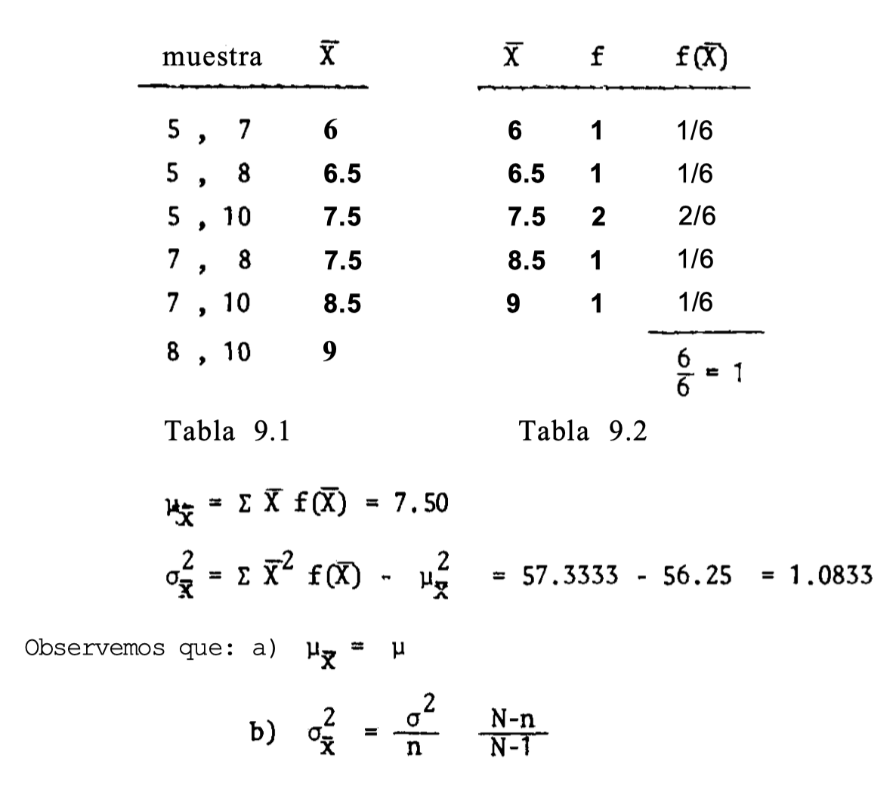
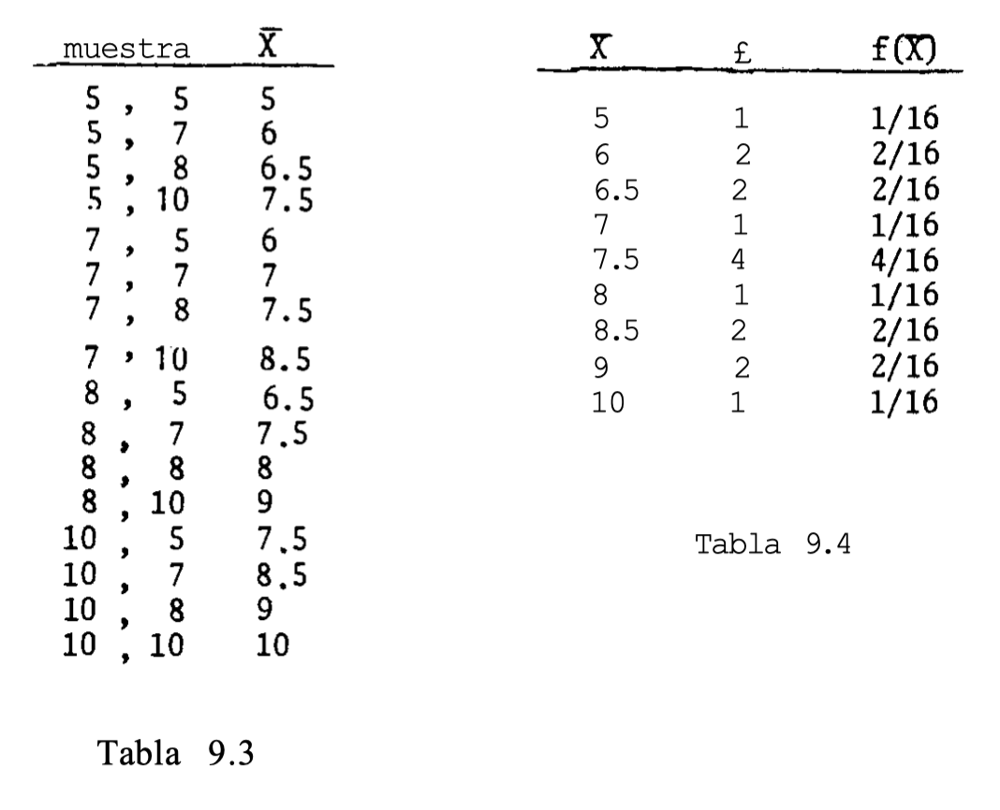
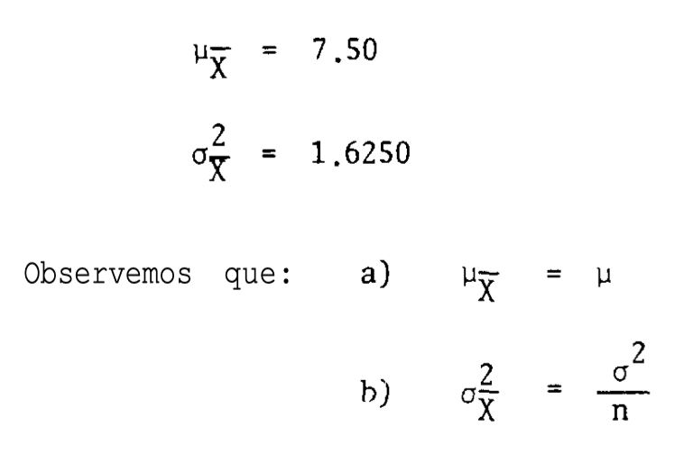

ESTIMACION Y PRUEBAS DE HIPOTESIS
=================================

DISTRIBUCIONES MUESTRALES
-------------------------

Se llama **distribución muestral** de un ``estadístico muestral`` a la distribución de probabilidad de todos los 
valores posibles que pueden ser 
tomados por dicho estadístico muestral, calculados a partir de muestras del mismo tamaño extraídos aleatoriamente de 
una población.

Ejemplo 1.

Consideremos la población formada por los números 5,7,8 y 10 cuya media  :math:`\mu = 7.50` y varianza :math:`\sigma^2 = 3.25`. 
Determinemos todas las muestras de tamaño 2 sin 
reemplazo e ignorando el orden de esta población y obtengamos la distribución muestral de la media.




Ejemplo 2: Consideremos las misma población que el Ejemplo 1 y  determinemos todas las muestras con reemplazo de 
tamaño 2 
y obtengamos la distribución muestral de la media.






ERROR ESTANDAR:
---------------

A la desviación estándar de la distribución muestral de un **estadístico muestral**  se le denomina ``error estándar`` o 
``error típico`` del **estadístico muestral** en cuestión.

Así,  :math:`\sigma_{\bar{x}} = \frac{\sigma}{\sqrt{n}}` es el error estándar de la media o simplemente error estándar, cuando 
el muestreo se hace con reemplazo.

**TEOREMA DEL LIMITE CENTRAL**

Dada una población cualquiera con media :math:`\mu` y varianza :math:`\sigma^2`. La distribución muestral de :math:`\bar{x}`, 
calculada a partir de todas las muestras aleatorias de tamaño **n** con reemplazo de esta población, estará distribuida en forma 
aproximadamente normal con media :math:`\mu_{\bar{x}}= \mu` y varianza :math:`\sigma_{\bar{x}}= \frac{\sigma^2}{n}` y 
la aproximación a la normal será mejor cuanto mayor sea **n**.

ESTADISTICA INFERENCIAL
-----------------------

La Estadística Inferencial pretende resolver dos problemas fundamentales: la estimación de parámetros poblacionales a partir de 
estadísticos muéstrales conocidos, y la toma de decisiones estadísticas acerca de hipótesis establecidas sobre la población, 
también con base al conocímiento de sus muestras.

El primer problema del cual se ocupa la estadística inferencial, la estimación, puede ser a través de un número simple, 
generalmente el estadístico correspondiente llamado ``estimación puntual`` o por medio de dos valores numéricos que definen un 
intervalo, el cual 
contiene el parámetro estimado con cierto grado de confiabilidad llamado ``intervalo de confianza``.

Este intervalo de confianza esta dado por:

.. math::

   P(\bar{x} - k \sigma_{\bar{x}} < \mu < \bar{x} - k \sigma_{\bar{x}}) := 1 - \alpha

donde k es un valor crítico correspondiente al nivel de confianza :math:`1 - \alpha`.

**CONTRASTES O PRUEBAS DE HIPOTESIS**

Una ``Hipotesis Estadística`` es una suposición que se plantea respecto a un problema o a una población, con el 
fin de probar si es o no 
verdadera.

En las pruebas de hipótesis se distinguen dos tipos de hipótesis: ``la hipòtesis nula`` designada por Ho, 
conocida también como 
hipótesis de no diferencia, es cualquier hipótesis estadística que se establece en principio con el único 
propósito de rechazarla o anularla; y la ``hipòtesis alternativa```,  Ha, que es cualquier suposición que difiera 
de la nula. La hipótesis nula 
generalmente se especifica en una forma opuesta a la que se supone cierta. Las hipótesis nula y alternativa deben 
ser mutuamente exclusivas.

**TIPOS DE PRUEBA**

Hay dos tipos de pruebas, bilaterales y unilaterales; las ``bilaterales o de dos colas`` cuya forma general es:

.. math::

   Ho: \theta = \theta_0

   Ha: \theta \neq \theta_0

Donde :math:`\theta` representa cualquier parámetro y :math:`theta_0` es un valor supuesto del parámetro.


