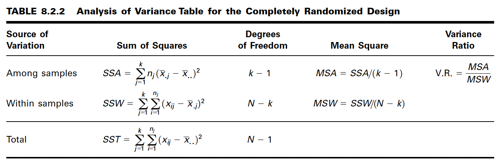
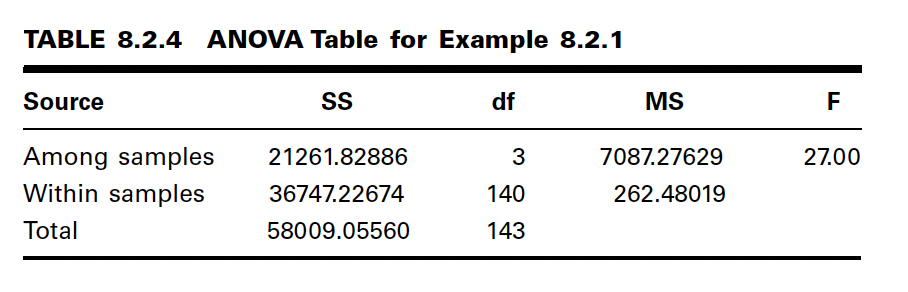

Ecuaciones-C08
==============

.. math::

   tratamientos

   \begin{matrix}
   & 1 & 2 & 3 & ... & k \\
   \hfill
   & x_{11} & x_{12} & x_{13} & ... & x_{1k} \\
   & x_{21} & x_{22} & x_{23} & ... & x_{2k} \\
   & x_{31} & x_{32} & x_{33} & ... & x_{3k} \\
   & ...    & ...    & ...    & ... & ... \\
   & x_{n_11} & x_{n_22} & x_{n_33} & ... & x_{n_kk} \\
   Total & T_{.1} & T_{.2} &T_{.3} & ...  & T_{.k} & T_{..} \\ 
   Media & \bar{x}_1 &  \bar{x}_2 & \bar{x}_3 & ... &  \bar{x}_k & \bar{x}_{..} 
   \end{matrix}

:math:`x_{ij}` = the i th observation resulting from the j th treatment (there are a total of k treatments)

:math:`T_{.j} = \sum_{i=1}^{n_j} x_{ij}`

:math:`\bar{x}_{.j} = \frac{T_{.j}}{n_j}`

:math:`T_{..} = \sum_{j=1}^k T_{.j} = \sum_{j=1}^k \sum_{i=1}^{n_j} x_{ij}`

:math:`\bar{x}_{..} = \frac{T_{..}}{N}, N = \sum_{j=1}^k n_j`

 
**El Modelo**

.. math::

   x_{ij} = \mu + \tau_j + \varepsilon_{ij} ; i = 1, 2, ..., n_j , j = 1, 2, ..., k

**Hipotesis**

.. math::

   H_0: \mu_1 = \mu_2 = ... \mu_k

   H_A : no todas las \mu_j son iguales

**The Total Sum of Squares**

.. math::

   SST = \sum_{j=1}^k \sum_{i=1}^{n_j} (x_{ij} - \bar{x}_{..})^2

The Within Groups Sum of Squares

.. math::

   SSW = \sum_{j=1}^k \sum_{i=1}^{n_j} (x_{ij} - \bar{x}_{.j})^2

The Among Groups Sum of Squares

.. math::

   SSA = \sum_{j=1}^k n_j  (\bar{x}_{.j} - \bar{x}_{..})^2

.. math::

   SST = SSA + SSW

The First Estimate of

.. math::

   \frac{\sum_{j=1}^{n_j} (x_{ij} - \bar{x}_{.j})^2} {n_j - 1}

.. math::

   MSW = \frac{\sum_{j=1}^k \sum_{j=1}^{n_j} (x_{ij} - \bar{x}_{.j})^2} {\sum_{j=1}^kn_j - 1}

**The Second Estimate of**

.. math::

   \frac{\sum_{j=1}^k (\bar{x}_{.j} - \bar{x}_{..})^2}{k-1}

.. math::

   MSA = \frac{\sum_{j=1}^k n_j (\bar{x}_{.j} - \bar{x}_{..})^2}{k-1}

**The Variance Ratio**

**EXAMPLE 8.2.1**

Game meats, including those from white-tailed deer and eastern gray squirrels, are
used as food by families, hunters, and other individuals for health, cultural, or personal
reasons. A study by David Holben (A-1) assessed the selenium content of meat
from free-roaming white-tailed deer (venison) and gray squirrel (squirrel) obtained
from a low selenium region of the United States. These selenium content values were
also compared to those of beef produced within and outside the same region. We want
to know if the selenium levels are different in the four meat groups.

Las carnes de caza, incluyendo las de venado de cola blanca y ardilla gris oriental, son utilizadas como alimento por familias, cazadores y otras personas por razones de salud, culturales o personales. Un estudio realizado por David Holben (A-1) evaluó el contenido de selenio en la carne de venado de cola blanca y ardilla gris en libertad, obtenida de una región de Estados Unidos con bajo contenido de selenio. Estos valores de contenido de selenio también se compararon con los de la carne de res producida dentro y fuera de la misma región. Queremos saber si los niveles de selenio son diferentes en los cuatro grupos de carne.

**Tukey’s HSD Test**

.. math::

   HSD = q_{\alpha, k, N-k} \sqrt{\frac{MSE}{n}}

Tukey’s Test for Unequal Sample Sizes

.. math::

   HSD^{*} = q_{\alpha, k, N-k} \sqrt{\frac{MSE}{2} (\frac{1}{n_i} + \frac{1}{n_j})}

