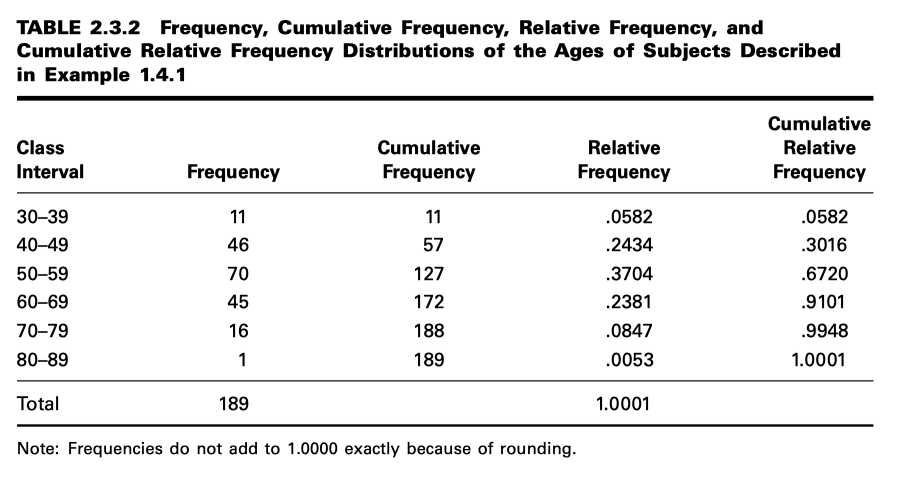
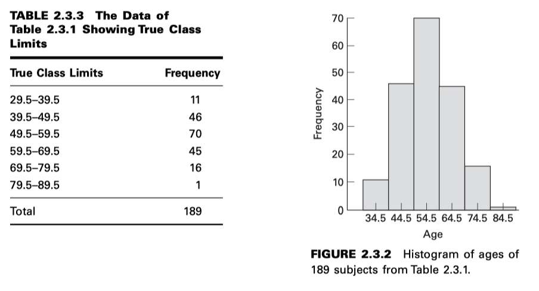
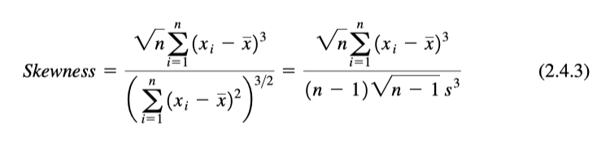
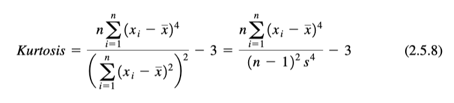

Estadística
===========

Los objetivos de estos días son dos: 

(1) enseñar al estudiante a organizar y resumir datos, y 
(2) enseñarle a tomar decisiones sobre un gran volumen de datos examinando solo una pequeña parte.

**1. Algunos conceptos básicos**

``Variable``. Si, al observar una característica, observamos que adquiere valores diferentes en distintas personas, 
lugares o cosas, la denominamos variable.

``Variables cuantitativas``

``Variables cualitativas``

``Variable aleatoria``

``Variable aleatoria discreta``

``Variable aleatoria continua``

``Población``

``Muestra``

**ESCALAS DE MEDICION**

La ``escala nominal``. La escala de medición más baja es la escala nominal. Como su nombre lo indica, consiste en nombrar 
las observaciones o clasificarlas en diversas categorías mutuamente excluyentes y colectivamente exhaustivas. 


La ``escala ordinal``. Siempre que las observaciones no solo difieren entre categorías, sino que también pueden 
clasificarse según algún criterio, se dice que se miden en una escala ordinal. 

La ``escala de intervalo```.  La escala de intervalo es una escala más sofisticada que la nominal u ordinal en que con esta 
escala no solo es posible ordenar mediciones, sino que también se conoce la distancia entre dos mediciones 
cualesquiera. 

La ``escala de razón``. El nivel más alto de medición es la escala de razón. Esta escala se caracteriza por permitir 
determinar la igualdad de razones, así como la igualdad de intervalos. Un punto cero verdadero es fundamental para la 
escala de razón. 

**MUESTREO e INFERENCIA ESTADÍSTICA**

La ``inferencia estadística`` es el procedimiento mediante el cual llegamos a una conclusión sobre una población en base 
base a la información contenida en una muestra extraída de esa población.

.. code:: R

   datos <- read.csv('EXA_C01_S04_01.csv', header=T)

   attach(datos)

   print(summary(AGE))

   ss = sample(AGE, 12)

   print(ss)

**ESTADISTICA DESCRIPTIVA**

``mean()``
``median()``
``var()``
``sd()``
``IQR()``
``range()``
``sort()``
``hist``
``barplot()``
``boxplot()``

Ejercicio. En base al ejercicio anterior generar las siguientes tablas y graficos.

.. image:: t1.png





.. image:: t4.png

Si el gráfico (histograma o polígono de frecuencias) de una distribución es asimétrico, se dice que la distribución está 
sesgada. Si una distribución no es simétrica porque su gráfico se extiende más a la derecha que a la izquierda, es decir, si 
tiene una cola larga a la derecha, decimos que la distribución está sesgada a la derecha o es positivamente sesgada. Si una 
distribución no es simétrica porque su gráfico se extiende más a la izquierda que a la derecha, es decir, si tiene una cola 
larga a la izquierda, decimos que la distribución está sesgada a la izquierda o es negativamente sesgada.	




La curtosis es una medida del grado en el cual una distribución es “picuda” o plana en comparación con una distribución normal 
cuyo gráfico se caracteriza por una apariencia en forma de campana.





