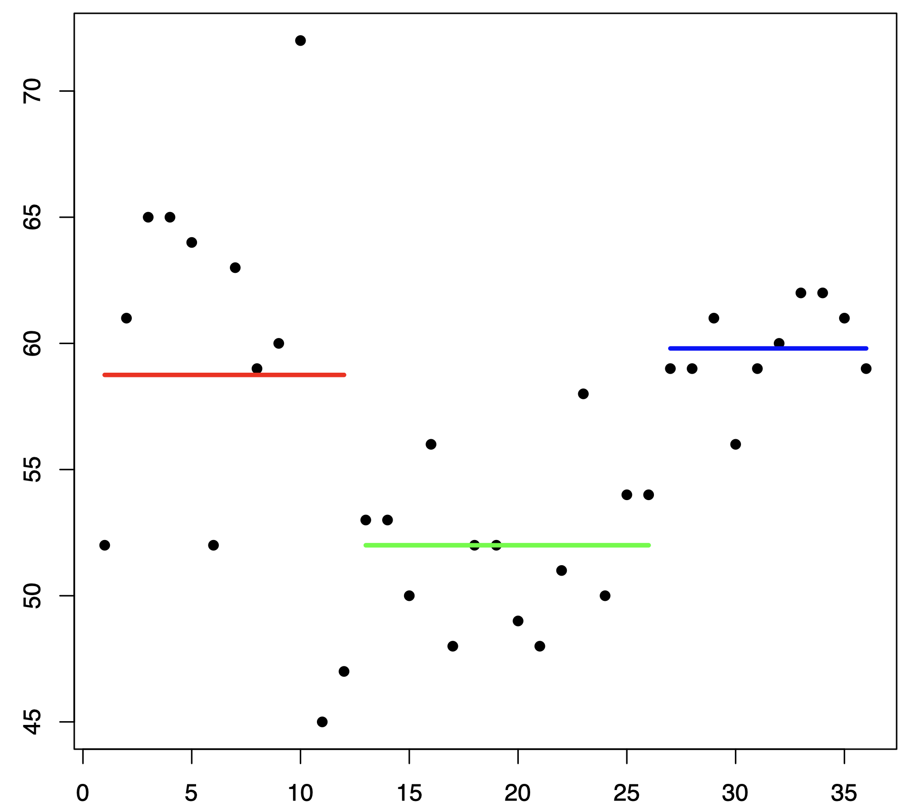

ANÁLISIS DE VARIANZA
====================

**CHAPTER OVERVIEW**

The topic of this chapter, analysis of variance, provides a methodology for partitioning the total variance 
computed from a data set into components, each of which represents the amount of the total variance that can be 
attributed to a specific source of variation. The results of this partitioning can then be used to estimate and 
test hypotheses about population variances and means. In this chapter we focus our attention on hypothesis 
testing of means. Specifically, we discuss the testing of differences among means when there is interest in 
more than two populations or two or more variables. The techniques discussed in this chapter are widely used in 
the health sciences.

El tema de este capítulo, el análisis de varianza, proporciona una metodología para dividir la varianza total 
calculada a partir de un conjunto de datos en componentes, cada uno de los cuales representa la cantidad de 
varianza total atribuible a una fuente específica de variación. Los resultados de esta división pueden 
utilizarse para estimar y contrastar hipótesis sobre varianzas y medias poblacionales. En este capítulo, nos 
centramos en la contrastación de hipótesis de medias. Específicamente, analizamos la contrastación de 
diferencias entre medias cuando se analizan más de dos poblaciones o dos o más variables. Las técnicas que se 
describen en este capítulo se utilizan ampliamente en las ciencias de la salud.

 **TOPICS**

8.1 INTRODUCTION

8.2 THE COMPLETELY RANDOMIZED DESIGN

8.3 THE RANDOMIZED COMPLETE BLOCK DESIGN

8.4 THE REPEATED MEASURES DESIGN

8.5 THE FACTORIAL EXPERIMENT

8.6 SUMMARY

**LEARNING OUTCOMES**

After studying this chapter, the student will

1. understand how the total variation in a data set can be partitioned into different components.

2. be able to compare the means of more than two samples simultaneously.

3. understand multiple comparison tests and when their use is appropriate.

4. understand commonly used experimental designs.

**8.1 INTRODUCTION**

In the preceding chapters the basic concepts of statistics have been examined, and they provide a foundation 
for the present and succeeding chapters.

En los capítulos anteriores se han examinado los conceptos básicos de la estadística, que proporcionan una base 
para el presente capítulo y los siguientes.

This chapter is concerned with analysis of variance, which may be defined as a technique whereby the total 
variation present in a set of data is partitioned into two or more components. Associated with each of these 
components is a specific source of variation, so that in the analysis it is possible to ascertain the magnitude 
of the contributions of each of these sources to the total variation.

Este capítulo se centra en el análisis de varianza, que puede definirse como una técnica mediante la cual la 
variación total presente en un conjunto de datos se divide en dos o más componentes. Cada componente tiene una 
fuente específica de variación asociada, de modo que en el análisis es posible determinar la magnitud de la 
contribución de cada una de estas fuentes a la variación total.

The development of analysis of variance 
(ANOVA) is due mainly to the work of R. A. Fisher (1), 
whose contributions to statistics, spanning the years 1912 to 1962, have had a tremendous influence on modern 
statistical thought (2, 3).

El desarrollo del análisis de varianza (ANOVA) se debe principalmente al trabajo de R. A. Fisher (1), cuyas 
contribuciones a la estadística, que abarcan los años 1912 a 1962, han tenido una enorme influencia en el 
pensamiento estadístico moderno (2, 3).

**Applications**

Analysis of variance finds its widest application in the analysis of data derived from experiments. The 
principles of the design of experiments are well covered in many books, including those by Hinkelmann and 
Kempthorne (4), Montgomery (5), and Myers and Well (6). We do not study this topic in detail, since to do it 
justice would require a minimum of an additional chapter. Some of the important concepts in experimental 
design, however, will become apparent as we discuss analysis of variance.

El análisis de varianza encuentra su aplicación más amplia en el análisis de datos derivados de experimentos. 
Los principios del diseño de experimentos se abordan en profundidad en numerosos libros, incluyendo los de 
Hinkelmann y Kempthorne (4), Montgomery (5) y Myers y Well (6). No profundizaremos en este tema, ya que para 
abordarlo adecuadamente se requeriría al menos un capítulo adicional. Sin embargo, algunos conceptos 
importantes del diseño experimental se harán evidentes al abordar el análisis de varianza.

Analysis of variance is used for two different purposes: (1) to estimate and test hypotheses about population 
variances, and (2) to estimate and test hypotheses about population means. We are concerned here with the 
latter use. However, as we will see, our conclusions regarding the means will depend on the magnitudes of the 
observed variances.

El análisis de varianza se utiliza con dos propósitos diferentes: (1) estimar y contrastar hipótesis sobre las 
varianzas poblacionales, y (2) estimar y contrastar hipótesis sobre las medias poblacionales. Nos centraremos 
aquí en este último uso. Sin embargo, como veremos, nuestras conclusiones sobre las medias dependerán de la 
magnitud de las varianzas observadas.

As we shall see, the concepts and techniques that we cover under the heading of analysis of variance are 
extensions of the concepts and techniques covered in Chapter 7. In Chapter 7 we learned to test the null 
hypothesis that two means are equal. In this chapter we learn to test the null hypothesis that three or more 
means are equal. Whereas, for example, what we learned in Chapter 7 enables us to determine if we can conclude 
that two treatments differ in effectiveness, what we learn in this chapter enables us to determine if we can 
conclude that three or more treatments differ in effectiveness. The following example illustrates some basic 
ideas involved in the application of analysis of variance. These will be extended and elaborated on later in 
this chapter.

Como veremos, los conceptos y técnicas que abordamos bajo el título de análisis de varianza son extensiones de 
los conceptos y técnicas abordados en el Capítulo 7. En el Capítulo 7, aprendimos a contrastar la hipótesis 
nula de que dos medias son iguales. En este capítulo, aprendemos a contrastar la hipótesis nula de que tres o 
más medias son iguales. Mientras que, por ejemplo, lo aprendido en el Capítulo 7 nos permite determinar si 
podemos concluir que dos tratamientos difieren en efectividad, lo aprendido en este capítulo nos permite 
determinar si podemos concluir que tres o más tratamientos difieren en efectividad. El siguiente ejemplo 
ilustra algunas ideas básicas relacionadas con la aplicación del análisis de varianza. Estas se ampliarán y 
desarrollarán más adelante en este capítulo.

**EXAMPLE 8.1.1**

Suppose we wish to know if three drugs differ in 
their effectiveness in lowering serum 
cholesterol in human subjects. Some subjects receive drug A, some drug B, and some drug C. After a specified 
period of time measurements are taken to determine the extent to which serum cholesterol was reduced in each 
subject. We find that the amount by which serum cholesterol was lowered is not the same in all subjects. In 
other words, there is variability among the measurements. Why, we ask ourselves, are the measurements not all 
the same? Presumably, one reason they are not the same is that the subjects received different drugs. 

Supongamos que deseamos saber si tres fármacos difieren en su eficacia para reducir el colesterol sérico en 
sujetos humanos. Algunos sujetos reciben el fármaco A, otros el fármaco B y otros el fármaco C. Tras un período 
específico, se toman mediciones para determinar el grado de reducción del colesterol sérico en cada sujeto. 
Descubrimos que la reducción del colesterol sérico no es la misma en todos los sujetos. En otras palabras, 
existe variabilidad entre las mediciones. ¿Por qué, nos preguntamos, no son todas iguales? Presumiblemente, una 
razón es que los sujetos recibieron fármacos diferentes.

We now 
look at the measurements of those subjects who received drug A. We find that the amount by which serum 
cholesterol was lowered is not the same among these subjects. We find this to be the case when we look at the 
measurements for subjects who received drug B and those subjects who received drug C. We see that there
is variability among the measurements within the treatment groups. Why, we ask ourselves again, are these 
measurements not the same? Among the reasons that come to mind are differences in the genetic makeup of the 
subjects and differences in their diets. Through an analysis of the variability that we have observed, we will 
be able to reach a conclusion regarding the equality of the effectiveness of the three drugs. To do this we 
employ the techniques and concepts of analysis of variance. 

Ahora observamos las mediciones de aquellos sujetos que recibieron el fármaco A. Encontramos que la cantidad en 
que se redujo el colesterol sérico no es la misma entre estos sujetos. Encontramos que este es el caso cuando 
observamos las mediciones de los sujetos que recibieron el fármaco B y los sujetos que recibieron el fármaco C. 
Vemos que hay variabilidad entre las mediciones dentro de los grupos de tratamiento. ¿Por qué, nos preguntamos 
de nuevo, estas mediciones no son las mismas? Entre las razones que vienen a la mente están las diferencias en 
la composición genética de los sujetos y las diferencias en sus dietas. A través de un análisis de la 
variabilidad que hemos observado, podremos llegar a una conclusión con respecto a la igualdad de la efectividad 
de los tres fármacos. Para ello empleamos las técnicas y conceptos de análisis de varianza.

**Variables**

In our example we allude to three kinds of variables. We find these variables to be present in all situations 
in which the use of analysis of variance is appropriate. First we have the treatment variable, which in our 
example was “drug.” We had three “values” of this variable, drug A, drug B, and drug C. The second kind of 
variable we refer to is the response variable. In the example it is change in serum cholesterol. The response 
variable is the variable that we expect to exhibit different values when different “values” of the treatment 
variable are employed. Finally, we have the other variables that we mentiongenetic composition and diet. These 
are called extraneous variables. These variables may have an effect on the response variable, but they are not 
the focus of our attention in the experiment. The treatment variable is the variable of primary concern, and 
the question to be answered is: Do the different “values” of the treatment variable result in differences, on 
the average, in the response variable?

En nuestro ejemplo, hacemos alusión a tres tipos de variables. Encontramos que estas variables están presentes 
en todas las situaciones en las que es apropiado el uso del análisis de varianza. Primero, tenemos la variable 
de tratamiento, que en nuestro ejemplo era "fármaco". Teníamos tres "valores" de esta variable: fármaco A, 
fármaco B y fármaco C. El segundo tipo de variable al que nos referimos es la variable de respuesta. En el 
ejemplo, es el cambio en el colesterol sérico. La variable de respuesta es la variable que esperamos que 
muestre valores diferentes cuando se emplean diferentes "valores" de la variable de tratamiento. Finalmente, 
tenemos las otras variables que mencionamos, la composición genética y la dieta. Estas se llaman variables 
extrañas. Estas variables pueden tener un efecto en la variable de respuesta, pero no son el foco de nuestra 
atención en el experimento. La variable de tratamiento es la variable de principal preocupación, y la pregunta 
a responder es: ¿Los diferentes "valores" de la variable de tratamiento resultan en diferencias, en promedio, 
en la variable de respuesta?

**Assumptions**

Underlying the valid use of analysis of variance as a tool of statistical inference are a set of fundamental 
assumptions. Although an experimenter must not expect to find all the assumptions met to perfection, it is 
important that the user of analysis of variance techniques be aware of the underlying assumptions and be able 
to recognize when they are substantially unsatisfied. Because experiments in which all the assumptions are 
perfectly met are rare, analysis of variance results should be considered as approximate rather than exact. 
These assumptions are pointed out at appropriate points in the following sections.

El uso válido del análisis de varianza como herramienta de inferencia estadística se sustenta en un conjunto de 
supuestos fundamentales. Si bien un experimentador no debe esperar que todos los supuestos se cumplan a la 
perfección, es importante que quien utilice técnicas de análisis de varianza conozca los supuestos subyacentes 
y sea capaz de reconocer cuándo son sustancialmente insatisfactorios. Dado que los experimentos en los que 
todos los supuestos se cumplen a la perfección son poco frecuentes, los resultados del análisis de varianza 
deben considerarse aproximados, no exactos. Estos supuestos se señalan en los puntos pertinentes de las 
siguientes secciones.

We discuss analysis of variance as it is used to analyze the results of two different experimental designs, the 
completely randomized and the randomized complete block designs. In addition to these, the concept of a 
factorial experiment is given through its use in a completely randomized design. These do not exhaust the 
possibilities. A discussion of additional designs may be found in the references (4–6).

Se analiza el análisis de varianza para analizar los resultados de dos diseños experimentales diferentes: el 
diseño completamente aleatorizado y el diseño de bloques completos aleatorizados. Además, se presenta el 
concepto de experimento factorial mediante su uso en un diseño completamente aleatorizado. Estas posibilidades 
no agotan las existentes. Se puede encontrar una discusión de diseños adicionales en las referencias (4-6).

**The ANOVA Procedure**

In our presentation of the analysis of variance for the different designs, we follow the ten-step procedure 
presented in Chapter 7. The following is a restatement of the steps of the procedure, including some new 
concepts necessary for its adaptation to analysis of variance.

En nuestra presentación del análisis de varianza para los diferentes diseños, seguimos el procedimiento de diez 
pasos presentado en el Capítulo 7. Lo que sigue es una reformulación de los pasos del procedimiento, incluyendo 
algunos conceptos nuevos necesarios para su adaptación al análisis de varianza.

1. Description of data. In addition to describing the data in the usual way, we display the sample data in 
tabular form.

**2. Assumptions.** Along with the assumptions underlying the analysis, we present the model for each design 
we discuss. The model consists of a symbolic representation of a typical value from the data being analyzed.

Junto con los supuestos subyacentes al análisis, presentamos el modelo para cada diseño que analizamos. El 
modelo consiste en una representación simbólica de un valor típico de los datos analizados.

3. Hypotheses.

4. Test statistic.

5. Distribution of test statistic.

6. Decision rule.

7. Calculation of test statistic. The results of the arithmetic calculations will be summarized in a table 
called the analysis of variance (ANOVA) table. The entries in the table make it easy to evaluate the results of 
the analysis.

7. Cálculo del estadístico de prueba. Los resultados de los cálculos aritméticos se resumirán en una tabla 
llamada análisis de varianza (ANOVA). Las entradas de la tabla facilitan la evaluación de los resultados del 
análisis.

8. Statistical decision.

9. Conclusion.

10. Determination of p value.

We discuss these steps in greater detail in Section 8.2.

**The Use of Computers**

The calculations required by analysis of variance are lengthier and more complicated than those we have 
encountered in preceding chapters. For this reason the computer assumes an important role in analysis of 
variance. All the exercises appearing in this chapter are suitable for computer analysis and may be used with 
the statistical packages mentioned in Chapter 1. The output of the statistical packages may vary slightly from 
that presented in this chapter, but this should pose no major problem to those who use a computer to analyze 
the data of the exercises. The basic concepts of analysis of variance that we present here should provide the 
necessary background for understanding the description of the programs and their output in any of the 
statistical packages.

Los cálculos que requiere el análisis de varianza son más largos y complejos que los que hemos visto en 
capítulos anteriores. Por ello, la computadora desempeña un papel importante en el análisis de varianza. Todos 
los ejercicios de este capítulo son adecuados para el análisis informático y pueden utilizarse con los 
programas estadísticos mencionados en el capítulo 1. El resultado de los programas estadísticos puede variar 
ligeramente del presentado en este capítulo, pero esto no debería suponer un problema importante para quienes 
utilizan una computadora para analizar los datos de los ejercicios. Los conceptos básicos del análisis de 
varianza que presentamos aquí proporcionan la base necesaria para comprender la descripción de los programas y 
su resultado en cualquiera de los programas estadísticos.

**8.2 THE COMPLETELY RANDOMIZED DESIGN**

We saw in Chapter 7 how it is possible to test the null hypothesis of no difference between two population 
means. It is not unusual for the investigator to be interested in testing the null hypothesis of no difference 
among several population means. The student first encountering this problem might be inclined to suggest that 
all possible pairs of sample means be tested separately by means of the Student t test. Suppose there are five 
populations involved. The number of possible pairs of sample means is 5 C 2 = 10. As the amount of work 
involved in carrying out this many t tests is substantial, it would be worthwhile if a more efficient 
alternative for analysis were available. A more important consequence of performing all possible t tests, 
however, is that it is very likely to lead to a false conclusion.

Vimos en el Capítulo 7 cómo es posible probar la hipótesis nula de que no hay diferencia entre dos medias 
poblacionales. No es inusual que el investigador esté interesado en probar la hipótesis nula de que no hay 
diferencia entre varias medias poblacionales. El estudiante que se encuentre por primera vez con este problema 
podría inclinarse a sugerir que todos los pares posibles de medias muestrales se prueben por separado mediante 
la prueba t de Student. Supongamos que hay cinco poblaciones involucradas. El número de pares posibles de 
medias muestrales es 5 C 2 = 10. Como la cantidad de trabajo involucrado en la realización de tantas pruebas t 
es sustancial, valdría la pena si hubiera disponible una alternativa más eficiente para el análisis. Sin 
embargo, una consecuencia más importante de realizar todas las pruebas t posibles es que es muy probable que 
conduzca a una conclusión falsa.

Suppose we draw five samples from populations having equal means. As we have 
seen, there would be 10 tests 
if we were to do each of the possible tests separately. If we select a significance level of a = .05 for each 
test, the probability of failing to reject a hypothesis of no difference in each case would be .95. By the 
multiplication rule of probability, if the tests were independent of one another, the probability of failing to 
reject a hypothesis of no difference in all 10 cases would be 1.952 10 = .5987. The probability of rejecting at 
least one hypothesis of no difference, then, would be 1 - .5987 = .4013. Since we know that the null hypothesis 
is true in every case in this illustrative example, rejecting the null hypothesis constitutes the committing of 
a type I error. In the long run,then, in testing all possible pairs of means from five samples, we would commit a type I error 40 percent of 
the time. The problem becomes even more complicated in practice, since three or more t tests based on the same 
data would not be independent of one another.

Supongamos que extraemos cinco muestras de poblaciones con medias iguales. Como hemos visto, habría 10 pruebas 
si realizáramos cada una de las pruebas posibles por separado. Si seleccionamos un nivel de significancia de a 
= .05 para cada prueba, la probabilidad de no rechazar una hipótesis de no diferencia en cada caso sería .95. 
Por la regla de multiplicación de la probabilidad, si las pruebas fueran independientes entre sí, la 
probabilidad de no rechazar una hipótesis de no diferencia en los 10 casos sería 1.952 10 = .5987. La 
probabilidad de rechazar al menos una hipótesis de no diferencia, entonces, sería 1 - .5987 = .4013. Dado que 
sabemos que la hipótesis nula es verdadera en todos los casos en este ejemplo ilustrativo, rechazar la 
hipótesis nula constituye la comisión de un error de tipo I. A largo plazo, al probar todos los pares de medias 
posibles de cinco muestras, cometeríamos un error de tipo I el 40 % de las veces. El problema se complica aún 
más en la práctica, ya que tres o más pruebas t basadas en los mismos datos no serían independientes entre sí.

It becomes clear, then, that some other method for testing for a significant difference among several means is 
needed. Analysis of variance provides such a method.

Queda claro, entonces, que se necesita otro método para comprobar si hay una diferencia significativa entre 
varias medias. El análisis de varianza proporciona dicho método.

**One-Way ANOVA**

The simplest type of analysis of variance is that known as one-way analysis of variance, in which only one 
source of variation, or factor, is investigated. It is an extension to three or more samples of the t test 
procedure (discussed in Chapter 7) for use with two independent samples. Stated another way, we can say that 
the t test for use with two independent samples is a special case of one-way analysis of variance.

El tipo más simple de análisis de varianza es el conocido como análisis de varianza unidireccional, en el que 
solo se investiga una fuente de variación, o factor. Es una extensión del procedimiento de la prueba t 
(discutido en el capítulo 7) para tres o más muestras, que se utiliza con dos muestras independientes. Dicho de 
otro modo, la prueba t para dos muestras independientes es un caso especial de análisis de varianza 
unidireccional.
 
In a typical situation we want to use one-way analysis of variance to test the null hypothesis that three or 
more treatments are equally effective. The necessary experiment is designed in such a way that the treatments 
of interest are assigned completely at random to the subjects or objects on which the measurements to determine 
treatment effectiveness are to be made. For this reason the design is called the completely randomized 
experimental design.

En una situación típica, se utiliza un análisis de varianza unidireccional para comprobar la hipótesis nula de 
que tres o más tratamientos son igualmente efectivos. El experimento necesario se diseña de tal manera que los 
tratamientos de interés se asignan completamente al azar a los sujetos u objetos en los que se realizarán las 
mediciones para determinar la efectividad del tratamiento. Por esta razón, el diseño se denomina diseño 
experimental completamente aleatorizado.

We may randomly allocate subjects to treatments as follows. Suppose we 
have 16 subjects available to 
participate in an experiment in which we wish to compare four drugs. We number the subjects from 01 through 16. 
We then go to a table of random numbers and select 16 consecutive, unduplicated numbers between 01 and 16. To 
illustrate, let us use Appendix Table A and a random starting point that, say, is at the intersection of Row 4 
and Columns 11 and 12. The two-digit number at this intersection is 98. The succeeding (moving downward) 16 
consecutive two-digit numbers between 01 and 16 are 16, 09, 06, 15, 14, 11, 02, 04, 10, 07, 05, 13, 03, 12, 01, 
and 08. We allocate subjects 16, 09, 06, and 15 to drug A; subjects 14, 11, 02, and 04 to drug B; subjects 10, 
07, 05, and 13 to drug C; and subjects 03, 12, 01, and 08 to drug D. We emphasize that the number of subjects 
in each treatment group does not have to be the same. Figure 8.2.1 illustrates the scheme of random allocation.

Podemos asignar aleatoriamente a los sujetos a los tratamientos de la siguiente manera. Supongamos que tenemos 
16 sujetos disponibles para participar en un experimento en el que deseamos comparar cuatro fármacos. Numeramos 
los sujetos del 01 al 16. Luego vamos a una tabla de números aleatorios y seleccionamos 16 números consecutivos 
no duplicados entre 01 y 16. Para ilustrar, usemos la Tabla A del Apéndice y un punto de inicio aleatorio que, 
digamos, está en la intersección de la Fila 4 y las Columnas 11 y 12. El número de dos dígitos en esta 
intersección es 98. Los 16 números consecutivos de dos dígitos subsiguientes (moviéndose hacia abajo) entre 01 
y 16 son 16, 09, 06, 15, 14, 11, 02, 04, 10, 07, 05, 13, 03, 12, 01 y 08. Asignamos los sujetos 16, 09, 06 y 15 
al fármaco A, los sujetos 14, 11, 02 y 04 al fármaco B, los sujetos 10, 07, 05 y 13 al fármaco C; y los sujetos 
03, 12, 01 y 08 al fármaco D. Cabe destacar que el número de sujetos en cada grupo de tratamiento no tiene por 
qué ser el mismo. La Figura 8.2.1 ilustra el esquema de asignación aleatoria.

**Hypothesis Testing Steps**

Once we decide that the completely randomized design is the appropriate design, we may proceed with the 
hypothesis testing steps. We discuss these in detail first, and follow with an example.

1. Description of data. The measurements (or observations) resulting from a completely randomized experimental 
design, along with the means and totals that can be computed from them, may be displayed for convenience as in 
Table 8.2.1. The symbols used in Table 8.2.1 are defined as follows:

1. **Descripción de los datos.** Las mediciones (u observaciones) resultantes de un diseño experimental 
completamente aleatorizado, junto con las medias y los totales que se pueden calcular a partir de ellas, pueden 
mostrarse para mayor comodidad como en la Tabla 8.2.1. Los símbolos utilizados en la Tabla 8.2.1 se definen de 
la siguiente manera:

:math:`x_{ij}` = the ith observation resulting from the j th treatment (there are a total of k 
treatments)

i = 1, 2,... , :math:`n_j` ,

j = 1, 2, ... , k

:math:`T_{i=1}^{n_j} x_{ij}` = total of the j th treatment

:math:`\bar{x}_{.j} = \frac{T_{.j}}{n_j}` = mean of the j th treatment

:math:`T_{..} = \sum_{j=1}^k T_{.j} = \sum_{k=1}^k \sum_{i=1}^{n_j} x_{ij}` = total of all observations

:math:`bar{x}_{..} = \frac{T_{..}}{N},  N = \sum_{j=1}^k n_j

2. Assumptions. Before stating the assumptions, let us specify the model for the experiment described here.

**The Model**

As already noted, a model is a symbolic representation of a typical value of a data set. To write 
down the model for the completely randomized experimental design, let us begin by identifying a typical value 
from the set of data represented by the sample displayed in Table 8.2.1. We use the symbol x ij to represent 
this typical value.

Como ya se mencionó, un modelo es una representación simbólica de un valor típico de un conjunto de 
datos. Para definir el modelo del diseño experimental completamente aleatorizado, comencemos por identificar un 
valor típico del conjunto de datos representado por la muestra que se muestra en la Tabla 8.2.1. Usamos el 
símbolo x ij para representar este valor típico.

The one-way analysis of variance model may be written as  follows:

.. math::

   x_{ij} = \mu + tau_j + \varepsilon_{ij} ; i=1,2,..., n_j; j=1,2..., k

The terms in this model are defined as follows:

1. :math:`\mu` represents the mean of all the k population means and is called the grand mean.

2. :math:`tau_j` represents the difference between the mean of the jth population and the grand mean and is 
called the **treatment effect**.

3. :math:`\varepsilon_{ij}` represents the amount by which an individual measurement differs from the mean of 
the population to which it belongs and is called the error term.

**Components of the Model**

By looking at our model we can see that a typical observation from the total set of data under study is 
composed of (1) the grand mean, (2) a treatment effect, and (3) an error term representing the deviation of the 
observation from its group mean.

Al observar nuestro modelo, podemos ver que una observación típica del conjunto total de datos en estudio se 
compone de (1) la media general, (2) un efecto del tratamiento y (3) un término de error que representa la 
desviación de la observación respecto de su media de grupo.

In most situations we are interested only in the k treatments represented in our experiment. Any inferences 
that we make apply only to these treatments. We do not wish to extend our inference to any larger collection of 
treatments. When we place such a restriction on our inference goals, we refer to our model as the fixed-effects 
model, or model 1. The discussion in this book is limited to this model.

En la mayoría de las situaciones, solo nos interesan los k tratamientos representados en nuestro experimento. 
Cualquier inferencia que hagamos se aplica únicamente a estos tratamientos. No deseamos extender nuestra 
inferencia a un conjunto mayor de tratamientos. Cuando imponemos dicha restricción a nuestros objetivos de 
inferencia, nos referimos a nuestro modelo como modelo de efectos fijos o modelo 1. La discusión en este libro 
se limita a este modelo.

**Assumptions of the Model follows:**

The assumptions for the fixed-effects model are as

(a) The k sets of observed data constitute k independent random samples from the respective populations.

(b) Each of the populations from which the samples come is normally distributed with mean m j and variance sj 2 
.

(c) Each of the populations has the same variance. That is, s 1 2 = s 2 2 = . . . = s k 2 = s2 

(d) The t j are unknown constants and gt j = 0 since the sum of all deviations of the m j from their mean, m, 
is zero.

the common variance.

(e) The P ij have a mean of 0, since the mean of x ij is m j .

(f) The P ij have a variance equal to the variance of the x ij , since the P ij and x ij differ only by a 
constant; that is, the error variance is equal to s2 , the common variance specified in assumption c.

(g) The :math:`\varepsilon_{ij}` are normally (and independently) distributed.

3. **Hypotheses.** We test the null hypothesis that all population or treatment means are equal against the 
alternative that the members of at least one pair are not equal. We may state the hypotheses formally as 
follows:

.. math::

   H_0 : \mu_1 = \mu_2 = ...  = \mu_k 

   H_A : not all \mu_j are equal

If the population means are equal, each treatment effect is equal to zero, so that, alternatively, the 
hypotheses may be stated as

.. math::

   H_0 : \tau_j = 0, j = 1, 2, ... , k

   H_A :not all \tau_j = 0

If H0 is true and the assumptions of equal variances and normally distributed populations are met, a picture 
of the populations will look like Figure 8.2.2. When H0 is true the population means are all equal, and the 
populations are centered at the same point (the common mean) on the horizontal axis. If the populations are all 
normally distributed with equal variances the distributions will be identical, so that in drawing their 
pictures each is superimposed on each of the others, and a single picture sufficiently represents them all.

Si H₂ es verdadera y se cumplen los supuestos de varianzas iguales y poblaciones con distribución normal, la 
representación de las poblaciones se verá como en la Figura 8.2.2. Cuando H₂ es verdadera, las medias 
poblacionales son todas iguales y las poblaciones están centradas en el mismo punto (la media común) en el eje 
horizontal. Si todas las poblaciones se distribuyen normalmente con varianzas iguales, las distribuciones serán 
idénticas, de modo que al dibujar sus representaciones, cada una se superpone a las demás, y una sola 
representación las representa a todas suficientemente.

When H 0 is false it may be false because one of the population means is different from the others, which are 
all equal. Or, perhaps, all the population means are different. These are only two of the possibilities when H 
0 is false. There are many other possible combinations of equal and unequal means. Figure 8.2.3 shows a picture 
of the populations when the assumptions are met, but H 0 is false because no two population means are equal.

Cuando H₂ es falsa, puede serlo porque una de las medias poblacionales es diferente de las demás, que son todas 
iguales. O, quizás, todas las medias poblacionales son diferentes. Estas son solo dos de las posibilidades 
cuando H₂ es falsa. Existen muchas otras combinaciones posibles de medias iguales y desiguales. La Figura 8.2.3 
muestra una imagen de las poblaciones cuando se cumplen los supuestos, pero H₂ es falsa porque no hay dos 
medias poblacionales iguales.

4. Test statistic. The test statistic for one-way analysis of variance is a computed variance ratio, which we 
designate by V.R. as we did in Chapter 7. The two variances from which V.R. is calculated are themselves 
computed from the sample data. The methods by which they are 
calculated will be given in the discussion that follows.

5. Distribution of test statistic. As discussed in Section 7.8, V.R. is distributed as the F distribution when 
H 0 is true and the assumptions are met.

6. Decision rule. In general, the decision rule is: reject the null hypothesis if the computed value of V.R. is 
equal to or greater than the critical value of F for the chosen a level.

7. Calculation of test statistic. We have defined analysis of variance as a process whereby the total variation 
present in a set of data is partitioned into components that are attributable to different sources. The term 
variation used in this context refers to the sum of squared deviations of observations from their mean, or sum 
of squares for short.

The initial computations performed in one-way ANOVA consist of the partitioning of the total variation present 
in the observed data into its basic components, each of which is attributable to an identifiable source.

Those who use a computer for calculations may wish to skip the following discussion of the computations 
involved in obtaining the test statistic.

**The Total Sum of Squares**

Before we can do any partitioning, we must first obtain the total sum of squares. The total sum of squares is 
the sum of the squares of the deviations of individual observations from the mean of all the observations taken 
together. This total sum of squares is defined as

Antes de realizar cualquier partición, debemos obtener la suma total de cuadrados. La suma total de cuadrados 
es la suma de los cuadrados de las desviaciones de las observaciones individuales con respecto a la media de 
todas las observaciones tomadas en conjunto. Esta suma total de cuadrados se define como

.. math::

   SST = \sum_{j=1}^k \sum_{i=1}^{n_j} (x_{ij} - \bar{x}_{..})^2

(8.2.2)

where g n i=1 j tells us to sum the squared deviations for each treatment group, and gk j=1  n j tells us to 
add the k group totals obtained by applying g i=1 . The reader will recognize Equation 8.2.2 as the numerator 
of the variance that may be computed from the complete set of observations taken together.

**The Within Groups Sum of Squares**

Now let us show how to compute the first of the two components of the total sum of squares.

The first step in the computation calls for performing certain calculations within each group. These 
calculations involve computing within each group the sum of the squared deviations of the individual 
observations from their mean. When these calculations have been performed within each group, we obtain the sum 
of the individual group results. This component of variation is called the within groups sum of squares and may 
be designated SSW. This quantity is sometimes referred to as the residual or error sum of squares. The 
expression for these calculations is written as follows:

El primer paso del cálculo requiere realizar ciertos cálculos dentro de cada grupo. Estos cálculos implican 
calcular, dentro de cada grupo, la suma de las desviaciones al cuadrado de las observaciones individuales con 
respecto a su media. Una vez realizados estos cálculos dentro de cada grupo, se obtiene la suma de los 
resultados individuales del grupo. Este componente de variación se denomina suma de cuadrados intragrupos y 
puede designarse como SSW. Esta cantidad a veces se denomina suma de cuadrados residual o del error. La 
expresión para estos cálculos se escribe de la siguiente manera:

.. math::

   SSW = \sum_{j=1}^k \sum_{i=1}^{n_j} (x_{ij} - \bar{x}_{.j})^2

**The Among Groups Sum of Squares**

To obtain the second component of the total sum of squares, we compute for each group the squared deviation of 
the group mean from the grand mean and multiply the result by the size of the group. Finally, we add these 
results over all groups. This quantity is a measure of the variation among groups and is referred to as the sum 
of squares among groups or SSA. The formula for calculating this quantity is as follows:

Para obtener el segundo componente de la suma total de cuadrados, calculamos para cada grupo la desviación al 
cuadrado de la media del grupo con respecto a la media general y multiplicamos el resultado por el tamaño del 
grupo. Finalmente, sumamos estos resultados para todos los grupos. Esta cantidad es una medida de la variación 
entre grupos y se denomina suma de cuadrados entre grupos o SSA. La fórmula para calcular esta cantidad es la 
siguiente:

.. math::

   SSA = \sum_{j=1}^k n_j (\bar{x}_{.j} - \bar{x}_{..})^2

(8.2.4)

In summary, then, we have found that the total sum of squares is equal to the sum of the among and the within 
sum of squares. We express this relationship as follows:

SST = SSA + SSW

From the sums of squares that we have now learned to compute, it is possible to obtain two estimates of the 
common population variance, s2 . It can be shown that when the assumptions are met and the population means are 
all equal, both the among sum of squares and the within sum of squares, when divided by their respective 
degrees of freedom, yield independent and unbiased estimates of s2 .

A partir de las sumas de cuadrados que hemos aprendido a calcular, es posible obtener dos estimaciones de la 
varianza poblacional común, s². Se puede demostrar que, cuando se cumplen los supuestos y las medias 
poblacionales son todas iguales, tanto la suma de cuadrados inter como la suma de cuadrados intra, al dividirse 
entre sus respectivos grados de libertad, producen estimaciones independientes e insesgadas de s².

**The First Estimate of** :math:`\sigma^2` 

Within any sample,

.. math::

   \frac{\sum_{i=1}^{n_j} (x_{ij}- \bar{x}_{.j})^2}{n_j-1}

provides an unbiased estimate of the true variance of the population from which the sample came. Under the 
assumption that the population variances are all equal, we may pool the k estimates to obtain

.. math::

   MSW = \frac{\sum_{j=1}^k \sum_{i=1}^{n_j} (x_{ij}-\bar{x}_{.j})^2}{\sum_{j=1}^k (n_j -1)}

(8.2.5)

This is our first estimate of s 2 and may be called the within groups variance, since it is the within groups 
sum of squares of Equation 8.2.3 divided by the appropriate degrees of freedom. The student will recognize this 
as an extension to k samples of the pooling of variances procedure encountered in Chapters 6 and 7 when the 
variances from two samples were pooled in order to use the t distribution. The quantity in Equation 8.2.5 is 
customarily referred to as the within groups mean square rather than the within groups variance.

Esta es nuestra primera estimación de s² y puede denominarse varianza intragrupos, ya que es la suma de 
cuadrados intragrupos de la ecuación 8.2.3 dividida entre los grados de libertad correspondientes. El 
estudiante reconocerá esto como una extensión a k muestras del procedimiento de agrupación de varianzas, 
utilizado en los capítulos 6 y 7, cuando se agruparon las varianzas de dos muestras para utilizar la 
distribución t. La cantidad en la ecuación 8.2.5 se denomina habitualmente cuadrático medio intragrupos, en 
lugar de varianza intragrupos.

The within groups mean square is a valid estimate of s 2 only if the population variances are equal. It is not 
necessary, however, for H 0 to be true in order for the within groups mean square to be a valid estimate of s2 
; that is, the within groups mean square estimates s 2 regardless of whether H 0 is true or false, as long as 
the population variances are equal.

El cuadrado medio intragrupos es una estimación válida de s₂ solo si las varianzas poblacionales son iguales. 
Sin embargo, no es necesario que H₂ sea verdadera para que el cuadrado medio intragrupos sea una estimación 
válida de s₂; es decir, el cuadrado medio intragrupos estima s₂ independientemente de si H₂ es verdadera o 
falsa, siempre que las varianzas poblacionales sean iguales.

The second estimate of s 2 2 may be obtained from the familiar formula for the variance of sample means, s x 2 
= s >n. If we solve this equation for s2 , the variance of the population from which the samples were drawn, we 
have

**The Second Estimate of S2**

s 2 = nsx 2 

(8.2.6)

An unbiased estimate of s x 2 computed from sample data is provided by

k 1x . j - x .. 2 2 a j=1 k - 1

If we substitute this quantity into Equation 8.2.6, we obtain the desired estimate of s2 ,

k n a 1x . j - x .. 2 2 j=1 MSA = k - 1

(8.2.7)

The reader will recognize the numerator of Equation 8.2.7 as the among groups sum of squares for the special 
case when all sample sizes are equal. This sum of squares when divided by the associated degrees of freedom k - 
1 is referred to as the among groups mean square.

When the sample sizes are not all equal, an estimate of s 2 based on the variability among sample means is 
provided by

k 2 a n j 1x . j - x .. 2 j=1 MSA = k - 1

(8.2.8)

If, indeed, the null hypothesis is true we would expect these two estimates of s2  to be fairly close in 
magnitude. If the null hypothesis is false, that is, if all population means are not equal, we would expect the 
among groups mean square, which is computed by using the squared deviations of the sample means from the 
overall mean, to be larger than the within groups mean square.

In order to understand analysis of variance we must realize that the among groups mean square provides a valid 
estimate of s 2 when the assumption of equal population

variances is met and when H 0 is true. Both conditions, a true null hypothesis and equal population variances, 
must be met in order for the among groups mean square to be a valid estimate of s2 .

**The Variance Ratio**

What we need to do now is to compare these two estimates of s2 , and we do this by computing the following 
variance ratio, which is the desired test statistic:

among groups mean square V.R. = within groups means square

If the two estimates are about equal, V.R. will be close to 1. A ratio close to 1 tends to support the 
hypothesis of equal population means. If, on the other hand, the among groups mean square is considerably 
larger than the within groups mean square, V.R. will be considerably greater than 1. A value of V.R. 
sufficiently greater than 1 will cast doubt on the hypothesis of equal population means.

We know that because of the vagaries of sampling, even when the null hypothesis is true, it is unlikely that 
the among and within groups mean squares will be equal. We must decide, then, how big the observed difference 
has to be before we can conclude that the difference is due to something other than sampling fluctuation. In 
other words, how large a value of V.R. is required for us to be willing to conclude that the observed 
difference between our two estimates of s 2 is not the result of chance alone?

**The F Test**

To answer the question just posed, we must consider the sampling distribution of the ratio of two sample 
variances. In Chapter 6 we learned that the quantity 1s 1 2 >s 1 2 2>1s 2 2 >s 2 2 2 follows a distribution 
known as the F distribution when the sample variances are computed from random and independently drawn samples 
from normal populations. The F distribution, introduced by R. A. Fisher in the early 1920s, has become one of 
the most widely used distributions in modern statistics. We have already become acquainted with its use in 
constructing confidence intervals for, and testing hypotheses about, population variances. In this chapter, we 
will see that it is the distribution fundamental to analysis of variance. For this reason the ratio that we 
designate V.R. is frequently referred to as F, and the testing procedure is frequently called the F test. It is 
of interest to note that the F distribution is the ratio of two Chi-square distributions.

In Chapter 7 we learned that when the population variances are the same, they cancel in the expression 1s 1 2 
>s 1 2 2>1s 2 2 >s 2 2 2, leaving s1 2 >s 2 2 , which is itself distributed as F. The F distribution is really 
a family of distributions, and the particular F distribution we use in a given situation depends on the number 
of degrees of freedom associated with the sample variance in the numerator (numerator degrees of freedom) and 
the number of degrees of freedom associated with the sample variance in the denominator (denominator degrees of 
freedom).

Once the appropriate F distribution has been determined, the size of the observed V.R. that will cause 
rejection of the hypothesis of equal population variances depends on the significance level chosen. The 
significance level chosen determines the critical value of F, the value that separates the nonrejection region 
from the rejection region.

As we have seen, we compute V.R. in situations of this type by placing the among groups mean square in the 
numerator and the within groups mean square in the denominator, so that the numerator degrees of freedom is 
equal to 1k - 12, the number of groups minus 1, and the denominator degrees of freedom value is equal to

k a j=1

k 1n j - 12 = a a n j b - k = N - k j=1

The ANOVA Table The calculations that we perform may be summarized and displayed in a table such as Table 
8.2.2, which is called the ANOVA table.

8. Statistical decision. To reach a decision we must compare our computed V.R. with the critical value of F, 
which we obtain by entering Appendix Table G with k - 1 numerator degrees of freedom and N - k denominator 
degrees of freedom.

If the computed V.R. is equal to or greater than the critical value of F, we reject the null hypothesis. If the 
computed value of V.R. is smaller than the critical value of F, we do not reject the null hypothesis.

**Explaining a Rejected Null Hypothesis**

There are two possible explanations for a rejected null hypothesis. If the null hypothesis is true, that is, if 
the two sample variances are estimates of a common variance, we know that the probability of getting a value of 
V.R. as large as or larger than the critical F is equal to our chosen level of significance. When we reject H 0 
we may, if we wish, conclude that the null hypothesis is true and assume that because of chance we got a set of 
data that gave rise to a rare event. On the other hand, we may prefer to take the position that our large 
computed V.R. value does not represent a rare event brought about by chance but, instead, reflects the fact 
that something other than chance is operative. This other something we conclude to be a false null hypothesis.

It is this latter explanation that we usually give for computed values of V.R. that exceed the critical value 
of F. In other words, if the computed value of V.R. is greater than the critical value of F, we reject the null 
hypothesis.

It will be recalled that the original hypothesis we set out to test was

H0 :m 1 = m 2 = Á = mk 

Does rejection of the hypothesis about variances imply a rejection of the hypothesis of equal population means? 
The answer is yes. A large value of V.R. resulted from the fact that the among groups mean square was 
considerably larger than the within groups mean square. Since the among groups mean square is based on the 
dispersion of the sample means about their mean (called the grand mean), this quantity will be large when there 
is a large discrepancy among the sizes of the sample means. Because of this, then, a significant value of V.R. 
tells us to reject the null hypothesis that all population means are equal.

9. Conclusion. When we reject H0 , we conclude that not all population means are equal. When we fail to reject 
H0 , we conclude that the population means may all be equal.

10. Determination of p value.

**EXAMPLE 8.2.1**

Game meats, including those from white-tailed deer and eastern gray squirrels, are used as food by families, 
hunters, and other individuals for health, cultural, or personal reasons. A study by David Holben (A-1) 
assessed the selenium content of meat from free-roaming white-tailed deer (venison) and gray squirrel 
(squirrel) obtained from a low selenium region of the United States. These selenium content values were also 
compared to those of beef produced within and outside the same region. We want to know if the selenium levels 
are different in the four meat groups.

Las carnes de caza, incluyendo las de venado de cola blanca y ardilla gris oriental, son utilizadas como 
alimento por familias, cazadores y otras personas por razones de salud, culturales o personales. Un estudio 
realizado por David Holben (A-1) evaluó el contenido de selenio en carne de venado de cola blanca y ardilla 
gris en libertad, obtenida de una región de Estados Unidos con bajo contenido de selenio. Estos valores de 
contenido de selenio también se compararon con los de la carne de res producida dentro y fuera de la misma 
región. Queremos saber si los niveles de selenio son diferentes en los cuatro grupos de carne.

**Solution:**

1. Description of data. Selenium content of raw venison (VEN), squirrel meat (SQU), region-raised beef (RRB), 
and nonregion-raised beef (NRB), in mg>100 g of dry weight, are shown in Table 8.2.3. A graph of the data in 
the form of a dotplot is shown in Figure 8.2.4. Such a graph highlights the main features of the data and 
brings into clear focus differences in selenium levels among the different 
meats.

2. Assumptions. We assume that the four sets of data constitute independent simple random samples from the four 
indicated populations. We assume that the four populations of measurements are normally distributed with equal 
variances.

3. Hypotheses.

H 0 : m 1 = m 2 = m 3 = m 4 (On average the four meats have the same selenium content.)

HA : Not all m’s are equal (At least one meat yields an average selenium content different from the average 
selenium content of at least one other meat.)

4. Test statistic. The test statistic is V.R. = MSA>MSW.

5. Distribution of test statistic. If H 0 is true and the assumptions are met, the V.R. follows the F 
distribution with 4 - 1 = 3 numerator degrees of freedom and 144 - 4 = 140 denominator degrees of freedom.

6. Decision rule. Suppose we let a = .01. The critical value of F from Appendix Table G is 6 3.95. The decision 
rule, then, is reject H 0 if the computed V.R. statistic is equal to or greater than 3.95.

7. Calculation of test statistic. By Equation 8.2.2 we compute

SST = 58009.05560

By Equation 8.2.4 we compute

SSA = 21261.82886

SSW = 58009.05560 - 21261.82886 = 36747.22674

The results of our calculations are displayed in Table 8.2.4.

8. Statistical decision. Since our computed F of 27.00 is greater than 3.95 we reject H0 .

9. Conclusion. Since we reject H0 , we conclude that the alternative hypothesis is true. That is, we conclude 
that the four meat types do not all have the same average selenium content.

10. p value. Since 27.00 7 3.95, p 6 .01 for this test.

**A Word of Caution**

The completely randomized design is simple and, therefore, widely used. It should be used, however, only when 
the units receiving the treatments are homogeneous. If the experimental units are not homogeneous, the 
researcher should consider an alternative design such as one of those to be discussed later in this chapter.

In our illustrative example the treatments are treatments in the usual sense of the word. This is not always 
the case, however, as the term “treatment” as used in experimental design is quite general. We might, for 
example, wish to study the response to the same treatment (in the usual sense of the word) of several breeds of 
animals. We would, however, refer to the 
breed of animal as the “treatment.”

We must also point out that, although the techniques of analysis of variance are more often applied to data 
resulting from controlled experiments, the techniques also may be used to analyze data collected by a survey, 
provided that the underlying assumptions are reasonably well met.

**Computer Analysis**

Figure 8.2.5 shows the computer procedure and output for Example 8.2.1 provided by a one-way analysis of 
variance program found in the MINITAB package. The data were entered into Columns 1 through 4. When you compare 
the ANOVA table on this printout with the one given in Table 8.2.4, you see that the printout uses the label 
“factor” instead of “among samples.” The different treatments are referred to on the printout as levels. Thus 
level 1 = treatment 1, level 2 = treatment 2, and so on. The printout gives the four sample means and standard 
deviations as well as the pooled standard deviation. This last quantity is equal to the square root of the 
error mean square shown in 
the ANOVA table. Finally, the computer output gives graphic representations of the 95 percent confidence 
intervals for the mean of each of the four populations represented by the sample data.

Figure 8.2.6 contains a partial SAS ® printout resulting from analysis of the data of Example 8.2.1 through use 
of the SAS ® statement PROC ANOVA. SAS ® computes some additional quantities as shown in the output. R-Square = 
SSA>SST. This quantity tells us what proportion of the total variability present in the observations is 
accounted for by differences in response to the treatments. C.V. = 100 (root MSE/selen mean). Root MSE is the 
square root of MSW, and selen mean is the mean of the 18 observations.

Note that the test statistic V.R. is labeled differently by different statistical software programs. MINITAB, 
for example, uses F rather than V.R. SAS ® uses the label F Value.

A useful device for displaying important characteristics of a set of data analyzed by one-way analysis of 
variance is a graph consisting of side-by-side boxplots. For each sample a boxplot is constructed using the 
method described in Chapter 2. Figure 8.2.7 shows the side-by-side boxplots for Example 8.2.1. Note that in 
Figure 8.2.7 the variable of interest is represented by the vertical axis rather than the horizontal axis.

**Alternatives**

If the data available for analysis do not meet the assumptions for one-way analysis of variance as 
discussed here, one may wish to consider the use of the Kruskal-Wallis procedure, a nonparametric technique 
discussed in Chapter 13.

**Testing for Significant Differences Between Individual Pairs of Mean**

 When the analysis of variance leads to 
a 
rejection of the null hypothesis of no difference among population means, the question naturally arises 
regarding just which pairs of means are different. In fact, the desire, more often than not, is to carry out a 
significance test on each and every pair of treatment means. For instance, in Example 8.2.1, where there 
are four treatments, we may wish to know, after rejecting H 0 : m 1 = m 2 = m 3 = m4 , which of the six 
possible individual hypotheses should be rejected. The experimenter, however, must exercise caution in testing 
for significant differences between individual means and must always make certain that the procedure is valid. 
The critical issue in the procedure is the level of significance. Although the probability, a, of rejecting a 
true null hypothesis for the test as a whole is made small, the probability of rejecting at least one true 
hypothesis when several pairs of means are tested is, as we have seen, greater than a. There are several 
multiple comparison procedures commonly used in practice. Below we illustrate two popular procedures, namely 
Tukey’s HSD test and Bonferroni’s method. The interested student is referred to the books by Hsu (7) and 
Westfall et al. (8) for additional techniques.

**Tukey’s HSD Test**

Over the years several procedures for making multiple comparisons have been suggested. A multiple comparison 
procedure developed by Tukey (9) is frequently used for testing the null hypothesis that all possible pairs of 
treatment means are equal when the samples are all of the same size. When this test is employed we select an 
overall significance level of a. The probability is a, then, that one or more of the null hypotheses is false.

Tukey’s test, which is usually referred to as the HSD (honestly significant difference) test, makes use of a 
single value against which all differences are compared. This value, called the HSD, is given by

.. math::

   HSD = q_{\alpha,k,N-k \sqrt{\frac{MSE}{n}}

(8.2.9)

where a is the chosen level of significance, k is the number of means in the experiment, N is the total number 
of observations in the experiment, n is the number of observations in a treatment, MSE is the error or within 
mean square from the ANOVA table, and q is obtained by entering Appendix Table H with a, k, and N - k.

The statistic q, tabulated in Appendix Table H, is known as the studentized range statistic. It is defined as 
the difference between the largest and smallest treatment means from an ANOVA (that is, it is the range of the 
treatment means) divided by the error mean square over n, the number of observations in a treatment. The 
studentized range is discussed in detail by Winer (10).

All possible differences between pairs of means are computed, and any difference that yields an absolute value 
that exceeds HSD is declared significant.

**Tukey’s Test for Unequal Sample Sizes**

When the samples are not all the same size, as is the case in Example 8.2.1, Tukey’s HSD test given by Equation 
8.2.9 is not applicable. Tukey himself (9) and Kramer (11), however, have extended the Tukey procedure to the 
case where the sample sizes are different. Their procedure, which is sometimes called the Tukey-Kramer method, 
consists of replacing MSE/n in Equation 8.2.9 with 1MSE>2211>n + 1>n j 2, where n i and n j are the sample 
sizes of the two groups to be compared. If i we designate the new quantity by HSD*, we have as the new test 
criterion

.. math::

   HSD^{*} = q_{\alpha,k,N-k \sqrt{\frac{MSE}{2}(\frac{1}{n_i} + \frac{1}{n_j})}

(8.2.10)

Any absolute value of the difference between two sample means that exceeds HSD* is declared significant.

**Bonferroni’s Method**

Another very commonly used multiple comparison test is based on a method developed by C. E. Bonferroni. As with 
Tukey’s method, we desire to maintain an overall significance level of a for the total of all pair-wise tests. 
In the Bonferroni method, we simply divide the desired significance level by the number of individual pairs 
that we are testing. That is, instead of testing at a significance level of a, we test at a significance level 
of a>k, where k is the number of paired comparisons. The sum of all a>k terms cannot, then, possibly exceed our 
stated level of a. For example, if one has three samples, A, B, and C, then there are k = 3 pair-wise 
comparisons. These are m A = mB , m A = mC , and m B = mC . If we choose a significance level of a = .05, then 
we would proceed with the comparisons and use a Bonferroni-corrected significance level of a>3 = .017 
Therefore, our p value must be no greater then .017 in order to reject the null hypothesis and conclude that 
two means differ.

Most computer packages compute values using the Bonferroni method and produce an output similar to the Tukey’s 
HSD or other multiple comparison procedures. In general, these outputs report the actual corrected p value 
using the Bonferroni method. Given the basic relationship that p = a>k, then algebraically we can multiply both 
sides of the equation by k to obtain a = pk. In other words, the total a is simply the sum of all of the pk 
values, and the actual corrected p value is simply the calculated p value multiplied by the number of tests 
that were performed.

**EXAMPLE 8.2.2**

Let us illustrate the use of the HSD test with the data from Example 8.2.1.

Solution:

The first step is to prepare a table of all possible (ordered) differences between means. The results of this 
step for the present example are displayed in Table 8.2.5.

Suppose we let a = .05. Entering Table H with a = .05, k = 4, and N - k = 140, we find that q 6 3.68. The 
actual value is q = 3.667, which can be obtained from SAS® . In Table 8.2.4 we have MSE = 262.4802.

The hypotheses that can be tested, the value of HSD*, and the statistical decision for each test are shown in 
Table 8.2.6.

SAS ® uses Tukey’s procedure to test the hypothesis of no difference between population means for all possible 
pairs of sample means. The output also contains

confidence intervals for the difference between all possible pairs of population means. This SAS output for 
Example 8.2.1 is displayed in Figure 8.2.8.

One may also use SPSS to perform multiple comparisons by a variety of methods, including Tukey’s. The SPSS 
outputs for Tukey’s HSD and Bonferroni’s method for the data for Example 8.2.1 are shown in Figures 8.2.9 and 
8.2.10. The outputs contain an exhaustive comparison of sample means, along with the associated standard 
errors, p values, and 95% confidence intervals.

8.3 THE RANDOMIZED COMPLETE BLOCK DESIGN

