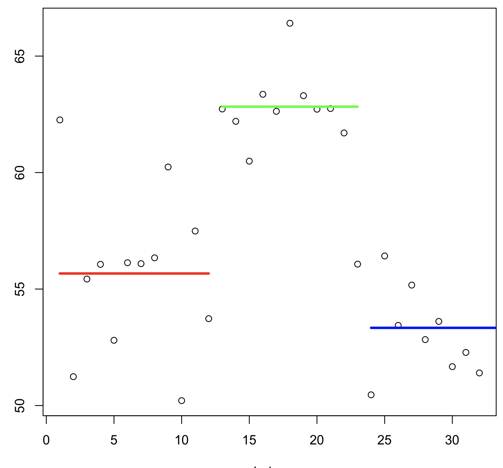
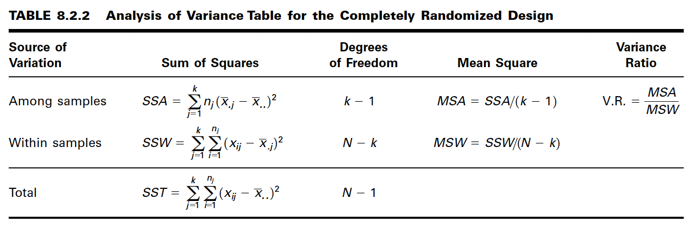

Ecuaciones-C08
==============

**One-Way ANOVA**

Se tienen k tratamientos, y cada j-tratamiento tiene :math:`n_j` medidas:

.. math::

   tratamientos

   \begin{matrix}
   & 1 & 2 & 3 & ... & k \\
   \hfill
   & x_{11} & x_{12} & x_{13} & ... & x_{1k} \\
   & x_{21} & x_{22} & x_{23} & ... & x_{2k} \\
   & x_{31} & x_{32} & x_{33} & ... & x_{3k} \\
   & ...    & ...    & ...    & ... & ... \\
   & x_{n_11} & x_{n_22} & x_{n_33} & ... & x_{n_kk} \\
   Total & T_{.1} & T_{.2} &T_{.3} & ...  & T_{.k} & T_{..} \\ 
   Media & \bar{x}_{.1} &  \bar{x}_{.2} & \bar{x}_{.3} & ... &  \bar{x}_{.k} & \bar{x}_{..} 
   \end{matrix}

Construcción de las ecuaciones para el análisis de Varianza:

:math:`x_{ij}` = la i-ésima observación resultanto del j-ésimo tratamiento (hay un total de k tratamientos)

:math:`T_{.j} = \sum_{i=1}^{n_j} x_{ij}`

:math:`\bar{x}_{.j} = \frac{T_{.j}}{n_j}`

:math:`T_{..} = \sum_{j=1}^k T_{.j} = \sum_{j=1}^k \sum_{i=1}^{n_j} x_{ij}`

:math:`\bar{x}_{..} = \frac{T_{..}}{N}, N = \sum_{j=1}^k n_j`

 
**Modelo que describe un Análisis Completamente Aleatorio**

.. math::

   x_{ij} = \mu + \tau_j + \varepsilon_{ij} ; i = 1, 2, ..., n_j , j = 1, 2, ..., k

Donde:

1. represents the mean of all the k population means and is called the grand mean.

1. :math:`\mu` representa la media de todas las k medias poblacionales y se denomina ``media general``.

2. represents the difference between the mean of the j th population and the grand
mean and is called the treatment effect.

2. :math:`tau_j` representa la diferencia entre la media de la j-ésima población y la media general y se denomina ``efecto del tratamiento``.

3. represents the amount by which an individual measurement differs from the
mean of the population to which it belongs and is called the error term.

3. :math:`\varepsilon_{ij}` representa la cantidad en que una medición individual difiere de la media de la población a la que pertenece y se denomina ``término de error``.

**Hipotesis**

.. math::

   H_0: \mu_1 = \mu_2 = ... \mu_k

   H_A : no todas las \mu_j son iguales

**La suma total de cuadrados**

.. math::

   SST = \sum_{j=1}^k \sum_{i=1}^{n_j} (x_{ij} - \bar{x}_{..})^2

La suma de cuadrados dentro de los grupos

.. math::

   SSW = \sum_{j=1}^k \sum_{i=1}^{n_j} (x_{ij} - \bar{x}_{.j})^2

La suma de cuadrados entre grupos

.. math::

   SSA = \sum_{j=1}^k n_j  (\bar{x}_{.j} - \bar{x}_{..})^2

.. math::

   SST = SSA + SSW

**La primera estimación de**

.. math::

   \frac{\sum_{j=1}^{n_j} (x_{ij} - \bar{x}_{.j})^2} {n_j - 1}

.. math::

   MSW = \frac{\sum_{j=1}^k \sum_{j=1}^{n_j} (x_{ij} - \bar{x}_{.j})^2} {\sum_{j=1}^kn_j - 1}

**La segunda estimación de**

.. math::

   \frac{\sum_{j=1}^k (\bar{x}_{.j} - \bar{x}_{..})^2}{k-1}

.. math::

   MSA = \frac{\sum_{j=1}^k n_j (\bar{x}_{.j} - \bar{x}_{..})^2}{k-1}

**La razón de varianza**

**EJEMPLO 8.2.1**

Las carnes de caza, incluyendo las de venado de cola blanca y ardilla gris oriental, son utilizadas como alimento por familias, cazadores y otras personas por razones de salud, culturales o personales. Un estudio realizado por David Holben (A-1) evaluó el contenido de selenio en la carne de venado de cola blanca y ardilla gris en libertad, obtenida de una región de Estados Unidos con bajo contenido de selenio. Estos valores de contenido de selenio también se compararon con los de la carne de res producida dentro y fuera de la misma región. Queremos saber si los niveles de selenio son diferentes en los cuatro grupos de carne.

.. image:: tabla8_2_4.png

**Prueba de Tukey’s HSD **

.. math::

   HSD = q_{\alpha, k, N-k} \sqrt{\frac{MSE}{n}}

Prueba de Tukey para tamaños de muestra desiguales

.. math::

   HSD^{*} = q_{\alpha, k, N-k} \sqrt{\frac{MSE}{2} (\frac{1}{n_i} + \frac{1}{n_j})}

