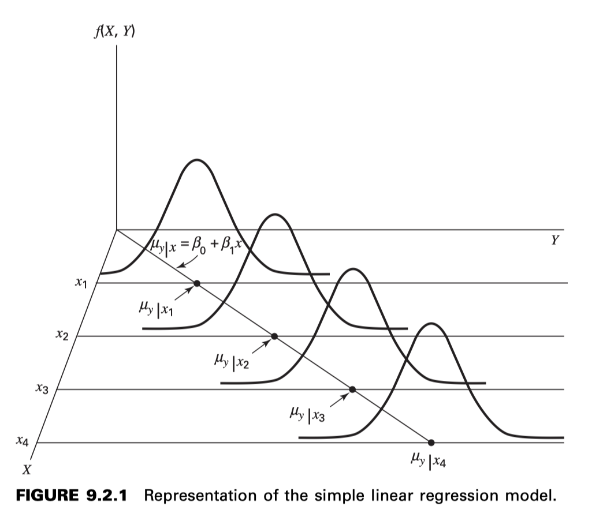

c09 - REGRESIÓN LINEAL SIMPLE Y CORRELACIÓN
==============================================

**9.2 EL MODELO DE REGRESIÓN**

**Supuestos subyacentes a la regresión lineal simple**

1. Se dice que los valores de la variable independiente X son **fijos**. Esto significa que el investigador preselecciona los valores de X para que, al 
recopilar los datos, no puedan variar. En este modelo, algunos autores se refieren a X como una variable no aleatoria y otros como una variable 
matemática. Cabe señalar que este supuesto clasifica nuestro modelo como un modelo de regresión clásico. El análisis de regresión también puede 
realizarse con datos donde X es una variable aleatoria.

2. La variable X se mide sin error. Dado que ningún procedimiento de medición es perfecto, la magnitud del error de medición en X es insignificante.

3. Para cada valor de X existe una subpoblación de valores de Y. Para que los procedimientos inferenciales habituales de estimación y prueba de 
hipótesis sean válidos, estas subpoblaciones deben tener una distribución normal. Para que estos procedimientos puedan presentarse, se asumirá que los 
valores de Y tienen una distribución normal en los ejemplos y ejercicios siguientes.

4. Las varianzas de las subpoblaciones de Y son todas iguales y se denotan por :math:`\sigma^2`.

5. Las medias de las subpoblaciones de Y se encuentran todas en la misma línea recta. Esto se conoce como el supuesto de linealidad. Este supuesto puede 
expresarse simbólicamente como

.. math::

   \mu_{y|x} = \beta_0 + \beta_1 x

(9.2.1)

donde :math:`\mu_{y|x}` es la media de la subpoblación de valores de Y para un valor particular de X,
:math:`\beta_0` y :math:`\beta_1` y se denominan coeficientes de regresión poblacional. 
Geométricamente, :math:`\beta_0`  y :math:`\beta_1`  representan la intersección con el eje y y la pendiente, respectivamente, de la línea donde se supone que se encuentran todas las 
medias.

6. Los valores de Y son estadísticamente independientes. En otras palabras, al extraer la muestra, se supone que los valores de Y elegidos en un valor 
de X no dependen en absoluto de los valores de Y elegidos en otro valor de X.

These assumptions may be summarized by means of the following equation, which
is called the regression model:

Estos supuestos pueden resumirse mediante la siguiente ecuación, denominada modelo de regresión:

.. math::

   y = \beta_0 + \beta_1 x + \varepsilon

(9.2.2)

where y is a typical value from one of the subpopulations of Y, :math:`\beta_0` and :math:`\beta_1` are as defined
for Equation 9.2.1, and is called the error term. If we solve 9.2.2 for :math:`\varepsilon`, we have

donde y es un valor típico de una de las subpoblaciones de Y, y son como se definen en la ecuación 9.2.1, y se denomina término de error. Si despejamos 
9.2.2 para , tenemos

.. math::

   \varepsilon = y - (\beta_0 + \beta_1 x) 

   = y - \mu_{y|x}

(9.2.3)

and we see that shows the amount by which y deviates from the mean of the subpopulation
of Y values from which it is drawn. As a consequence of the assumption that the
subpopulations of Y values are normally distributed with equal variances, the :math:`\varepsilon`’s for each
subpopulation are normally distributed with a variance equal to the common variance of
the subpopulations of Y values.

y vemos que :math:`\varepsilon` muestra la desviación de y respecto a la media de la subpoblación de valores Y de la que se extrajo. Como consecuencia 
del supuesto de que 
las subpoblaciones de valores Y se distribuyen normalmente con varianzas iguales, los :math:`\varepsilon`'s valores de cada subpoblación se distribuyen 
normalmente con una 
varianza igual a la varianza común de las subpoblaciones de valores Y.

**9.3 THE SAMPLE REGRESSION EQUATION**

LA ECUACIÓN DE REGRESIÓN MUESTRAL

**Obtaining the Least-Square Line**

Obtención de la recta de mínimos cuadrados

The least-squares regression line equation may be obtained from sample data by simple
arithmetic calculations that may be carried out by hand using the following equations

La ecuación de la línea de regresión de mínimos cuadrados se puede obtener a partir de datos de muestra mediante cálculos aritméticos simples que pueden 
realizarse manualmente utilizando las siguientes ecuaciones

.. math::

   \hat{\beta}_1 = \frac{\sum_{i=1}^n (x_i - \bar{x})(y_i - \bar{y})}{\sum_{i=1}^n (x_i - \bar{x})^2}

   \hat{\beta}_0 = \bar{y} - \hat{\beta}_1 \bar{x}

**9.4 EVALUATING THE REGRESSION EQUATION**

EVALUACIÓN DE LA ECUACIÓN DE REGRESIÓN

** When :math:`H_0: \beta_1 = 0` Is Not Rejected**

If in the population the relationship between X and Y is linear, :math:`\beta_1`, the slope of the line that describes this relationship, will be 
either positive, 
negative, or zero. If :math:`\beta_1` is zero, sample data drawn from the population will, in the long run, yield regression equations that are of 
little or no 
value for prediction and estimation purposes. Furthermore, even though we assume that the relationship between X and Y is linear, it may be that the 
relationship could be described better by some nonlinear model. When this is the case, sample data when fitted to a linear model will tend to yield 
results compatible with a population slope of zero. 

Si en la población la relación entre X e Y es lineal, :math:`\beta_1`, la pendiente de la línea que describe esta relación será positiva, negativa o 
cero. Si :math:`\beta_1` es cero, 
los datos muestrales extraídos de la población producirán, a largo plazo, ecuaciones de regresión con escaso o nulo valor para fines de predicción y 
estimación. Además, aunque asumimos que la relación entre X e Y es lineal, es posible que algún modelo no lineal la describa mejor. En este caso, los 
datos muestrales, al ajustarse a un modelo lineal, tenderán a producir resultados compatibles con una pendiente poblacional de cero.

Thus, following a test in which the null hypothesis that b 1 equals zero is not rejected, we may 
conclude (assuming that we have not made a type II error by accepting a false null hypothesis) either (1) that although the relationship between X and Y 
may be linear it is not strong enough for X to be of much value in predicting and estimating Y, or (2) that the relationship between X and Y is not 
linear; that is, some curvilinear model provides a better fit to the data. Figure 9.4.1 shows the kinds of relationships between X and Y in a population 
that may prevent rejection of the null hypothesis that :math:`\beta_1 = 0`.

Por lo tanto, tras una prueba en la que no se rechaza la hipótesis nula de que b 1 es igual a cero, podemos concluir (suponiendo que no hemos cometido 
un error de tipo II al aceptar una hipótesis nula falsa) (1) que, aunque la relación entre X e Y puede ser lineal, no es lo suficientemente fuerte como 
para que X sea de gran valor para predecir y estimar Y, o (2) que la relación entre X e Y no es lineal; es decir, algún modelo curvilíneo proporciona un 
mejor ajuste a los datos. La figura 9.4.1 muestra los tipos de relaciones entre X e Y en una población que pueden evitar el rechazo de la hipótesis nula 
de que

**When :math:`H_0: \beta_1 = 0` Is Rejected**

Now let us consider the situations in a population that may lead to rejection of the null hypothesis that :math:`\beta_1 = 0`. Assuming that we do not 
commit a type 
I error, rejection of the null hypothesis that :math:`\beta_1 = 0`  may be attributed to one of the following conditions in the population: (1) 
the relationship is 
linear and of sufficient strength to justify the use of sample regression equations to predict and estimate Y for given values of X; and (2) there is a 
good fit of the data to a linear model, but some curvilinear model might provide an even better fit. Figure 9.4.2 illustrates the two population 
conditions that may lead to rejection of :math:`H_0 : \beta_1 = 0`.

Consideremos ahora las situaciones en una población que pueden llevar al rechazo de la hipótesis nula de que
. Suponiendo que no cometemos un error de tipo I, el rechazo de la hipótesis nula de que
puede atribuirse a una de las siguientes condiciones en la población: (1) la relación es lineal y con la solidez suficiente para justificar el uso de 
ecuaciones de regresión muestral para predecir y estimar Y para valores dados de X; y (2) los datos se ajustan bien a un modelo lineal, pero algún 
modelo curvilíneo podría proporcionar un ajuste aún mejor. La Figura 9.4.2 ilustra las dos condiciones poblacionales que pueden llevar al rechazo de

Thus, we see that before using a sample regression equation to predict and estimate, it is desirable to test H 0 : b 1 = 0. We may do this either by 
using analysis of variance and the F statistic or by using the t statistic. We will illustrate both methods. Before we do this, however, let us see how 
we may investigate the strength of the relationship between X and Y.

Por lo tanto, antes de usar una ecuación de regresión muestral para predecir y estimar, es conveniente comprobar H₂: b₁ = 0. Podemos hacerlo mediante el 
análisis de varianza y el estadístico F, o bien mediante el estadístico t. Ilustraremos ambos métodos. Sin embargo, antes de hacerlo, veamos cómo 
podemos investigar la solidez de la relación entre X e Y.

 **The Coefficient of Determination**

The Total Deviation

The Explained Deviation

Unexplained Deviation

Desviación inexplicable.

.. math::

   (y_i - \bar{y}) = (\hat{y}_i - \bar{y}) + (y_i - \hat{y}_i)

Entonces

.. math::

   \sum (y_i - \bar{y})^2 = \sum (\hat{y}_i - \bar{y})^2 + \sum (y_i - \hat{y}_i)^2

Total Sum of Squares

Explained Sum of Squares

.. image:: fig_9_4_4.png

Unexplained Sum of Squares

Suma de cuadrados inexplicable

.. math::

   SST = SSR * SSE

**Calculando** :math:`r^2`

.. math::

   r^2 = \frac{\sum (\hat{y}_i - \bar{y})^2}{\sum (y_i - \bar{y})^2} = \frac{SSR}{SST}

**Estimating the Population Coefficient of Determination**

Estimación del coeficiente de determinación poblacional

.. math::

   \widetilde{r}^2 = 1-  \frac{\sum (y_i - \hat{y})^2/(n-2)}{\sum (y_i - \bar{y})^2/(n-1)} 

**Testing** :math:`H_0: \beta_1 = 0` **with the t Statistic**

.. math::

   \mu_{\hat{\beta}_0} = \beta_0

   \sigma_{\hat{\beta}_0}^2 = \frac{\sigma_{y|x}^2 \sum x_i^2}{n \sum (x_i - \bar{x})^2}

   \mu_{\hat{\beta}_1} = \beta_1

y

.. math::

   \sigma_{\hat{\beta}_1}^2 = \frac{\sigma_{y|x}^2}{ \sum (x_i - \bar{x})^2}

**The Test Statistic**

For testing hypotheses about :math:`\beta_1` the test statistic when :math:`\sigma_{y|x}^2` is known is

.. math::

   z = \frac{\hat{\beta}_1 - (\beta_1)_0}{\sigma_{\hat{\beta}_1}}

(9.4.8)

where is the hypothesized value of . The hypothesized value of does not
have to be zero, but in practice, more often than not, the null hypothesis of interest is
that
As a rule is unknown. When this is the case, the test statistic is
(9.4.9)
where is an estimate of and t is distributed as Student’s t with degrees of
freedom.
If the probability of observing a value as extreme as the value of the test statistic
computed by Equation 9.4.9 when the null hypothesis is true is less than (since we
have a two-sided test), the null hypothesis is rejected.

of sample evidence, that b 1 is zero, we may be interested in obtaining an interval estimate of b 1 . The general formula for a confidence interval,

estimator ; 1reliability factor21standard error of the estimate2

N1  may be used. When obtaining a confidence interval for b1 , the estimator is b , the reliability factor is some value of z or t (depending on whether 
or not s y ƒ x 2 is known), and the standard error of the estimator is

N s b 1 =

C

s 2 ƒx y

g1x i - x2 2

C

When s y 2 ƒ x is unknown, s b is estimated by

N s b 1 =

2 s y ƒx g1x i - x2 2

2 where s y ƒx = MSE In most practical situations our 10011 - a2 percent confidence interval for b is N1  b ; t11-a>22 s b N 1 (9.4.10)

For our illustrative example we construct the following 95 per

9.5 USING THE REGRESSION EQUATION

that the assumptions of Section 9.2 are met, and when s y 2 ƒ x is unknown, then the 10011 - a2 percent prediction interval for Y is given by

N y ;t11-a>22 sy ƒ x 

1 + + C n

1

1x p - x2 2

g1x i - x2 2

(9.5.1)

where x p is the particular value of x at which we wish to obtain a prediction interval for Y and the degrees of freedom used in selecting t are n - 2.

Estimating the Mean of Y for a Given X

The 10011 - a2 percent confidence interval for m y ƒ x when s y 2 ƒ x is unknown, is given by

,

N y ; t11-a>22 s y ƒ x

+ C n

1

1x p - x2 2

g1x i - x2 2

(9.5.2)

**9.6 THE CORRELATION MODEL**

**9.7 THE CORRELATION COEFFICIENT**

A Test for Use When the Hypothesized R Is a Nonzero Value

The use of the t statistic computed in the above test is appropriate only for testing H 0 : r = 0. If it is desired to test H 0 : r = r0 , where r 0 is 
some value other than zero, we must use another approach. Fisher (5) suggests that r be transformed to z r as follows:

1 1 + r z r = ln 2 1 - r

(9.7.4)

1 s z p = (9.7.5) 1n - 3 To test the null hypothesis that r is equal to some value other than zero, the test statistic is

where ln is a natural logarithm. It can be shown that z r is approximately normally distributed with a mean of z r = 1 2 ln511 + r2>11 - r26 and 
estimated standard deviation of

z r - zr  Z = 1>1n - 3

(9.7.6)

which follows approximately the standard normal distribution.

To determine z r for an observed r and z r for a hypothesized r, we consult Table I, thereby avoiding the direct use of natural logarithms.

