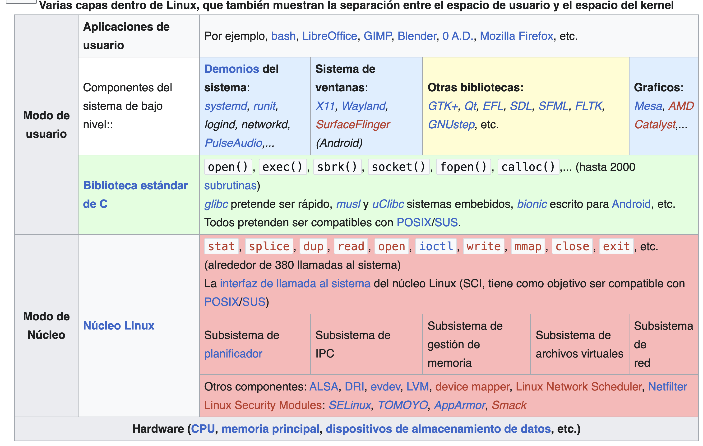

GNU/Linux
=========

https://es.wikipedia.org/wiki/GNU/Linux

GNU/Linux (pronunciado oficialmente como ñu linux o también ge-ene-u linux en español)[2]​ es una familia de sistemas operativos tipo 
Unix compuesto por software libre y de código abierto.[3]​ GNU/Linux surge de las contribuciones de varios proyectos de software, 
entre los cuales destacan GNU (iniciado por Richard Stallman en 1983) y el núcleo Linux (comenzado por Linus Torvalds en 1991).[4]​

A pesar de que en la jerga cotidiana la mayoría de las personas usan el vocablo Linux para referirse a este sistema operativo,[5]​[6]​ 
en realidad ese es solo el nombre del kernel o núcleo, que representa menos del 50 por ciento de todo el código del sistema. El 
sistema completo está formado también por una gran cantidad de componentes del Proyecto GNU junto a componentes de terceros, que van 
desde compiladores hasta entornos de escritorio.[7]​[8]​ Cabe señalar que existen derivados que usan el núcleo Linux pero que no tienen 
componentes GNU, como por ejemplo el sistema operativo Android.[9]​ También existen distribuciones de software GNU donde el núcleo 
Linux está ausente.

El núcleo del sistema operativo gestiona todos los procesos vitales y recursos. El núcleo en su más pura forma es distante del 
usuario, su misión es a un bajo nivel y muy difícilmente el usuario interactúa con él. Pero el núcleo en sí no hace alusión a ninguna 
interfaz gráfica ni programa que de manera básica interactúe con el usuario.

Los sistemas operativos GNU/Linux se encuentran normalmente en forma de compendios conocidos como distribuciones o «distros».[10]​ 
Entre las más populares se encuentran Debian, Ubuntu, Red Hat, SUSE y ArchLinux. El propósito de estas distribuciones es ofrecer 
GNU/Linux como un producto final para instalar o probar en un ordenador, cubriendo una gama de necesidades, las cuales van desde el 
uso cotidiano personal hasta aplicaciones muy específicas en ambientes especializados. Al sistema base las distros añaden su propia 
selección de aplicaciones y programas preinstalados (por ejemplo ambientes gráficos basados en X11, GNOME y KDE), o aplicaciones que 
pueden descargarse desde un repositorio para su posterior instalación.

Algunas de estas distribuciones son especialmente conocidas por su uso en servidores de Internet, en supercomputadoras, y en sistemas 
embebidos;[11]​ mercados donde GNU/Linux tiene la mayor cuota de participación. El proyecto de ranking Top500.org informa que, desde 
2017, las 500 supercomputadoras más potentes del mundo utilizan todas ellas alguna versión del sistema operativo GNU/Linux; y desde 
2004 ya era el sistema dominante.[12]​Diversas encuestas lo han posicionado constantemente como el sistema operativo más popular para 
servidores web.[13]​[14]​[15]​ En aplicaciones embebidas es común encontrar Linux instalado en routers, smart TV y relojes inteligentes, 
sistemas de entretenimiento de automóviles, y grabadoras de video digital.[16]​[17]​ Aunque con menor participación, el sistema 
GNU/Linux también se usa en el segmento de las computadoras de escritorio, portátiles, dispositivos móviles, computadoras de 
bolsillo, videoconsolas y otros.

GNU/Linux es uno de los ejemplos más prominentes de software libre: todo su código fuente puede ser utilizado, modificado y 
redistribuido libremente por cualquier persona, empresa o institución, bajo los términos de la Licencia Pública General de GNU, así 
como de otra serie de licencias de derechos de autor.[18]​

El acrónimo recursivo GNU, GNU's Not Unix (GNU no es Unix), proviene de las herramientas básicas de sistema operativo creadas por el 
proyecto GNU, iniciado por Richard Stallman en 1983 y mantenido por la Free Software Foundation. El nombre Linux viene del núcleo 
Linux, inicialmente escrito por Linus Torvalds en 1991.[19]​

La contribución del proyecto GNU al sistema es la razón por la que existe controversia a la hora de utilizar Linux o GNU/Linux para 
referirse al sistema operativo formado por el sistema GNU y el núcleo Linux en su conjunto.[20]​[21]​

El sistema operativo Unix fue concebido e implementado en 1969 en los laboratorios Bell de AT&T en los Estados Unidos por Ken 
Thompson, Dennis Ritchie, Douglas McIlroy, y Joe Ossanna.[22]​ Unix se escribió completamente en lenguaje ensamblador por primera vez 
en 1971, ya que era una práctica común en el momento. Más tarde, en 1973, en un enfoque innovador, se volvió a escribir en el 
lenguaje de programación C, por Dennis Ritchie (a excepción del núcleo y del sistema de entrada y salida de datos). La disponibilidad 
de un lenguaje de alto nivel para implementar Unix propició su portabilidad a diferentes plataformas de computación con mayor 
facilidad; ayudando así a su propagación.

Debido a un anterior caso antimonopolio que le prohibía entrar en el negocio de las computadoras, AT&T licenciaba gratuitamente el 
código fuente del sistema operativo Unix a cualquier persona que lo solicitara.[23]​ Como resultado, Unix creció rápidamente y llegó a 
ser ampliamente adoptado por las instituciones académicas y empresas. En 1984, AT&T se despojó de Bell Labs; quedando libre de la 
obligación legal que requería la concesión de dichas licencias.[24]​

Creación
El proyecto GNU, iniciado en 1983 por Richard Stallman, tiene el objetivo de crear un «sistema de software compatible con Unix, 
compuesto enteramente de software libre». El trabajo comenzó en el año 1984.[25]​ Más tarde, en 1985, Stallman fundó la Free Software 
Foundation para financiar el desarrollo de GNU, y redactó la Licencia Pública General de GNU en 1989. A principios de la década de 
1990, muchos de los programas que se requieren en un sistema operativo (como bibliotecas, compiladores, editores de texto, un shell 
Unix y un sistema de ventanas) ya se habían conseguido desarrollar y estaban operativos en el proyecto GNU. Sin embargo, otros 
elementos, como los controladores de dispositivos y los daemons, estaban todavía en desarrollo e incompletos.[26]​

En retrospectiva, Linus Torvalds declaró que si el núcleo del proyecto GNU hubiera estado disponible en 1991, no se habría decidido a 
desarrollar su propio núcleo.[27]​ Asimismo, también declaró que si el núcleo 386BSD (del cual NetBSD, OpenBSD y FreeBSD descienden), 
cuyo desarrollo es anterior al núcleo Linux y que no se liberó hasta 1992 por temas legales, hubiera estado disponible probablemente 
tampoco lo habría desarrollado.[28]​

En 1991, cuando Torvalds asistía a la Universidad de Helsinki y era usuario del sistema operativo MINIX, creado en 1987 por Andrew S. 
Tanenbaum, y de los programas provenientes del proyecto GNU, estaba muy interesado por el funcionamiento de los sistemas 
operativos.[29]​ Frustrado por la concesión de licencias de uso que utilizaba MINIX, que en ese momento se limitaba a uso educativo, 
ese mismo año decidió comenzar a desarrollar su propio núcleo[29]​[30]​ adoptando la estructura y código del núcleo de MINIX.

Hacia 1992, Torvalds había trabajado tanto en el desarrollo del núcleo Linux que llegó a superar a otros núcleos que se encontraban 
también en desarrollo en ese momento.[28]​ Las aplicaciones GNU también se fueron desarrollando de modo que reemplazaron todos los 
componentes de MINIX, porque era más ventajoso utilizar el código libre del proyecto GNU con el nuevo sistema operativo. El código 
GNU con licencia bajo la GPL puede ser reutilizado en otros programas de computadora, siempre y cuando también se liberen bajo la 
misma licencia o una licencia compatible. Posteriormente Torvalds inició un cambio de su licencia original, la cual prohibía la 
redistribución comercial, y lo difundió bajo la licencia GPL.[31]​ Los desarrolladores de ambas partes trabajaron para integrar 
componentes de GNU con el núcleo Linux, consiguiendo un sistema operativo completamente funcional.[30]​

Diseño
Muchos desarrolladores de código abierto están de acuerdo en que el núcleo Linux no fue diseñado, sino que evolucionó a través de una 
forma de «selección natural». Torvalds considera que, aunque el diseño de Unix sirvió como andamiaje, «Linux creció con muchas 
mutaciones, y debido a que las mutaciones eran menos que aleatorias, eran más rápidas y más dirigidas que las partículas alfa en el 
ADN».[32]​ Raymond considera que los aspectos revolucionarios de Linux son sociales, no técnicos, antes de que el software complejo de 
Linux fuera diseñado cuidadosamente por grupos pequeños, pero «Linux evolucionó de una manera completamente diferente. Desde casi el 
principio, fue pirateado de manera bastante casual por un gran número de voluntarios coordinando solo a través de Internet. La 
calidad se mantuvo no por estándares rígidos o autocracia, sino por la estrategia ingenuamente simple de publicar cada semana y 
obtener comentarios de cientos de usuarios en unos días, creando una especie de selección darwiniana rápida sobre las mutaciones 
introducidas por los desarrolladores».[33]​ Bryan Cantrill, un ingeniero de un sistema operativo de la competencia, está de acuerdo en 
que «Linux no se diseñó, evolucionó», pero considera que esto es una limitación, y propone que algunas características, especialmente 
las relacionadas con la seguridad, no se pueden convertir en, «este no es un sistema biológico al final del día, es un sistema de 
software».[34]​ Un sistema basado en Linux es un sistema operativo modular tipo Unix, que deriva gran parte de su diseño básico de los 
principios establecidos en Unix durante las décadas de 1970 y 1980. Dicho sistema utiliza un núcleo monolítico, el núcleo Linux, que 
maneja el control de procesos, las redes, el acceso a los periféricos y los sistemas de archivos. Los controladores de dispositivos 
se integran directamente con el núcleo o se agregan como módulos que se cargan mientras el sistema está en ejecución.

El espacio de usuario de GNU es una parte clave de la mayoría de los sistemas basados en el núcleo Linux, siendo Android la excepción 
notable. La implementación del Proyecto de la biblioteca C funciona como un contenedor para las llamadas al sistema del núcleo Linux 
necesarias para la interfaz kernel-espacio de usuario. La cadena de herramientas es una amplia colección de herramientas de 
programación vitales para el desarrollo de Linux (incluidos los compiladores utilizados para construir el núcleo Linux así mismo), y 
las coreutils implementan muchas herramientas básicas de Unix. El proyecto también desarrolla Bash, un popular shell CLI. La interfaz 
gráfica de usuario (o GUI) que utilizan la mayoría de los sistemas Linux se basa en una implementación del sistema X Window.[35]​ Más 
recientemente, la comunidad Linux busca avanzar a Wayland como el nuevo protocolo de servidor de visualización en lugar de X11. 
Muchos otros proyectos de software de código abierto contribuyen a los sistemas Linux.

Los componentes instalados de un sistema GNU/Linux incluyen los siguientes:[35]​[36]​

* Un cargador de arranque, por ejemplo GNU GRUB, LILO, SYSLINUX o Gummiboot. Este es un programa que carga el núcleo Linux en la 
memoria principal de la computadora, al ser ejecutado por la computadora cuando se enciende y después de que se realiza la 
inicialización del firmware.

* Un programa de inicio, como el sysvinit tradicional y el systemd más nuevo, OpenRC y Upstart. Este es el primer proceso lanzado por 
el núcleo Linux, y está en la raíz del árbol de procesos: en otros términos, todos los procesos se inician a través de init. Inicia 
procesos como los servicios del sistema y las solicitudes de inicio de sesión (ya sean gráficos o en modo terminal).

* Bibliotecas de software, que contienen código que pueden utilizar los procesos en ejecución. En los sistemas Linux que utilizan 
archivos ejecutables en formato ELF, el enlazador dinámico que gestiona el uso de bibliotecas dinámicas se conoce como ld-linux.so. 
Si el sistema está configurado para que el usuario compile el software por sí mismo, también se incluirán archivos de cabecera para 
describir la interfaz de las bibliotecas instaladas. Además de la biblioteca de software más utilizada en los sistemas Linux, la 
biblioteca GNU C (glibc), existen muchas otras bibliotecas, como SDL y Mesa.

* La biblioteca estándar C es la biblioteca necesaria para ejecutar programas C en un sistema informático, siendo la biblioteca GNU C 
el estándar. Para los sistemas embebidos, se han desarrollado alternativas como musl, EGLIBC (una bifurcación glibc usada una vez por 
Debian) y uClibc (que fue diseñado para uClinux), aunque las dos últimas ya no se mantienen. Android usa su propia biblioteca C, 
Bionic.

* Comandos básicos de Unix, siendo GNU Core Utilities la implementación estándar. Existen alternativas para los sistemas embebidos, 
como el copyleft BusyBox y el Toybox con licencia BSD.

* Los kits de herramientas de widgets son las bibliotecas que se utilizan para crear interfaces gráficas de usuario (GUI) para 
aplicaciones de software. Hay numerosos kits de herramientas de widgets disponibles, incluidos GTK y Clutter desarrollados por el 
proyecto GNOME, Qt desarrollado por Qt Project y dirigido por Digia, y Enlightenment Foundation Libraries (EFL) desarrolladas 
principalmente por el equipo de Enlightenment.

* Un sistema de gestión de paquetes, con un formato de paquetes específico. Alternativamente, los paquetes se pueden compilar a 
partir 
de archivos tar binarios o fuente.

* Programas de interfaz de usuario como shells de comandos/órdenes o gestores de ventanas.

**Entorno gráfico**

Los sistemas operativos GNU/Linux pueden funcionar tanto en entorno gráfico como en modo consola, ya que el entorno gráfico no va 
explícitamente unido al resto de programas de manejo del sistema y puede usarse de forma opcional.[37]​ La consola es común en 
distribuciones para servidores, mientras que la interfaz gráfica está orientada al usuario final, tanto de hogar como empresarial. 
Asimismo, también existen los entornos de escritorio, que son un conjunto de programas formado por gestores de ventanas, iconos y 
muchas aplicaciones que facilitan la utilización de la computadora en modo gráfico. Los escritorios más populares en GNU/Linux son: 
GNOME, KDE Plasma, LXQt, Xfce, MATE y Cinnamon, aunque existen muchos más, también puede usarse con solo los gestores de ventanas, 
que son la columna vertebral de los entornos de escritorio, y los encargados de dibujar la interfaz de las aplicaciones y la 
composición.

